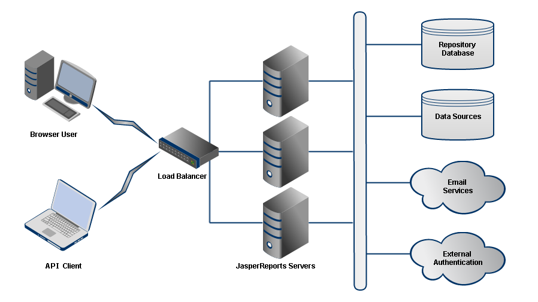

# Sample Cluster Architecture

A cluster refers to a group of servers, along with any associated computers, dedicated hardware, and other server software that perform the same task as a single server. Each server instance runs on its own node, a real or virtual computer with the necessary software. When properly configured, the cluster architecture is transparent to users. All users access the same URL and see the same data, but each session is handled by a different node.

A cluster typically provides load balancing among nodes and some form of failover, both of which lead to higher availability and scalability. A cluster design must also take into account all of the resources JasperReports Server instances must access and scale them appropriately.

In general, a cluster may incorporate computers of different hardware and software configurations. For simplicity, we recommend deploying JasperReports Server as a cluster of identical nodes, with one instance on each node and all instances configured the same.

The following diagram shows the architecture of a sample JasperReports Server cluster:

*Figure 1: Architecture of a Sample JasperReports Server Cluster*

The major components of the sample JasperReports Server cluster architecture are:

- JasperReports Server clients:
  - Browser users: Administrators and end users who log into the JasperReports Server web interface.
  - API clients: Applications that embed JasperReports Server functionality through the REST API or Visualize.js.
- Load balancer: Specialized hardware or software that redirects client requests to instances in the cluster.
- JasperReports Server instances: Identically configured instances running on separate computers, real or virtual.
- Shared resources:
  - Repository database: Defines users, roles, organization, folders, and resources for the cluster. The repository is a single logical database that should also be configured for high availability and failover.
  - Data sources – Contain the data that JasperReports Server queries when creating or running a report. Data sources should be able to handle the load of simultaneous queries expected from the cluster.
  - Email services: Send email notifications and output of scheduled reports. Email services are optional, but almost always implemented.
  - External authentication: Provides alternative login policies such as corporate directories or single sign-on. External authentication is optional and more complicated to configure, but often required in an enterprise deployment.

The requirements and considerations for each of these components are given in the following sections. For simplicity, the sample architecture assumes that all components of the cluster are in the same geographic location. Distributed clusters to serve distributed users are possible, but require extra network and performance considerations beyond the scope of this chapter.
