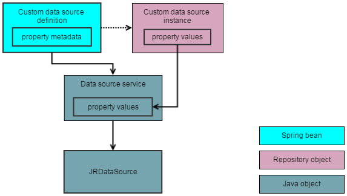

# Custom Data Source Architecture

A JasperReports Library data source (`JRDataSource`) is a Java class that contains the logic to retrieve data and feed it to the JasperReports Library process that generates a JRXML report. For example, you may write code to access a REST API and format the data. When using JasperReports Library natively in a Java environment, you must write the code to initialize your `JRDataSource`, for example any URLs or credentials needed to access the data.

JasperReports Server lets users enter the parameters for a data source and select which reports to run. When you want to use this same `JRDataSource` in the JasperReports Server environment, you must write additional classes and resources so that the server can do the following:

-   At startup, register the data source so it can be selected by users.

-   When a user creates an instance of this data source, get its parameters from the user and store them in the repository.

-   When a user runs a report that uses this data source, instantiate and initialize the `JRDataSource` at runtime from the stored parameters. When the report is finished, clean up the `JRDataSource` object.

-   Optionally, if you have input controls for reports that use this data source, instantiate and initialize the `JRDataSource` again to process the query for input controls.

Each of these actions are described in the following sections.

## Server Startup

On startup, the Spring framework registers the custom data source definition with the custom report data source service factory in JasperReports Server. Users see the custom data source type on the Type menu in the New Data Source dialog, using the name defined in the message catalog.

## Creation of a Custom Data Source

When a user selects a custom data source type from the **Type** menu in the **New Data Source** dialog, they must enter values for any visible properties required to create the corresponding `JRDataSource`. Properties are specified in the Spring bean definition file, with labels defined in a message catalog (or bundle if you include translated messages for other locales). There may be additional hidden properties, set up in the Spring definition file.

When you create a custom data source, you can optionally implement validation for the property values in the **New Data Source** dialog. The logic for validation is defined by a Java class that implements the `CustomDataSourceValidator` interface. This class receives the user input, verifies it, and if necessary raises an error with strings defined in the message catalog.

Saving the data source instance creates a persistent object in the JasperReports Server repository.

## Instantiation of a Custom Data Source

When a user runs a report that uses the custom data source, the server instantiates the corresponding `JRDataSource` to access the data. This also happens when defining a Domain that uses the custom data source, when creating or running an Ad Hoc view based on a Domain that uses the custom data source, or when viewing a dashboard that includes any of these.

The `JRDataSource` is instantiated as follows:

-   The custom data source instance is read from the repository and its data source definition is looked up by name.

-   An implementation of `ReportDataSourceService` is created and the properties from the repository are used to set the corresponding properties on the data source service.

-   A `JRDataSource` is created in one of two ways, depending on whether the data source uses a query:

    -   If there is no query, the data source service has to provide the `JRDatasource`.

    -   If there is a query, JasperReports Library creates a `JRQueryExecuter` of the correct class for the query language. The data source service passes any objects that the query executer needs by setting parameters. The `JRQueryExecuter` reads the parameters and produces the `JRDataSource`.

-   The `JRDataSource` is used to fill the report and produce a `JasperPrint` object, from which the server generates HTML or other supported output formats.

!!! note

    A JasperReports Library data source is an implementation of the `JRDataSource` interface that provides data organized in rows and columns to the JasperReports Library filler. Each field declared in the JRXML corresponds to a column in the `JRDataSource` output.

The following figure shows the main steps in creating a `JRDataSource` from a custom data source instance.

*Figure 1 JRDataSource Creation from Custom Data Source Instance*

## Query Executers

A query executer is an implementation of the `JRQueryExecuter` interface in the JasperReports Library. It interprets the `queryString` in the JRXML and produces a `JRDataSource`. JasperReports Library (either standalone or running in JasperReports Server) determines which query executer to use by looking at the `language` attribute of the `queryString` and looking up a query executer factory registered for that language.

JasperReports Server data sources can use two different methods to create a `JRDataSource`:

-   The JasperReports Server data source can create a `JRDataSource` directly, without a `queryString` in the JRXML; or

-   The server can pass implementation-specific objects to the query executer through the report parameter map. The query executer then uses the objects from the parameter map, as well as the contents of the `queryString`, to create the `JRDataSource`.

Selecting the method to use depends on the nature of the data source, as well as whether you want to use a `queryString` to control your data source. A good example of a data source using a query executer is the JDBC data source: it passes a JDBC connection to the JDBC query executer, which it uses to pass the SQL `queryString` to the database.

The samples demonstrate both methods:

-   The custom bean data source creates a `JRDataSource` directly, which returns data from a hard-coded internal array. See [Custom Bean Data Source](custom-data-source-examples.md).

-   The webscraper data source can either create a `JRDataSource` directly, using the properties supplied by the data source instance, or it can get those properties from a `queryString` in the JRXML. In this case, a data source instance isn’t required. The sample reports for this data source demonstrate each of these approaches. See [Hibernate Custom Data Source](custom-data-source-examples.md).
