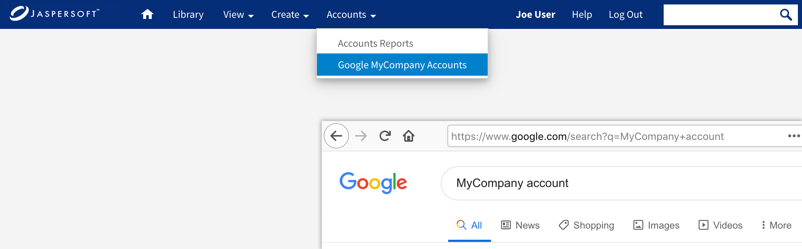

# Adding a New Main Menu

The following example shows two useful ways to add custom menu items:

- You can add your own menus to the main menu bar.

- You can add menu items to either existing or custom menus and link them outside the server.

This example creates a new menu named Accounts. It contains the internal search item created in the previous example and an external search with Google.

1.  Edit the file `<js-webapp>/WEB-INF/actionModel-navigation.xml`. Add the menu definition with two menu items to the end of the file.

```
  ...
  <!--MyCompany custom menu-->
  <context name="main_custom_mutton" test="!banUserRole">
    <selectAction labelKey="NAV_801_ACCOUNTS">
      <option labelKey="NAV_802_SEARCH_IN"
              action="primaryNavModule.navigationOption"
              actionArgs="accounts"/>
      <option labelKey="NAV_803_SEARCH_OUT"
              action="externalSearchHandler"
              actionArgs="MyCompany+account"/>
    </selectAction>
  </context>
</actions>
```

Each menu item has a label and an action defined, but no conditions. All users can access these menu items.

The internal search item is the same as the MyCompany Accounts example above. The external search item needs to have its own action, which you’ll define in another file.

1.  Open the properties file for your edition of JasperReports Server:

|  |  |
|----|----|
| Commercial Editions: | `<js-webapp>/WEB-INF/bundles/pro_nav_messages.properties` |
| Community Project: | `<js-webapp>/WEB-INF/bundles/jasperserver_messages.properties` |

1.  Add three simple labels, one for each key defined in the actionModel file.

```
NAV_801_ACCOUNTS=Accounts
NAV_802_SEARCH_IN=Accounts Reports
NAV_803_SEARCH_OUT=Google MyCompany Accounts
```

1.  If you support multiple locales, add the same message key to the other language bundles.
2.  To edit the JavaScript source code, create a working directory where you can edit and build source code, as described in [1.0.1, “Customizing JavaScript Files,” on page 1](customizing-javascript.md).
3.  Edit your working copy of `jasperserver-ui/ce/jrs-ui/src/actionModel/actionModel.primaryNavigation.js`. Add the accounts navigation path if you didn’t do so in the previous procedure:

```
  ...
  navigationPaths : {
    ...
  accounts : {url : "flow.html", params : "_flowId=searchFlow&mode=search
  filterId=resourceTypeFilter&filterOption=resourceTypeFilter-reports&searchText=account"},    ...
```

The accounts navigation path used in the previous example is the same as the one used in this example. It performs a search of reports in the repository containing the word `account` in their name or description.

!!! warning

    Because of space limitations, the line is shown broken across two lines. In your application, make sure it is on a single line.

1.  In the same copy of the `jasperserver-ui/ce/jrs-ui/src/actionModel/actionModel.primaryNavigation.js` file, add the external search handler function to the end of the file, outside of all other definitions:

```
var externalSearchHandler = function(qstring) {
  window.location.href = "http://google.com/search?q=" + qstring;
};

window.primaryNavModule = primaryNavModule;
window.externalSearchHandler = externalSearchHandler;

export default primaryNavModule;
export {externalSearchHandler};
```

!!! note

    You are required to export the additional function to enable the custom menu.

1.  Build the JavaScript source code and copy the output back to JasperReports Server as described in [1.0.1, “Customizing JavaScript Files,” on page 1](customizing-javascript.md).
2.  Reload the web app in the app server to see the changes (see [1.0.1, “Reloading the JasperReports Server Web App,” on page 1](reloading-jrs-webapp.md)).
3.  When the web app has reloaded, log into JasperReports Server as `joeuser`. You'll see the new Accounts menu with **Accounts \> Google MyCompany** opening a Google search. The following figure shows both the new menu and the external search results.

  

*Figure 1: Creating a Custom Menu and an External Link*

!!! note

    The menu shown is the one seen by `joeuser`. The actionModel automatically creates and places the new menu and its menu items. For `jasperadmin` who also sees the Manage menu, the Accounts menu would be closer to the metalinks; a second menu might overlap them. When creating custom menus whose visibility is based on roles, be sure to test different users to see the different UI layouts.

    You may need to adjust other parts of the UI, such as the placement of the metalinks or search field. In this case you could use themes to avoid overlap with the search field.
