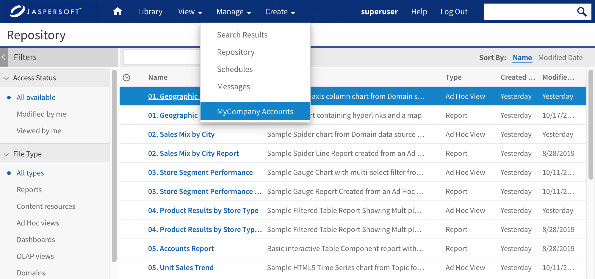

# Adding an Item to the Main Menu

Adding menu items involves three files:

-   The actionModel file for the menu item.
-   The properties file that labels the menu item.
-   An action file that handles events for the menu item.

This example adds a special menu item so that MyCompany employees can easily find their accounts reports.

1.  Edit the file `<js-webapp>/WEB-INF/actionModel-navigation.xml`. Locate the actionModel for the **View** menu near the beginning of the file.

    ``` html
    <!--context for view option on primary menu-->
    <context name="main_view_mutton" test="!banUserRole">
      <selectAction labelKey="menu.repository">
        <option labelKey="menu.search" action="primaryNavModule.navigationOption"
                actionArgs="search"/>
        ...
         <separator/>

         <option labelKey="NAV_028_ACCOUNTS" action="primaryNavModule.navigationOption"
          actionArgs="accounts"/>
      </selectAction>
    </context>
    ...
    ```

2.  Add a `separator` tag and an `option` tag for the menu item. The `option` tag has attributes to specify the label key and the name of the action to perform.

3.  Open one of these files. The name of the properties file depends on your edition of JasperReports Server:

    Commercial Editions: `<js-webapp>/WEB-INF/bundles/pro_nav_messages.properties`

    Community Project: `<js-webapp>/WEB-INF/bundles/jasperserver_messages.properties`

    The names of the keys are slightly different depending on the file. The following example is based on the contents of the commercial edition `pro_nav_messages.properties`.

    ``` properties
    NAV_001_HOME=Home
    NAV_002_VIEW=View
    NAV_003_MANAGE=Manage
    NAV_004_LOGOUT=Log Out
    NAV_005_CREATE=Create
    ...
    NAV_027_SEARCH=Search Results
    NAV_028_ACCOUNTS=MyCompany Accounts
    ...
    ```

4.  Add the line for the `NAV_028_ACCOUNTS` property with an appropriate value, in this case `MyCompany Accounts`.

5.  If you support multiple locales, add the same message key to the other language bundles.

6.  Create a working directory where you can edit and build JavaScript source code, as described in [Customizing JavaScript Source Code](customizing-javascript.md).

7.  Edit your working copy of the file `jasperserver-ui/ce/jrs-ui/src/actionModel/actionModel.`<br>
    `primaryNavigation.js`.

    ``` javascript
    var primaryNavModule = {
      NAVIGATION_MENU_CLASS : "menu vertical dropDown",
      ACTION_MODEL_TAG : "navigationActionModel",
      CONTEXT_POSTFIX : "_mutton",
      NAVIGATION_MUTTON_DOM_ID : "navigation_mutton",
      NAVIGATION_MENU_PARENT_DOM_ID : "navigationOptions",
      JSON : null,
     /**
       * Navigation paths used in the navigation menu
       */
      navigationPaths : {
        library : {url : "flow.html", params : "_flowId=searchFlow"},
        home : {url : "home.html"},
        logOut : {url : "exituser.html"},
        search : {url : "flow.html", params : "_flowId=searchFlow&mode=search"},
        report : {url : "flow.html", params : "_flowId=searchFlow&mode=search&
        filterId=resourceTypeFilter&filterOption=resourceTypeFilter-reports&searchText="},
        accounts : {url : "flow.html", params : "_flowId=searchFlow&mode=search&
        filterId=resourceTypeFilter&filterOption=resourceTypeFilter-reports&searchText=account"},
        ...
    ```

    !!! warning

        Because of space limitations, the line is shown broken across two lines. In your application, make sure it's on a single line.

8.  Add a URL and parameters to load the target page of the new accounts menu item. In this example, the action is to perform a search for all reports with the word `account` in their name or description.

9.  Build the JavaScript source code in your working directory and copy the output back to JasperReports Server as described in [1.0.1, “Customizing JavaScript Files,” on page 1](customizing-javascript.md).

10. Save the modified files and reload the web app in the app server to see the changes (see [1.0.1, “Reloading the JasperReports Server Web App,” on page 1](reloading-jrs-webapp.md)).

11. When the web app has reloaded, log into JasperReports Server as `joeuser`. You'll see the **View &gt; MyCompany Accounts** menu item was created and, when you select it, it performs a customized search. The following figure shows both the menu item and the search results on the same page.



*Figure 1 Custom Menu Items and Corresponding Action*
