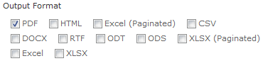

# Adding Custom Export Channels

When users run reports in JasperReports Server, they can export the results in several formats, such as PDF and ODT. If your users need to export to other file formats, you can create a custom export channel. You must implement a custom Java class that generates the required file format then integrate the new class into the server. As a result, this customization must be made in the source code of JasperReports Server.

In the following example, a custom export channel is added to the server’s pluggable, flexible export channel list. The example adds the export channel in three places: the report viewer, the scheduler, and web services.

This section assumes the following:

-   You are familiar with the underlying technologies, such as Java, Spring, JSPs, and web services.
-   You have downloaded and tested the source code distribution, as described in [Working With Source Code Files](customizing-java-classes.md). Paths and filenames in this section are based on the &lt;js-src&gt; location.
-   You have implemented an exporter class that can be integrated with JasperReports Server. This section further assumes that your exporter class creates files with a `.<MyFormat>` file extension and format.
-   That, where the instructions read` <MyFormat>`, you have used the correct name for your export format. For example, if you're creating an exporter that generates .DBF files, where the instructions describe the `Report<MyFormat>Exporter` class, your class is called `ReportDBFExporter`.

## About Export Parameters

Export parameters determine how JasperReports Server generates your output format. For example, consider the paginated Excel exporter. Its export parameters determine how a report is converted to the XLS file format. The parameter settings have information like whether each page of the report should be represented as a separate sheet in the Excel spreadsheet (`IS_ONE_PAGE_PER_SHEET`).

Export parameters have default values that can be set at the report- or application-level. Many of the parameters are optional; others are valid only for certain export channels. When you create an export channel, you can define such parameters to control how your reports are exported in the new format. If you don’t need to specify such settings when reports are run, you might not need to define any parameters.

## Adding the Exporter to the Report Viewer

The most prominent place where the export channel should be available is the page that appears when the report is run. The drop-down list of export channels in the default report viewer is shown in [“Adding the Exporter to the Report Viewer” on page 1](#adding-the-exporter-to-the-report-viewer) . Adding a new exporter to the report viewer involves:

-   Implementing a new exporter action class that extends `AbstractReportExporter`.

-   Implementing a new export parameters bean class that extends `AbstractExportParameters`.

-   Creating a new export configuration bean of type `ExporterConfigurationBean`.

-   Adding a resource bundle property for the label in the menu.

    To add the exporter to the default report viewer

    1.  Create a new exporter action class that extends the abstract `com.jaspersoft.jasperserver.war.action.AbstractReportExporter` 
        class. Name it `Report<MyFormat>Exporter`.

        For guidance about creating such a class, look at the `ReportCsvExporter` class, which is similar. You'll find it in the `com.jaspersoft.jasperserver.war.action` package.

    2.  Create a new export parameters Java bean class, which should implement `Serializable` and extend the `com.jaspersoft.jasperserver.api.engine.jasperreports.common.AbstractExportParameters` class. It should implement the `public void setPropertyValues(Object object)` method, which is required to perform dynamic data binding and validation. Give the class a unique name, such as `<MyFormat>ExportParametersBean`, and ensure that it contains only user-customizable export parameters (that is, it should not contain the `JRExporterParameter.JASPER_PRINT` or `JRExporterParameter.OUTPUT_FILE_NAME` parameters, which are already set). For an example, see the `XlsExportParametersBean` class in the `com.jaspersoft.jasperserver.api.engine.jasperreports.common` package.

    3.  Now that you have everything you need to view the new export format, and you must configure it for Spring.

    There are two ways to set export parameter values:

    -   Application-level settings. These settings set the defaults for all reports in the repository, including all export parameter values. They apply in the absence of report-level settings. This is the server’s default behavior.

    -   Report-level settings. These settings allow an individual report to have values different from the default. Every report in the repository can have user-defined export parameter values.

        To enable report-level settings, edit the file &lt;js-src&gt;/jasperserver/common/shared-config/applicationContext.xml. Locate the `configurationBean` bean and set the `reportLevelConfigurable` property to `true`. This enables the report-level settings mode; otherwise, parameter values are inherited from the application-level settings. If a report includes exporter hint properties, they override the application-level values.

        1.  Edit the file &lt;js-src&gt;/jasperserver/jasperserver-war/src/main/webapp/WEB-INF/flows/viewReportBeans.xml.

            The configurable list of exporters is controlled by the `configuredExporters` property in the `reportExporter` bean. The list of exporters is defined by the `exporterConfigMap` at the end of the file. Its keys are important because it's the key name sent to the server when a user clicks an export button. Key names are also part of some state names in the associated web flow, so you must be careful to use correctly-implemented names when adding a new object in the `exporterConfigMap` map.

            As a rule, all key names should correspond with the extension name of the file generated by the given exporter (for example, the key for Excel exporter is `xls`, and the key for PDF exporter is `pdf`). While using file extensions as key names is not mandatory, we strongly recommend it, as in the case of `<MyFormat>`.

            Add a new entry in the `exporterConfigMap` element:

            `<entry key="<MyFormat>" value-ref="<MyFormat>ExporterConfiguration"/>`

        2.  The values in the `exporterConfigMap` object are `com.jaspersoft.jasperserver.war.action.ExporterConfigurationBean` 
            objects, which defines a custom type that stores configuration information about any given exporter.

        Create a bean named `<MyFormat>ExporterConfiguration` with the following properties. For guidance, refer to the similar objects in the viewReportBeans.xml file.

    -   `iconSrc` – A context-relative path to the icon for the tool bar button; usually icons are stored in the /images location. Any new exporter should have a related icon image saved in that directory. The icon should be 18 pixels by 18 pixels.

    -   `descriptionKey` – A key in the `jasperserver_messages.properties` resource bundle file that should be displayed as the tooltip when the mouse is held over exporter’s icon; you’ll add this key to the jasperserver_messages.properties file in step 7.

    -   `exportParameters` – A `com.jaspersoft.jasperserver.api.engine.jasperreports.common.ExportParameters` 
        XML bean, which wraps a specific export parameters class that contains export parameter default values. In the case of this example, use the `<MyFormat>ExportParametersBean` class you created in step 2. Name it `<MyFormat>ExportParameters.`

    -   `currentExporter` – An `AbstractReportExporter` type object that contains specific export business logic; for example, the `Report<MyFormat>Exporter` class you created.

1.  Still in the file viewReportBeans.xml, write a bean with an element named `report<MyFormat>Exporter` for your new exporter class. For guidance, refer to the similar `reportCsvExporter` bean.

2.  In the file &lt;js-src&gt;/jasperserver/jasperserver-war/src/main/webapp/WEB-INF/bundles/jasperserver_messages.properties, add a new key for your exporter’s name and tooltip:

    `jasper.report.view.hint.export.<MyFormat>=<MyFormat Tooltip Description>`

    If your server instance supports multiple languages, be sure to add the correct entries in the properties file for each supported language.

3.  Finally, edit the file &lt;js-src&gt;/jasperserver/common/shared-config/applicationContext.xml to add the additional export parameters. Create a bean with the name `<MyFormat>ExportParameters` and configure it. For guidance, refer to the similar ExportParameters beans in the file. You must also edit the applicationContext-report-scheduling.xml file found in the same location; this file defines the parameters used when reports are scheduled. For more information about configuring the exporter for scheduled reports, refer to the following section.

4.  The new output format is now configured. Compile the source code and redeploy the web application, as described in [Working With Source Code Files](customizing-java-classes.md).

Your new exporter appears in the list of exporters when you run a report. When selected, the report is exported in the new file format.

## Adding the Export Format to the Scheduler

When users schedule reports, they specify the file format to generate when the report runs. The report scheduling mechanism is more complicated that the mechanism that displays reports directly to users, so the process of adding an export format to the scheduler is also more complicated.

Default Export Formats on the Scheduler Output Page

Adding a new export format to the scheduler requires these steps:

-   Implement the `Output` interface.
-   Define a key for your exporter.
-   Implement a new export parameters bean class.
-   Register the new export format in Spring configuration files.

To add the exporter to the report scheduler

1.  Create a class that implements the `com.jaspersoft.jasperserver.api.engine.scheduling.quartz.Output` interface and name it `<MyFormat>ReportOutput`. You must implement the `getOutput()` method, which generates the output to the new myformat format and returns a `com.jaspersoft.jasperserver.api.engine.scheduling.quartz.ReportOutput` object. If your format required custom default values for the export parameters at the application level, this class should also contain a `com.jaspersoft.jasperserver.api.engine.jasperreports.common.ExportParameters` property, named `exportParams`. For guidance, refer to the `com.jaspersoft.jasperserver.api.engine.scheduling.quartz.XlsReportOutput` class.

2.  Associate a new key with your `<MyFormat>ReportOutput` business class and name this key `<MyFormat>`. To preserve backward compatibility, the keys and integer numbers must correspond. Edit the file &lt;js-src&gt;/jasperserver/jasperserver-war/src/main/webapp/WEB-INF/bundles/jasperserver_config.properties to add a new row:

    `report.scheduling.output.format.{number}=<MyFormat>`

    Replace the `{number}` placeholder with the next greater integer number to continue the series defined in the properties file.

3.  Edit the file &lt;js-src&gt;/jasperserver/common/shared-config/applicationContext-reportscheduling.xml to make the following changes:

    1.  Associate a new key with your &lt;MyFormat&gt;ReportOutput business class and name this key &lt;MyFormat&gt;. To preserve backward compatibility, the keys and integer numbers must correspond.

        Add a new entry in the outputKeyMapping bean similar to the following:

        `<entry key="{number}" value="<MyFormat>"/>`

        Replace the {number} placeholder with the next consecutive integer key number to continue the series. For example, if you were adding a DBF exporter and the last key number in the map is 10, the line might be similar to:

        `<entry key="11" value="DBF"/>`

    2.  Create a new `job<MyFormat>ExportParameters` bean and specify a parent listed in the applicationContext.xml file. If necessary, the new bean should contain scheduling-specific values for export parameters. If no values are set, the default values are read from the parent bean. For guidance, refer to the `jobXlsExportParameters` bean.

        If no `job<MyFormat>ExportParameters` is created, the server assumes the export parameters weren’t set, and the JasperReports engine automatically handles their values.

    3.  Add the new `job<MyFormat>ExportParameters` bean in the `jobExportParametersMap` map object. Follow the pattern used by the existing map entries.

    4.  Create a new `myformatOutput` bean object of type `com.jaspersoft.jasperserver.api.engine.scheduling.quartz.<MyFormat>ReportOutput` 
        , which wraps the `<MyFormat>ReportOutput` object you created in step 1. If the `exportParams` property is present, the `<MyFormat>Output` bean should contain a property named `exportParams`, as well. For guidance, refer to the `htmlOutput` and `xlsOutput` objects.

    5.  Add the new `<MyFormat>Output` bean in the `outputFormatMap` map object. Follow the pattern set by the existing map entries.

4.  Edit the file &lt;js-src&gt;/jasperserver/jasperserver-war/src/main/webapp/WEB-INF/flows/reportJobBeans.xml to add the new output format in the `allOutputFormats` list:

    <table>
    <colgroup>
    <col style="width: 100%" />
    </colgroup>
    <tbody>
    <tr>
    <td>
<pre class="sourceCode xml"><code class="sourceCode xml">&lt;bean class=&quot;com.jaspersoft.jasperserver.war.dto.ByteEnum&quot;&gt;
      &lt;property name=&quot;code&quot;&gt;
        &lt;value type=&quot;java.lang.Byte&quot;&gt;{number}&lt;/value&gt;
      &lt;/property&gt;
      &lt;property name=&quot;labelMessage&quot;&gt;
        &lt;value&gt;report.output.&lt;MyFormat&gt;.label&lt;/value&gt;
      &lt;/property&gt;
    &lt;/bean&gt;</code></pre>
</td>
    </tr>
    </tbody>
    </table>

    The `{number}` and `<MyFormat>` values are the same as you used previously in step 2.

5.  If you didn’t add the label in [1.1.2, “Adding the Exporter to the Report Viewer,” on page 1](#adding-the-exporter-to-the-report-viewer), add it now. In the jasperserver_messages.properties file (found in WEB-INF/bundles), add the new `report.output.<MyFormat>.label` key introduced in the reportJobBeans.xml. For example:

    `report.output.<MyFormat>.label=<MyFormat>`

    If your server instance supports multiple languages, be sure to add the correct entries in the properties file for each supported language.

6.  The new scheduler output format is now configured. Compile the source code and redeploy the web application, as described in [Working With Source Code Files](customizing-java-classes.md).

Your new export channel is added to the scheduler’s Output page, and when selected a scheduled report generates the output in your new format.
