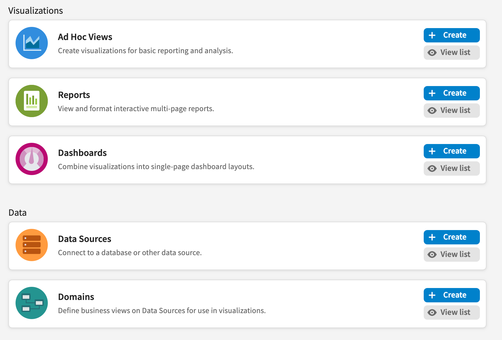

# Adding View List Buttons to the Getting Started Page

Each workflow block on the Getting Started page has a large icon you can click to open a filtered repository list. For example, you can view a list of the dashboards in your repository if you click on the icon in the Dashboards workflow block. You can add **View List** buttons to the workflow blocks that link to the appropriate repository list if you prefer your users didn't use the large icon.

To add View List buttons to workflow blocks

1.  Edit a theme or create a new one.

2.  If necessary, copy the `overrides_custom.css` file from the default theme to the main folder of your theme.

3.  Edit the `overrides_custom.css` file and add the following:

    ``` text
    .workflow-actions .button.action.view
    {
       display: inline-block;
    }
    ```

4.  Upload and activate the new theme with your CSS file and click your browser’s **Refresh** button.



*Figure 1 The Getting Started page with View List buttons in the workflow blocks*
