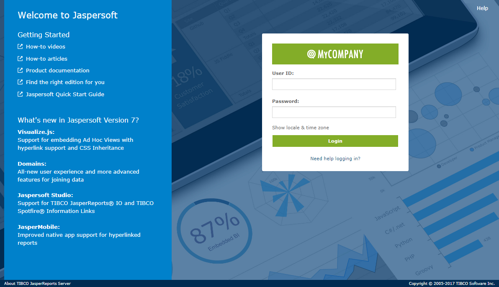
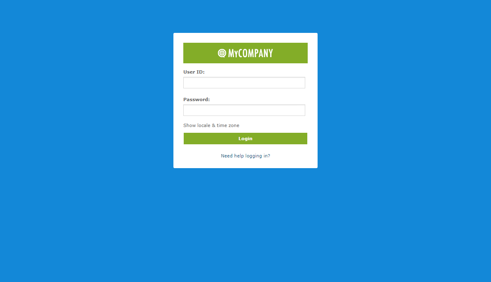
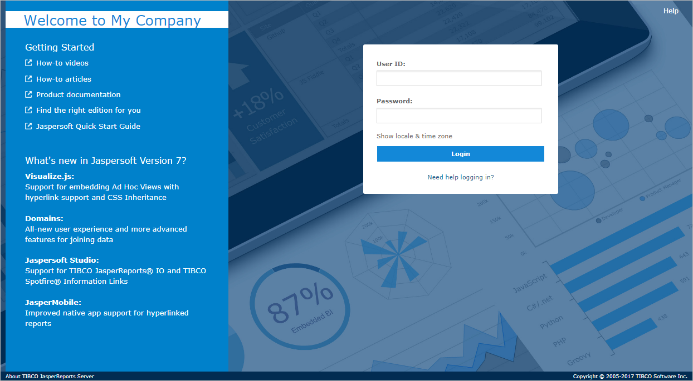
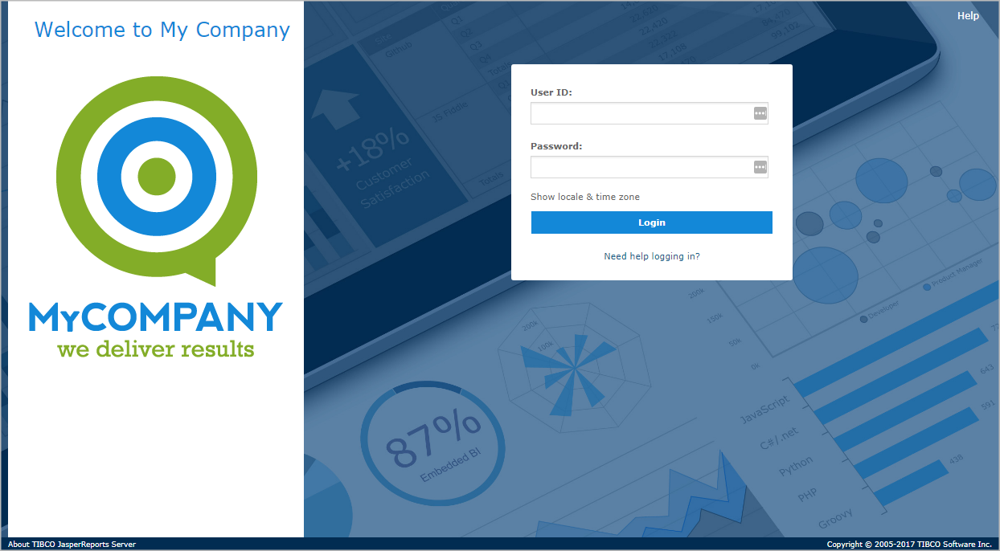
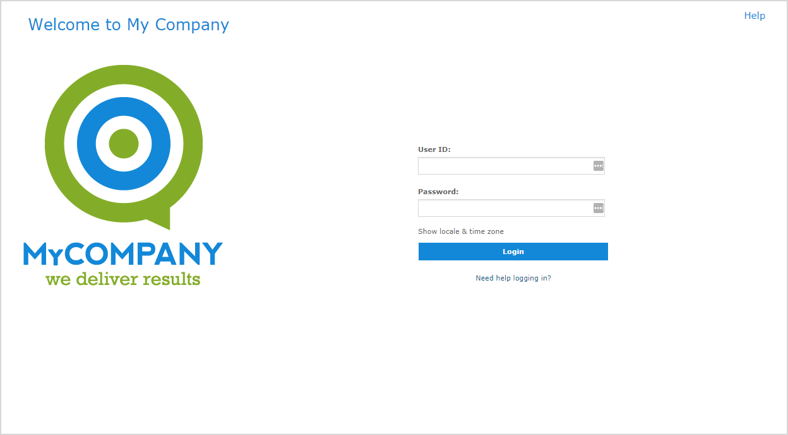

# Customizing the Login Page

If you want to replace the Jaspersoft branding, the login page requires changes to the CSS rules using a theme.

## Creating a Login Page with Custom Branding

JasperReports Server 7.0 introduced easier CSS customization of the login page. You can remove the text sidebar and add your logo to create a login page with your own custom branding. The following example shows how to do the following:

- Change the Jaspersoft logo to your own

- Hiding the Getting Started and What's New text

- Remove the background image and change the page's colors

Change the company logo and the color of the login button

1.  Edit a theme or create a new one.
2.  Edit or create the `overrides_custom.css` file in the main folder of your theme and add the following CSS rules:

```
#loginForm .devices {
background-image: url(images/logo_wide.png) !important;
background-position: center center !important;
background-size: 136px 22px !important;
background-color: #83ad28;
}
#loginPage #loginForm .action.primary {
background-color: #83ad28;
}
```

The first CSS statement changes the logo to an image file in your custom theme, defines the size and position of the logo, and sets the background behind the logo to green. The second statement sets the Login button to green.

1.  Save your files and upload your `overrides_custom.css` and your logo image file to your theme.

To optionally see the effect of the changes up to this point, save the files you modified, upload your theme and set it as the active theme, and then log out.



*Figure 1: Changing the Logo on the Login Page*

Remove the background image

1.  To hide the image of charts behind the login form, add the following CSS rule to your `overrides_custom.css` file:

```
body#loginPage {
    background: #1388d8;
}
```

This CSS rule changes the background from an image to a blue color.

1.  You also have the option of hiding the Help link and the footer text by adding the following CSS rules:

```
#frameFooter{
    display: none;
}

#loginPage #help {
    display: none;
}
```

The first rule hides the footer and the second rule hides the Help link.

1.  Save and upload your `overrides_custom.css` file to your theme.

These customizations give the login page a new appearance with all Jaspersoft branding removed.



*Figure 3: Custom Layout and Rebranding of Login Page*

## Creating a Login Page with Customized Text

If you want to add custom text to the login page, you may need to edit a number of files that define the content. The following example shows how to do the following:

- Customize CSS rules using a theme.
- Edit JSP files for the login page and login messages.
- Modify a string on the login page using properties files.

Remove the logo and add a customized welcome message

1.  Edit a theme or create a new one.
2.  Edit or create the overrides_custom.css file in the main folder of your theme and add the following CSS rules:

```
#loginForm .devices {
display: none;
}
#loginPage #welcome, #loginPage .community #welcome {
background-color: #ffffff;
}
```

The first CSS statement hides the logo. The second statement sets the background behind the "Welcome to Jaspersoft" to white.

1.  You can replace "Welcome to Jaspersoft" with text of your own. To enable the text, edit the file \<js‑webapp\>/WEB-INF/jsp/modules/login/login.jsp and locate the `welcome` div. If the spring message line is commented out, then remove the comment code:

```
<div id="welcome" class="row">
    <h1>
        <span class="logo">Jaspersoft</span>
        <spring:message code='LOGIN_WELCOME_OS'/>
    </h1>
</div>
```

1.  The text for messages is kept in the properties files. Edit \<js-webapp\>/WEB-INF/bundles/jasperserver_messages.properties and change the following string to customize the welcome text:

```
#Welcome Login Page
LOGIN_WELCOME_OS=Welcome to My Company
```

If you support multiple locales, modify the same message key in the other language bundles. See the JasperReports Server Administrator Guide for more information about localization.

1.  You can style the welcome text using CSS styles in your custom theme. To do this, return to your overrides_custom.css file and add the following rules:

```
#loginPage #welcome .text {
    color: #1388d8;
    font-size: 25px;
    font-weight: normal;
    display: inline-block;
}
```

To optionally see the effect of the changes up to this point, save the files you modified, upload your theme and set it as the active theme, and then log out .



*Figure 4: Effect of Changes to Welcome Area on Login Page*

!!! note

    In commercial editions with the organizations architecture, you must log in as system admin (`superuser`) to set the theme on the login page.

Remove the Getting Started and What's New text

1.  In your overrides_custom.css file, add the following CSS statements to remove the html code for the Getting Started and What's New text and to set the background behind them to white:

```
#loginPage #rotating > .primary,
#loginPage #rotating > .secondary {
display: none;
}
#loginPage #copy,
#loginPage .info > .content {
background-color: #ffffff;
}
```

!!! note

    The html for the What's New and Getting Started lists is located in the following files:<br>
    \<js-webapp\>/WEB-INF/jsp/modules/login/rotating/login_rotating_community_0.jsp (community edition) or \<js-webapp\>/WEB-INF/jsp/modules/login/rotating/login_rotating_pro_0.jsp (commercial editions).

1.  To place an image or logo in the area that had the lists, upload the image as part of your custom theme and set it as the background to the `rotating` div:

!!! note

    ```
    #loginPage #rotating {
        background-image: url("images/logo_square.png");
        background-position: center center;
        background-repeat: no-repeat;
        height: 400px;
        background-size: 300px;
    }
    ```

To optionally see the effect of the changes up to this point, save the files you modified, upload your theme and set it as the active theme, and then restart your app server. The figure below shows the Getting Started and What's New text replaced by an image of a fictional MyCompany logo.



*Figure 5: Adding a Logo on the Login Page*

!!! note

    In commercial editions with the organizations architecture, you must log in as system admin (`superuser`) to set the theme on the login page.

Remove background image and reposition login form

1.  To remove the background image and set the page to white, add the following CSS to your overrides_custom.css file:

```
body#loginPage {
    background: #ffffff;
}
```

1.  Reposition the login form by setting a top margin in the overrides_custom.css:

```
#loginForm .content {
    margin-top: 120px;
    padding-bottom: 12px;
}
```

1.  Hide the footer text and change the font color for the Help link by adding the following CSS rules:

```
#frameFooter{
    display: none;
}

#loginPage a#helpLink {
    color: #1388d8 !important;
    font-size: 15px;
    font-weight: normal;
}
```

The first rule hides the footer and the second rule changes the color and font size for the Help link.

1.  Save your files and upload your overrides_custom.css and your logo image file to your theme.
2.  Set your new theme as the active theme. In commercial editions with the organizations architecture, you must log in as system admin (`superuser`) to upload and activate the theme at the root level. The theme at the root level applies to the login page for all users, regardless of organization.
3.  Restart the app server or reload the JasperReports Server web app as described in [, “Reloading the JasperReports Server Web App,” on page 1](reloading-jrs-webapp.md).

These customizations give the login page a new appearance with all Jaspersoft branding removed:



*Figure 6: Custom Layout and Rebranding of Login Page*
