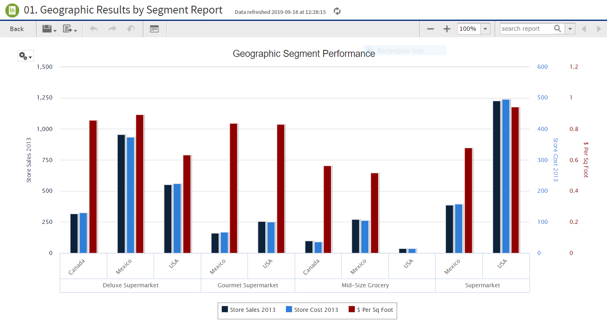
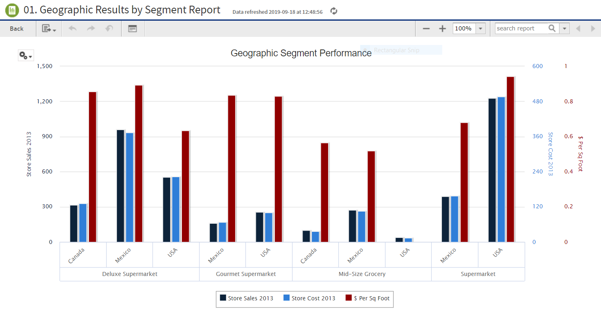

# Customizing the Report Rendering Page

The report viewer is the UI module that displays JasperReports. It is a central part of the UI that users interact with frequently. In addition to displaying the report contents, the report viewer provides the following functionality:

- Display Input controls so users can set report options, also called parameters.

- Enable navigation through the pages of the report.

- Enable users to export the report in various formats.

Each of these is customizable, which allows you to control many details of the report viewing experience. The Input controls can be set either globally or on individual reports. The report viewer can be set globally.

## Customizing Input Controls

A report can have many Input controls. You can group them by some category and display them on different tabs in the Input controls dialog. This improves the user experience.

In the following example, Input controls are grouped by location and time.

To customize the Input controls

1.  Create a report with Input controls named Country, Zip, Year, and Month.

2.  Create a `customParametersForm.jsp` file and place it in the `jasperserver-pro/WEB-INF/jsp/modules/inputControls/` folder with the following content:

    ``` javascript
    <%@ taglib prefix="t" uri="http://tiles.apache.org/tags-tiles" %>

    <jsp:include page="InputControlTemplates.jsp" />
    <script type=“text/javascript” src=“${pageContext.request.contextPath}/scripts/underscore-umd-min.js”></script>

    <!-- styles we want to apply to new tabs on Input Controls dialog -->

    <style type="text/css">

        .tabsButtons {
            margin-bottom: 30px;
        }

        #nicPanel {
            min-width:500px;
            min-height:400px;
        }

        .nicControlsPanel {
            border: 1px solid #e0e0e0;
            padding: 20px;
        }

        #nicCountrySearch {
            width: 300px;
        }

        #spanCountry {
            position: relative;
            top: -7px;
        }

        #inputControls {
            min-width: 550px;
            min-height: 500px;
        }
    </style>

    <!-- adding tabs element from template -->
    <div class="tabs tabsButtons">
        <t:insertTemplate template="/WEB-INF/jsp/templates/control_tabSet.jsp">
            <t:putAttribute name="type" value="buttons"/>
            <t:putAttribute name="containerClass" value="horizontal"/>
            <t:putListAttribute name="tabset">
                <!-- tab that will contain input controls related to Shipping Location -->
                <t:addListAttribute>
                    <t:addAttribute>nicByShippingLocationTab</t:addAttribute>
                    <t:addAttribute>By Shipping Location</t:addAttribute>
                    <t:addAttribute>selected</t:addAttribute>
                </t:addListAttribute>
                <!-- tab that will contain input controls related to Shipping Date -->
                <t:addListAttribute>
                    <t:addAttribute>nicByShippingDateTab</t:addAttribute>
                    <t:addAttribute>By Shipping Date</t:addAttribute>
                </t:addListAttribute>
            </t:putListAttribute>
        </t:insertTemplate>
    </div>
    <div id="nicByShippingLocationPanel" class="nicControlsPanel">
    </div>
    <div id="nicByShippingDatePanel" class="nicControlsPanel"></div>

    <script type="text/javascript">
        document.addEventListener("controls:initialized", function(event) {
        const controlsViewModel = event.detail;
        controlsViewModel.draw = function (jsonStructure) {

            //get and initialize Inptut Controls object
            const drawControl = function (container, jsonControl) {
                if (jsonControl.visible) {
                    const control = this.findControl({id: jsonControl.id});
                    control.render();
                    document.getElementById(container).append(control.getElem() && control.getElem()[0]);
                }
            };

            //selecting only input controls named Country or Zip
            const leftPanelControls = _.filter(jsonStructure, function (controlStructure) {
                return _.indexOf(["Country", "Zip"], controlStructure.id) >= 0;
            });

            //assigning Country and Zip ICs to the left panel
            _.each(leftPanelControls, _.bind(drawControl, this, "nicByShippingLocationPanel"));


            //selecting only input controls named Year or Month
            const rightPanelControls = _.filter(jsonStructure, function (controlStructure) {
                return _.indexOf(["Month", "Year"], controlStructure.id) >= 0;
            });


            //assigning Year and Month ICs to the right panel
            _.each(rightPanelControls, _.bind(drawControl, this, "nicByShippingDatePanel"));
        };

        // tab handlers
        const nic = {
            tabByShippingLocationClickHandler: function () {
                document.getElementById("nicByShippingLocationPanel").hidden = false;
                document.getElementById("nicByShippingDatePanel").hidden = true;
                document.querySelector("div.tabs.tabsButtons > ul > li.tab.first").
                           classList.add("selected");
                document.querySelector("div.tabs.tabsButtons > ul > li.tab.last").
                           classList.remove("selected");
            },

            tabByShippingDateClickHandler: function () {
                document.getElementById("nicByShippingLocationPanel").hidden = true;
                document.getElementById("nicByShippingDatePanel").hidden = false;
                document.querySelector("div.tabs.tabsButtons > ul > li.tab.last").
                           classList.add("selected");
                document.querySelector("div.tabs.tabsButtons > ul > li.tab.first").
                           classList.remove("selected");
            }
        };

        nic.clickHandlerMap = {
            'nicByShippingLocationTab':nic.tabByShippingLocationClickHandler,
            'nicByShippingDateTab':nic.tabByShippingDateClickHandler
        };


        // assign handlers
        _.each(nic.clickHandlerMap, function (handler, selector) {
            const shippingTabElement = document.getElementById(selector);
            shippingTabElement.addEventListener('click', handler, false);
        });
    });
    </script>
    ```

3.  Download the `underscore-umd-min.js` script from <https://underscorejs.org/underscore-umd-min.js> and place it into `/webapps/jasperserverpro/scripts/`.

4.  Restart JasperReports Server.

5.  Go to **View \> Repository** and click **Edit**.

6.  Select **Controls & Resources** from the menu and then enter `modules/inputControls/customParametersForm.jsp` in the **Optional JSP Location** field.

7.  Save and run the report.

You can see that the **Input Controls** dialog has two tabs "By Shipping Location" and "By Shipping Date". Each of these tabs contains the corresponding Input controls.


*Figure 1: By Shipping Location Tab*


*Figure 2: By Shipping Date Tab*

## Customizing the Report Viewer

The report viewer creates the page with the controls for paging through a report, and then exporting its contents in other formats. The main JSP files of the report viewer are:

`<js-webapp>/WEB-INF/jsp/modules/viewReport/ViewReport.jsp`

`<js-webapp>/WEB-INF/jsp/modules/viewReport/DefaultJasperViewer.jsp`

To change the report viewer, modify and save the default files without changing their names. The procedure would be similar to [Customizing JSP and JavaScript for the Login Page](customizing-login-page.md). After redeploying the web app, your changes to the report view appear in every report for every user. The following example shows how to modify the `ViewReport.jsp` file so that the Save and Save As options are only visible to administrators.

To modify the Save and Save As buttons in the report viewer:

1.  Add the line to import the Spring `authz` tag near the beginning of the file. This line is necessary to implement access control in a JSP file:

    `<%@ taglib uri="http://www.springframework.org/security/tags" prefix="authz"%>`

    ``` text
    ...
    <%@ taglib prefix="t" uri="http://tiles.apache.org/tags-tiles" %>
    <%@ taglib prefix="c" uri="http://java.sun.com/jstl/core_rt" %>
    <%@ taglib prefix="spring" uri="http://www.springframework.org/tags" %>
    <%@ taglib prefix="js" uri="/WEB-INF/jasperserver.tld" %>
    <%@ taglib prefix="fn" uri="http://java.sun.com/jsp/jstl/functions" %>
    <%@ taglib  prefix="authz" uri="http://www.springframework.org/security/tags"%>
    ...
    ```

2.  Insert `authz:authorize` tags around the elements that implement the **Save** and **Save As** options.

``` text
<%-- changes for Ult Guide to remove save buttons --%>
<authz:authorize access="hasRole('ROLE_ADMINISTRATOR')">
  <c:if test="${isPro}">
     <li class="leaf"><button id="fileOptions" class="button capsule mutton up first"
          title="<spring:message code="button.save"/>" disabled="true">
          <span class="wrap"><span class="icon"></span>
          <span class="indicator"></span></span></button></li>
  </c:if>
  <c:if test="${!isPro}">
    <li class="leaf"><button id="fileOptions" class="button capsule mutton up first"
          title="<spring:message code="button.save"/>
           - <spring:message code="feature.pro.only"/>" disabled="true">
          <span class="wrap"><span class="icon"></span>
          <span class="indicator"></span></span></button></li>
   </c:if>
</authz:authorize>
```

The following figure shows that the Save icon at the top left, under the report title, still appears for an administrator:



*Figure 3: Administrator's View of Modified Report Viewer*

The following figure shows the view for an end user, with the Save icon removed.



*Figure 4: User's View of Modified Report Viewer*
