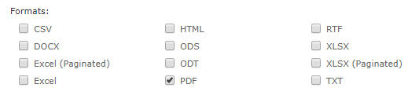

# Customizing the Scheduler Pages

The Output Options pages of the report scheduler and dashboard scheduler display the output types available for a scheduled report or dashboard. You can customize these options in several ways:

- Show or hide specific output types on the scheduler page. When an output type is hidden, it does not show on the **Output Options** page, but can still be accessed via REST.

- Disable specific output types for the schedulers.

## Customizing Display of Available Outputs

The Output Options pages of the report scheduler and dashboard scheduler display the output types available for a scheduled report or dashboard.

To show or hide output options in the scheduler

1.  Edit the file `<js-webapp>/WEB-INF/applicationContext-report-scheduling.xml`.
2.  Locate the bean for the page you want to edit:

- For report output formats, locate the `availableReportJobOutputFormats` bean.
- For dashboard output formats, locate the `availableDashboardJobOutputFormats` bean.

For example, the `availableReportJobOutputFormats` bean might look like this:

```
<util:list id="availableReportJobOutputFormats" value-type="java.lang.String">
        <value>CSV</value>
        <value>HTML</value>
        <value>RTF</value>
        <value>DOCX</value>
        <value>ODS</value>
        <value>XLSX_NOPAG</value>
        <value>XLS</value>
        <value>ODT</value>
        <value>XLSX</value>
        <value>XLS_NOPAG</value>
        <value>PDF</value>
        <value>PPTX</value>
        <!--<value>TXT</value>-->
        <value>DATA_SNAPSHOT</value> <!-- This one will not appear if data snapshot persistence is turned off  -->
    </util:list>
```

1.  To hide an output format on the Output Options page, comment out the corresponding option. To enable an option, uncomment it. For example, to hide PowerPoint (PPTX) output and enable text (TXT) output, edit those lines:

```
<util:list id="availableReportJobOutputFormats" value-type="java.lang.String">
        <value>CSV</value>
        <value>HTML</value>
        <value>RTF</value>
        <value>DOCX</value>
        <value>ODS</value>
        <value>XLSX_NOPAG</value>
        <value>XLS</value>
        <value>ODT</value>
        <value>XLSX</value>
        <value>XLS_NOPAG</value>
        <value>PDF</value>
        <!--<value>PPTX</value>-->
        <value>TXT</value>
        <value>DATA_SNAPSHOT</value> <!-- This one will not appear if data snapshot persistence is turned off  -->
    </util:list>
```

1.  Save the modified files and reload the web app in the app server to see the changes (see [1.0.1, “Reloading the JasperReports Server Web App,” on page 1](reloading-jrs-webapp.md)).
2.  Open the report scheduler by navigating to a report in the repository, right-clicking on the report, and selecting **Schedule…** from the context menu. Go to the **Output Options** tab to see that the visible options reflect your uncommented options in the `applicationContext-report-scheduling.xml` file.



*Figure 1: Modified List of Formats on Output Options Page*

## Disabling output formats

When you disable an output format, the corresponding output will not be generated even if it is selected in the UI or via REST.

1.  Edit the file `<js-webapp>/WEB-INF/applicationContext-report-scheduling.xml`.
2.  Locate the `outputFormatMap` bean:

```
<util:map id="outputFormatMap">
        <entry key="pdf" value-ref="pdfOutput"/>
        <entry key="html" value-ref="htmlOutput"/>
        <entry key="xls" value-ref="xlsOutput"/>
        <entry key="xlsNoPag" value-ref="xlsNoPagOutput"/>
        <entry key="rtf" value-ref="rtfOutput"/>
        <entry key="csv" value-ref="csvOutput"/>
        <entry key="odt" value-ref="odtOutput"/>
        <entry key="txt" value-ref="txtOutput"/>
        <entry key="docx" value-ref="docxOutput"/>
        <entry key="ods" value-ref="odsOutput"/>
        <entry key="xlsx" value-ref="xlsxOutput"/>
        <entry key="xlsxNoPag" value-ref="xlsxNoPagOutput"/>
        <entry key="pptx" value-ref="pptxOutput"/>
        <entry key="json" value-ref="jsonOutput"/>
    </util:map>
```

1.  Comment out the format(s) you do not want generated.
2.  To avoid user confusion, hide disabled formats on the scheduler page(s), as described in the previous section. Even if the output format is selected on the scheduler page, the output will not be generated.
3.  Save the modified files and reload the web app in the app server to see the changes (see [1.0.1, “Reloading the JasperReports Server Web App,” on page 1](reloading-jrs-webapp.md)).
