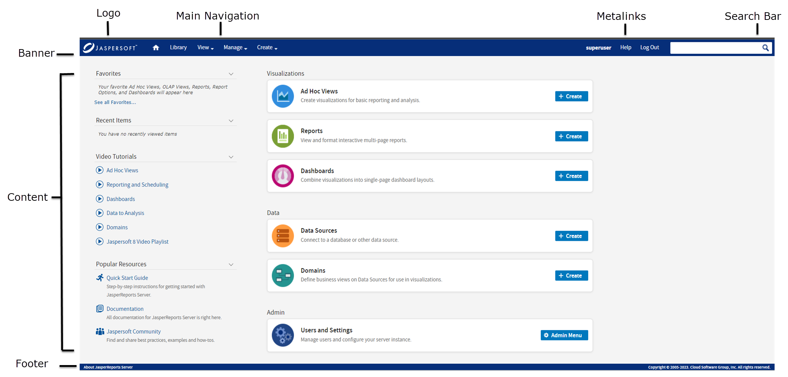

# Customizing the Branding with SiteMesh

JasperReports Server uses the SiteMesh framework to lay out and decorate nearly every page. The decoration is the HTML for the headers and footers that are nearly identical on every page.

The SiteMesh framework is controlled by the following files:

-   `<js-webapp>/WEB-INF/web.xml`

-   `<js-webapp>/WEB-INF/sitemesh.xml`

-   `<js-webapp>/WEB-INF/decorators.xml`

-   `<js-webapp>/WEB-INF/decorators/main.jsp`

-   `<js-webapp>/WEB-INF/decorators/decorator.jsp`

Essentially, the XML files specify how UI pages should be generated, and the JSP files generate the pages. The following sections describe these files and how to customize the JSPs to change the overall branding of the UI.

## web.xml

The `<js-webapp>/WEB-INF/web.xml` configuration file contains the configuration information that enables SiteMesh. You can see that SiteMesh’s `PageFilter` class is applied to all targeted URLs (that is, `<url-pattern>/*</url-pattern>`):

``` xml
<filter>
  <filter-name>sitemesh</filter-name>
  <filter-class>com.opensymphony.module.sitemesh.filter.PageFilter</filter-class>
</filter>
...
<filter-mapping>
  <filter-name>sitemesh</filter-name>
  <url-pattern>/*</url-pattern>
  <dispatcher>FORWARD</dispatcher>
</filter-mapping>
```

## sitemesh.xml and decorators.xml

The SiteMesh page filter assumes that the `<js-webapp>/WEB-INF/sitemesh.xml` file specifies further configurations. You can see that the main decorator’s definition points to `decorators.xm`l. You'll also see the SiteMesh mapping that handles the default locale (U.S. English):

``` xml
<property name="decorators-file" value="/WEB-INF/decorators.xml"/>
<!-- Mapper for localization -->
<mapper class="com.opensymphony.module.sitemesh.mapper.LanguageDecoratorMapper">
  <param name="match.en" value="en"/>
  ...
</mapper>
```

Next, look at the `<js-webapp>/WEB-INF/decorators.xml` file. First it defines URL patterns that SiteMesh should skip. Then it defines the main decorator JSP page that is used by JasperReports Server:

``` xml
<excludes>
  <pattern>*adhoc/crosstab*</pattern>
  <pattern>*adhoc/table*</pattern>
  ...
</excludes>
<decorator name="main" page="main.jsp">
  <pattern>/*</pattern>
</decorator>
...
```

!!! note

    For more detailed information about SiteMesh and decorators, see <https://github.com/sitemesh/sitemesh2>.

## main.jsp and decorator.jsp

In `<js-webapp>/WEB-INF/decorators/`, the `main.jsp` includes the `decorator.jsp` file, and together they set the appearance and layout of the JasperReports Server web interface. Figure 1-1 shows the display elements as they appear in JasperReports Server.



*Figure 1: JasperReports Server Display Elements*

In particular, `decorator.jsp` specifies all the display elements that appear as the header and footer of every JasperReports Server page. Inside the header and footer and main frame is the `<decorator:body/>` tag that specifies where to add the HTML content generated for the target page.

In `decorator.jsp`, you can see the structure of every JasperReports Server HTML page, with the main frame, the banner, the body content, and the footer:

``` html
<html>
<head>
<title>Jaspersoft: <decorator:title /></title>
...
<decorator:head />
</head>
<body id="<decorator:getProperty property='body.id'/>"
class="<decorator:getProperty property='body.class'/>">
<div id="banner" class="banner">
...
<div id="logo" class="sectionLeft"></div>
...
<div class="sectionLeft">
...
<div id="mainNavigation" class="menu horizontal primaryNav">
iv class="sectionRight searchContainer">
...
<ul id="metaLinks" class="sectionRight">
...
</div>
<div id="frame" style="<c:if test="${param['frame'] == 0}">top:0;bottom:0;</c:if>">
<div class="content">
<decorator:body />
</div>
</div>
<div id="frameFooter">
...
</div>
...
</body>
</html>
```

For example, if the user clicks `View > Reports`, the action executes `WEB-INF/jsp/modules/ListReports.jsp` is. The `ListReports.jsp` generates the HTML content. Before this content is emitted, the SiteMesh page filter inserts the content into the location specified by `<decorator:body/>`. Then the whole HTML content is sent to the user’s browser.

## Editing decorator.jsp for Rebranding

Now that you know how `decorator.jsp` defines the main page of the server UI, you can customize the file. If you use JasperReports Server as part of your suite of business applications, you may not want the Jaspersoft branding on the page. Editing the decorators.jsp file in the deployed webapp lets you remove the branding. The following elements make up the Jaspersoft branding:

-   The company logo: to change or remove the logo , see [1.0.1, “Changing the Logo and Favicon,” on page 1](themes-customizing-logo-and-favicon.md).

-   The browser icon (favicon): to change or remove the browser icon, see [1.0.1, “Changing the Logo and Favicon,” on page 1](themes-customizing-logo-and-favicon.md).

-   The page title appearing in the browser.

-   The About link and copyright footer on every page.

To edit the page title

1.  Edit the file `<js-webapp>/WEB-INF/decorators/decorator.jsp`.

2.  Change the title text, for example:

    ``` html
    <html>
      <head>
        <title>My Company: <decorator:title /></title>
        ...
        <decorator:head />
      </head>
      ...
    ```

3.  After saving your changes to the JSP file, restart your application server or reload the JasperReports Server web app.

To change the footer text

1.  Edit the file `<js-webapp>/WEB-INF/decorators/decorator.jsp`.

2.  Change the footer text, for example to comment out the about and copyright lines:

    ``` text
    ...
    <div id="frameFooter">
    <!-- <p id="about">
      <a href="#"><spring:message code="decorator.aboutLink"/></a>
      <c:if test="${isDevelopmentEnvironmentType}">
        <span id="license">
          (<spring:message code="LIC_023_license.envtype.development.label"/>)
        </span>
      </c:if>
      </p>
      <p  id="copyright"><spring:message code="decorators.main.copyright"/></p>
    -->
    </div>

    ...
    ```

3.  After saving your changes to the JSP file, restart your application server or reload the JasperReports Server web app.

!!! warning

    If you are rebranding JasperReports Server, you must display "Powered by Jaspersoft" on any distributed reports or report portal. You may not remove or delete any of Jaspersoft's copyright or other proprietary notices.
