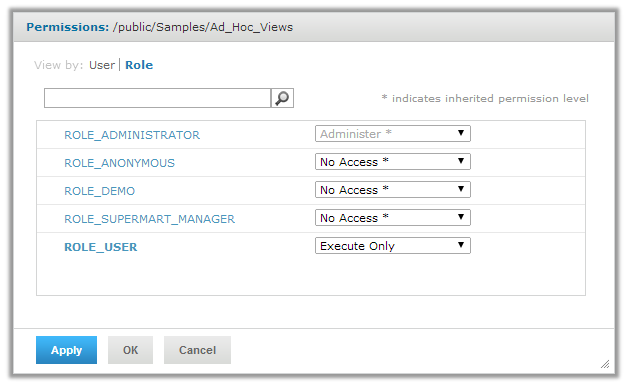

# Restricting Access to a Location in the Repository

You can use role-based permissions to control access to repository locations. For example, by default, the **Public &gt; Samples &gt; Ad Hoc Views** folder is set to **Read Only** for ROLE_USER. This allows users to see the folder contents and to create new reports from the Ad Hoc views in this folder, but they can't edit those views.

You can hide the contents of this folder from ROLE_USER by setting repository permissions to execute only. To do this:

1.  Log in as jasperadmin.

2.  Select **View &gt; Repository** from the menu.

3.  Navigate to the **Public/Samples** folder.

4.  Right-click the **Ad Hoc Views** folder and select **Permissions...**

5.  Change the permissions for ROLE_USER to **Execute Only**.

    

    *Figure 1 Setting Permissions to Execute Only*

6.  Click **OK**.

With these permissions, when users with no additional permissions select Library view, they won't see the Ad Hoc views in this folder, nor do they see the folder in the Repository. But they're still able to open reports based on the views in this folder.

!!! note

    When you restrict access based on file location in the repository, if a user saves an Ad Hoc view to a different location, users will still be able to access the view according to the permissions set on that location. You can also restrict access based on the Spring web flow. See [section 1.0.1, “Restricting Access by Role,” on page 1](restricting-access-by-role.md) for more information.
