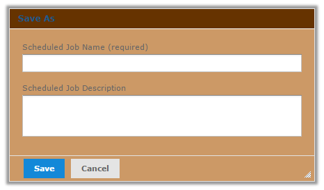
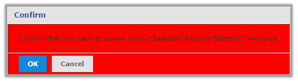
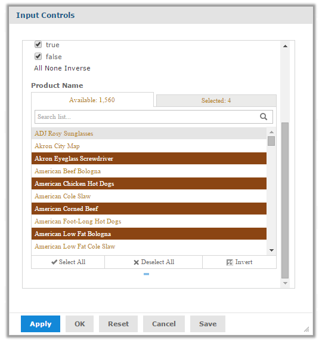

# Changing Dialog Boxes

The alternate themes pods_summer and jasper_dark show some of the customizations that are possible using themes. To explore additional customizations you can do, download the default theme and look at the various CSS files. For example, you can customize the color of dialog boxes by overriding the CSS in the .dialog section of containers.css.

The containers.css file supports several subclasses of dialog boxes. The `dialog.overlay` and `dialog.overlay.widget` classes are used for free-standing dialog boxes. The `dialog.inlay` class is used for some special dialog boxes, usually dialog boxes that are integrated into the page where they appear, such as the login box on the login screen.

To change the background color for dialog boxes

1.  Edit a theme or create a new one.

2.  If necessary, copy the overrides_custom.css file from the default theme to the main folder of your theme.

3.  Download overrides_custom.css from your theme and open the file in a text editor.

4.  To identify the properties you want to modify, open the containers.css file from the default theme in another window of the text editor, and find the `.dialog` section.

5.  Copy the CSS you want to modify from containers.css and paste it in your overrides_custom.css.

6.  Modify the overrides_custom.css file. To change the background, add rules like the following:

    <table>
    <colgroup>
    <col style="width: 100%" />
    </colgroup>
    <tbody>
    <tr>
    <td>
<pre><code>.dialog.overlay .header {
        background: #663300;
    }

.dialog.overlay {
        background-color: #CC9966;
    }

.dialog .sub.header {
        background-color: #CC9966;
    }

.dialog.inlay {
        background-color: #CC9966;
    }</code></pre>
</td>
    </tr>
    </tbody>
    </table>

7.  Upload overrides_custom.css to your chosen location.

8.  Activate your new theme and click your browser’s **Refresh** button.

Customization of dialog box using themes

To limit the scope of a customization to a specific dialog box, use the ID of the dialog box. For example, to change the background of the \#standardConfirm dialog box displayed when a user is required to confirm an action, use code like the following:

<table>
<colgroup>
<col style="width: 100%" />
</colgroup>
<tbody>
<tr>
<td>
<pre class="sourceCode bash"><code class="sourceCode bash">#standardConfirm.dialog.overlay {
    background-color: red;
}</code></pre>
</td>
</tr>
</tbody>
</table>

Customization of specific dialog box using themes

You can find the IDs for common dialog boxes in the Dialogs section of the UI Sample Galleries. See the JasperReports Server Administrator Guide for more information.

## Changing Font and Color for Input Controls

Some input controls allow you to choose from a list of options. You can customize the font and color of this list by overriding certain properties in the jasper-ui.css file.

To modify input controls

1.  Edit a theme or create a new one.

2.  If necessary, copy overrides_custom.css file from the default theme to the main folder of your theme.

3.  Download overrides_custom.css from your theme and open the file in a text editor.

4.  Open the jasper-ui.css file from the jasper-ui folder of the default theme in another window of the text editor, find the .jr-mSelectlist-item.jr\* sections to select the CSS you want to modify.

5.  Copy the CSS you want to modify from jasper-ui.css and paste it in your overrides_custom.css.

6.  Make your changes to overrides_custom.css. For example, the following changes set the font color to `#B8860B` and the font style to `serif`, and set the background color when an item is selected to `#8b4513`:

    <table>
    <colgroup>
    <col style="width: 100%" />
    </colgroup>
    <tbody>
    <tr>
    <td>
<pre><code>.jr-mSelectlist.jr {
    /* fonts */
      font-family:serif;
      color: #B8860B;
    }

.jr-mSelectlistSelected.jr &gt; .jr-mSelectlist-item.jr {
      background-color: #8b4513;
    }</code></pre>
</td>
    </tr>
    </tbody>
    </table>

7.  Upload overrides_custom.css to your chosen location.

8.  Activate your new theme and click your browser’s **Refresh** button.

JasperReports Server can display the input controls form in a pop-up window (the default), in a separate page, in a separate column, or at the top of the report page. The overrides you make show in all reports with input controls.

Input Control Dialog Modified Using Themes
