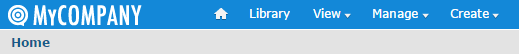

# Changing the Logo and Favicon

One very simple way to customize JasperReports Server is to replace the logo and/or favicon with your own images.

The Jaspersoft logo is white on a transparent border and is displayed on the blue background of the default theme. If your logo isn't visible on this background. you can change the background color to suit your needs, as explained in [1.0.1, “Changing Colors and Fonts,” on page 1](themes-changing-colors-and-fonts.md). You can change the logo either of these ways:

- Replace the logo file with your own. If your logo has roughly the same dimensions as the Jaspersoft logo you can simply replace the logo file. The Jaspersoft logo is 200 pixels wide by 23 pixels high.

- Change the CSS to load your logo file. If you can't make your logo to fit the CSS, edit the CSS to load your logo.

To change the favicon, replace the favicon file. The favicon is 16 pixels wide by 16 pixels high and saved as a .ico file.

For additional ways to change the branding of the server, see [1.1.4, “Editing decorator.jsp for Rebranding,” on page 1](customizing-ui-with-sitemesh.md).

## Replacing the Files

One way to replace the logo and/or favicon is to create an image file with the same file name as the one provided with the server. When you create a theme with this file in the same path as the logo or favicon file, your image is displayed instead. This is the easiest customization.

To replace the logo and/or favicon file with your own

1.  Edit a theme or create a new one. Make sure it includes a folder named images.
2.  Do one or both of the following:

- Replace the logo. Convert your logo image to the SVG format, save it with the filename logo_reverse.svg, and copy it to the images folder.
- Replace the favicon. Convert your favicon to the ICO format, save it with the filename favicon.png, and copy it to the images folder.

1.  Upload and activate the new theme to the chosen location and click your browser’s **Refresh** button. Your logo appears in the top-left corner of every page:



*Figure 1: MyCompany Logo on Home Page*

## Modifying the CSS File

Another way to replace the logo is to modify the CSS files in the theme to reference your own image files. This creates a new filename and path. Use this procedure if your logo can't be modified to fit. The Jaspersoft logo is 200 pixels wide by 23 pixels high.

To modify the CSS file to use your own logo file

1.  Edit a theme or create a new one. In this theme, you can place your image file in any folder structure you want.
2.  If necessary, copy the **overrides_custom.css** file from the default theme to the main folder of your theme.
3.  Edit the **overrides_custom.css** file and add rules like those below. In this example, the logo is a file called MyCompanyLogo.png in a folder called MyImages and is 40px x 230px. Adjust all pixel values based on the dimensions of your image:

```
#logo { /* new logo image name and size (example is twice the original logo) */
  background: url("images/MyCompanyLogo.png") 0 0;
  height: 40px;
  width: 230px;
}
.banner { /* increases height of banner to accommodate bigger logo */
  height:65 px
}
#frame { /* moves the main frame a bit down to accommodate bigger logo */
  top: 66px;
}
```

!!! note

    The IDs and classes used in the CSS are dependent on the JSP source code for the server. Look at the JSP files to see which IDs and property values are used. Alternatively, you can inspect the HTML and CSS returned by the server, for example by using the developer tools in Firefox. For more information, see the *JasperReports Server Administrator Guide*.

1.  Upload and activate the new theme with your images and CSS file and click your browser’s **Refresh** button.
