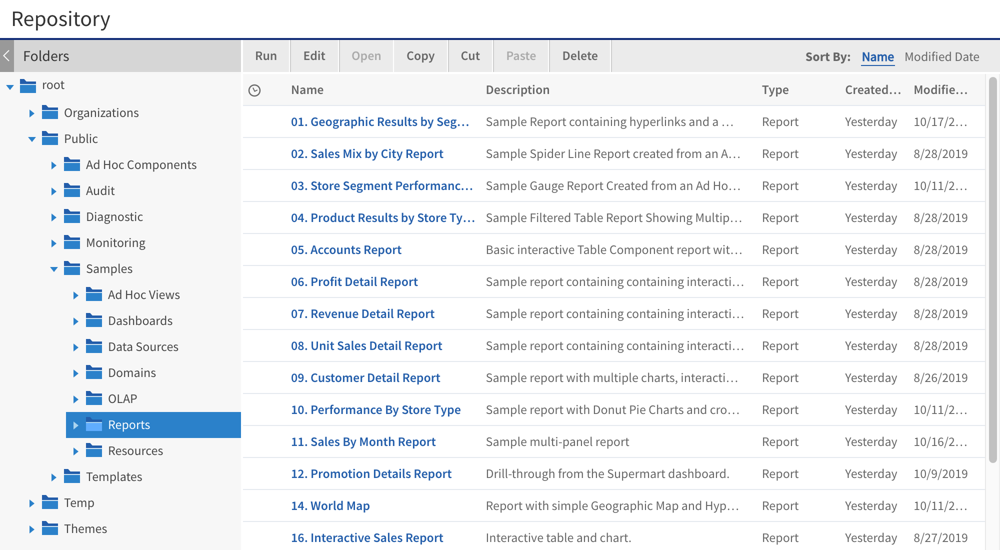

# Using Themes to Remove Branding

One advantage of customizing CSS in themes is that you can drastically change the appearance of the UI with very few overrides. CSS controls the spacing and layout of page content, so by changing a few rules, you can rearrange the default layout in many ways.

!!! note

    Many CSS attributes affect spacing, including margins, borders, and edge and corner images. Also, the various `div` elements that make up the UI interact, making it hard to set the spacing correctly in some cases. Be sure to look at your overrides on all JasperReports Server pages to verify that the appearance is consistent and correct throughout the UI.

If you embed JasperReports Server in your application, you may want to remove all branding and menus. The following example shows how to remove the banner and footer entirely using themes.

!!! warning

    Removing the menus restricts your ability to navigate the JasperReports Server UI. If you need to revert to the default theme, change your theme for the session by adding `&theme=default` to the end of the current URL. You can also log in as an administrator, select **Manage Server**, then select **Repository** to locate and change themes.

1.  Create a new theme in JasperReports Server. This example assumes you named the theme "embed".

2.  On your computer, create the following CSS file and save it as `overrides_custom.css`.

    ``` text
    /*
    overrides_custom.css
    Basic theme for embedding
    */
    body {
      background-color: white;
      background: none;
    }
    #banner {
      background: none;
      display:none;
    }
    #frame {
      top: 0;
      bottom: 0;
    }
    #frameFooter {
      display:none;
    }
    ```

    !!! warning

        If you're rebranding JasperReports Server, you must use the phrase "Powered by Jaspersoft" on any distributed reports or report portal. You may not remove or delete any of Jaspersoft's copyright or other proprietary notices.

3.  Log into JasperReports Server as an administrator.

4.  Select **View &gt; Repository** and navigate to the location where you created your theme.

5.  Right-click the embed theme in the repository and select **Add Resource &gt; File &gt; CSS**.

6.  Select the `overrides_custom.css` file you created and enter `overrides_custom.css` for the Name and Resource ID.

7.  Click **Submit**.

8.  Right-click the embed theme and select **Set as Active Theme**. The result is a theme that has no footers or menus.



*Figure 1: Basic Theme for Embedding*
