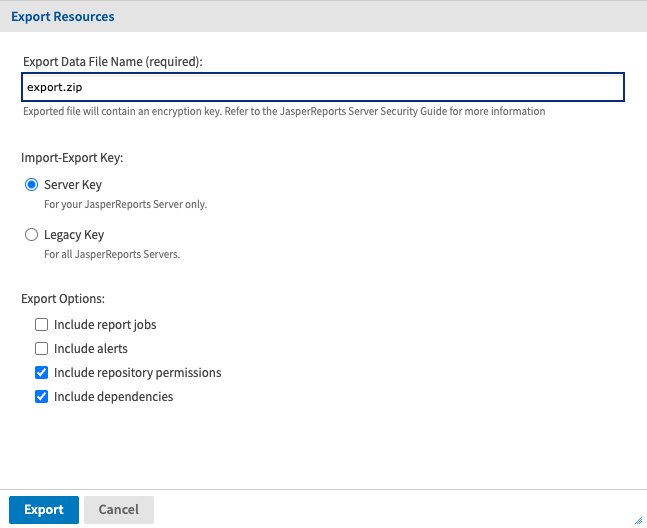
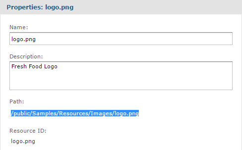
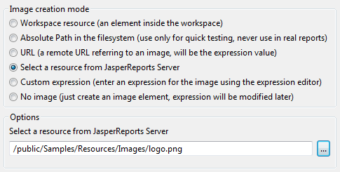
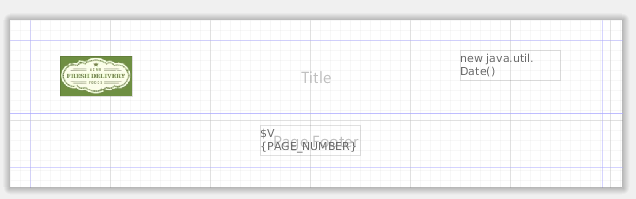
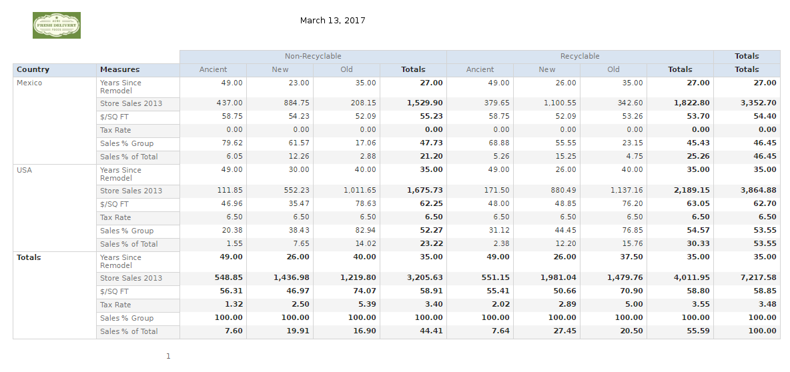

# Creating a New Report Template

Report templates customize the look of the reports you create from Ad Hoc views. JasperReports Server has several report templates in the `Public/Templates` folder of the repository. If you want to create a new report template, Jaspersoft recommends editing the default report template in Jaspersoft Studio and importing it into JasperReports Server.

The following example shows how to create a template using the following:

-   Export the default report template from JasperReports Server. This is usually the Actual Size report template, which is used in this example.

-   Edit the report template in Jaspersoft Studio to add a page header with a company logo and the current date and a page footer with the page number. This example uses the `logo.png` sample image from the JasperReports Server's repository as part of the updated template.

-   Import the edited report template as a new template in JasperReports Server and use it to create a report from an Ad Hoc view.

!!! note

    Do not use the original filename for the new template file. JasperReports Server will overwrite the original template if you upload a new file with the same filename. In addition, your changes may be overwritten if you upgrade the server. See the JasperReports Server Administrator Guide for details on how you can change the default template for reports.

To export a template in JasperReports Server

1.  Log in as an admin to JasperReports Server.

2.  Click **View &gt; Repository** and browse to **Public &gt; Templates**.

3.  Right-click on the Actual Size report template and select **Export**. The **Export Resources** dialog appears.

    

    *Figure 1: Export Dialog Box*

4.  If desired, change the default name of the zip file for the exported catalog. This dialog allows only the zip archive format.

5.  Select the Legacy key to protect any passwords in the export catalog.

6.  Click **Export**. The server generates the catalog Zip file and your browser prompts you to save the file.

7.  Locate the Zip file in your download folder and extract the files.

8.  In the extracted files folder, find `resources/public/templates/actual_size.<ver>.jrxml.data`.

9.  Rename the file to remove the .data extension. The filename should now be `actual_size.<ver>.jrxml`.

10. Move the template file to your MyReports folder in your Jaspersoft Studio workspace.

11. In JasperReports Server browse to **Public &gt; Samples &gt; Resources &gt; Images**.

12. Right-click the logo.png file and select **Properties** from the context menu.

13. Copy the path for the file and click **Cancel**.

*Figure 2: Image Properties Box*

To edit a report template in Jaspersoft Studio

1.  Open Jaspersoft Studio.

2.  Go to **File &gt; Open File**.

3.  Browse to your My Reports folder, select the template file, and click **Open**. Jaspersoft Studio opens the template in the **Design** tab.

4.  In the **Outline** tab, right-click **Page Header** and select **Add Band**. The **Page Header** band appears in the template.

5.  Right-click **Page Footer** and select **Add Band**. The **Page Footer** appears in the template.

6.  From the **Palette** tab, drag the **Image** element to the Title band of the template. The Create new image element window appears.

7.  Select **Select a resource from Jaspersoft Server**.

8.  Enter the repository path for the `logo.png` image file in the field under **Options** and click **OK**.

    

    *Figure 3: Create New Image Element Window*

9.  Click and drag the image's margins to adjust its size.

10. From the **Palette** tab, drag the **Current Date** element to the title bar of the template.

11. Drag the **Page Number** element to the footer of the template.

    

    *Figure 4: Customized Report Template*

12. Save the template with a new filename.

!!! note

    Do not export the template through Jaspersoft Studio. It must be exported manually from JasperReports Server so that it can be uploaded as a template, not a report.

To import a template and create a report in JasperReports Server

1.  In JasperReports Server, click **View &gt; Repository** and browse to **Public &gt; Templates**.
2.  Right-click the **Templates** folder and select **Add Resource &gt; File &gt; JRXML** from the context menu. The **Add File** page appears.
3.  Enter the required information for the template. Click **Choose File** to locate the report template on your file system.
4.  When done, click **Submit**. The new template appears in the Templates folder in the repository.
5.  On the JasperReports Server Home page, click **Create** in the Reports block. The **Create Report** wizard opens.
6.  Select the Ad Hoc view you want to use as the basis for your report.
7.  Select your new report template.
8.  Click **OK**. If asked, enter the input controls needed.

JasperReports Server displays the report.

*Figure 5: Report with New Template*
