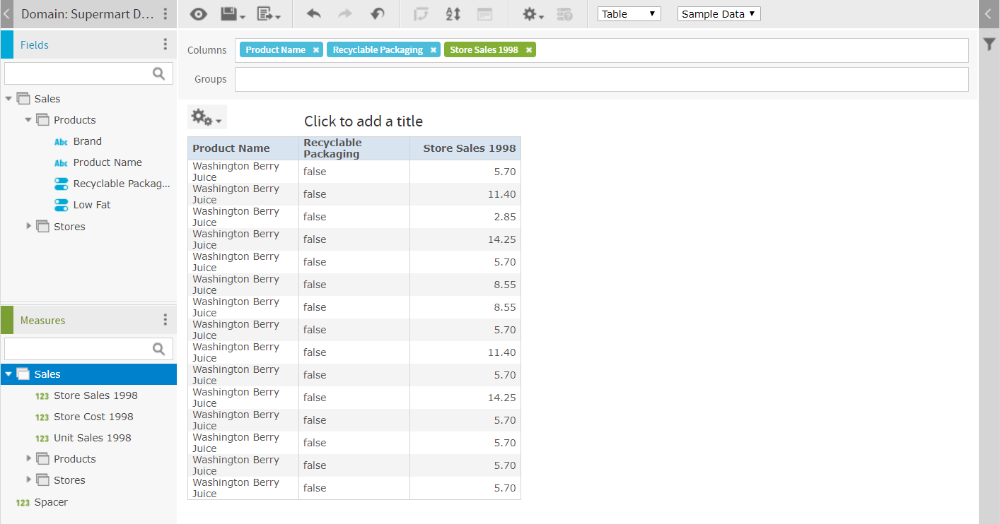
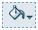
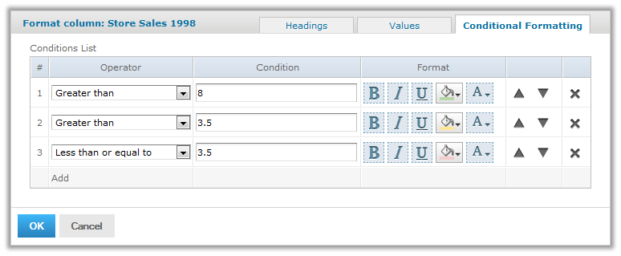
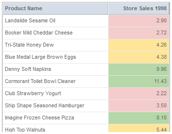

# The Report Viewer and Conditional Text

The interactive Report Viewer lets you highlight table values using conditional formatting. This section shows how to use multiple conditions in a table to create a stoplight format based on ranges. To set up this format, you need to use the inheritance feature of conditional formatting. For colored backgrounds, this specifies that when a table cell satisfies multiple conditions, the condition that appears highest in the list of conditions is applied.

To create the Ad Hoc table for use in the example

1.  Select **Create &gt; Ad Hoc View** from the menu. The **Data Chooser** wizard opens.

2.  Click **Domains**, select SuperMart Domain, and click **Choose Data**. The **Data Chooser** opens to the **Select Fields** page.

3.  In the **Source** panel, double-click Sales to move it to the **Selected Fields** panel and click **OK**. The Ad Hoc Editor is displayed with the selected fields.

4.  Click . The **Select Visualization Type** window appears.

5.  Select  and click **X** in the upper corner of the window to create a table.

6.  Double-click the following fields and measures to add them to the Columns area: Product Name, Recyclable Packaging, Store Sales. The Ad Hoc view appears as shown in the following figure.

    

    *Figure 1: Ad Hoc View for Conditional Text*

7.  Hover over  and select **Save Ad Hoc View and Create Report**. The **Save Ad Hoc View** dialog opens.

8.  Fill in the required fields as follows:

    1.  Data View Name: Conditional Text Example View
    2.  Data View Description: Created in Ultimate Guide
    3.  Report Name: Conditional Text Example Report
    4.  Report Description: Created in Ultimate Guide

9.  For **Save Location**, click **Browse**, select **Public &gt; Samples &gt; Reports**, and click **OK**.

10. Click **Save**. A message confirms that the view was saved.

To open the report in the viewer

1.  Select **View &gt; Repository**.
2.  Navigate to **Public &gt; Samples &gt; Reports** and click Conditional Text Example Report. The report opens in the interactive report viewer.

To create “stop light” conditional formatting on a numeric column

1.  Click the Store Sales column. The column is highlighted and the column formatting icons appear at the top of the column.

2.  Move your mouse over  and select **Formatting...** The **Format Columns** dialog box appears.

3.  Click the **Conditional Formatting** tab. The **Conditional Formatting** options appear.

4.  Click **Add** to create a new condition, and fill in the fields as follows:

    1.  Select **Greater than** from the **Operator** menu.
    2.  Enter **8** in the **Condition** box.
    3.  Click  and pick a green background.

5.  Click **Add** to create a second condition, and fill in the fields as follows:

    1.  Select **Greater than** from the **Operator** menu.
    2.  Enter **3.5** in the **Condition** box.
    3.  Click  and pick a yellow background.

6.  Click **Add** to create a new condition, and fill in the fields as follows:

    1.  Select **Less than or equal to** from the **Operator** menu.

    2.  Enter **3.5** in the **Condition** box.

    3.  Click  and pick a red background.

        

        *Figure 2: Conditional Formatting for Numeric Values*

7.  Click **OK**. The dialog box closes and your choices are applied. The report appears as shown in the following figure:

*Figure 3: Report with Conditional Formatting*

Notice that numbers greater than 8 satisfy the first two conditions; the first condition they satisfy is the one that is applied.
