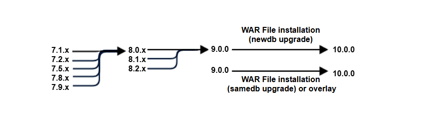

# Introduction

JasperReports® Server builds on JasperReports® Library as a comprehensive family of Business Intelligence (BI) products, providing robust static and interactive reporting, report server, and data analysis capabilities. These capabilities are available as either stand-alone products, or as part of an integrated end-to-end BI suite. The products utilize common metadata and provide shared services, such as security, a repository, and scheduling. The server exposes comprehensive public interfaces. This enables seamless integration with other applications and the capability to add custom functionality with ease.

!!! info "Important"

    The features in this section may be restricted by your JasperReports Server software license. If you don't see some of the options described, your current license likely prohibits their use. Contact us to learn about your licensed features or to discuss upgrading.

The heart of the Jaspersoft® BI Suite is the server, which provides the ability to:

-   Easily create reports based on views designed in an intuitive, web-based, drag and drop Ad Hoc Editor.
-   Efficiently and securely manage many reports.
-   Interact with reports, including sorting, changing formatting, entering parameters, and drilling on data.
-   Schedule reports for distribution through email and storage in the repository.
-   Arrange reports and web content to create appealing, data-rich Jaspersoft Dashboards that quickly convey business trends.

For users interested in multi-dimensional modeling, we offer Jaspersoft® OLAP, which runs as part of the server.

While the Ad Hoc Editor lets users create simple reports, more complex reports can be created outside of the server. You can either use Jaspersoft® Studio or manually write JRXML code to create a report that can be run in the server. We recommend that you use Jaspersoft Studio unless you have a thorough understanding of the JasperReports file structure.

You can use the following sources of information to learn about JasperReports Server:

-   Our core documentation describes how to install, administer, and use JasperReports Server and Jaspersoft Studio. Core documentation is available in PDF format on the [Product Documentation website](https://community.jaspersoft.com/documentation/). You can also access PDF and HTML versions of these guides from the [Documentation section](http://community.jaspersoft.com/documentation) of the Jaspersoft Community website.

-   Our Ultimate Guides document advanced features and configuration. They also include best practice recommendations and numerous examples. You can access PDF and HTML versions of these guides online from the [Documentation section](http://community.jaspersoft.com/documentation) of the Jaspersoft Community website.

-   The [Jaspersoft Community site](https://community.jaspersoft.com/) covers topics for:

    -   Developers
    -   System administrators
    -   Business users
    -   Data integration users

-   Our free samples, which are installed with JasperReports Library, Jaspersoft Studio, and JasperReports Server, are available and documented online. Please visit our [GitHub repository](https://github.com/Jaspersoft/jasperreports).

-   If you have a subscription to our professional support offerings, please contact our Technical Support team when you have questions or run into difficulties. They're available on the web at <https://www.jaspersoft.com/support>.

JasperReports Server is a component of commercial offerings. It integrates the standard features such as security, scheduling, web services interface, and much more for running and sharing reports. Commercial editions provide additional features for hosting large BI deployments, including:

-   Reporting Engine
-   Pixel-perfect report designer
-   Web-based design tool
-   Interactive visualizations
-   HTML5 charts
-   Maps
-   HTML Pro component
-   Custom visualizations
-   Ad Hoc views and reports
-   Advanced charts
-   Business Intelligence dashboards
-   Domains/metadata layer
-   Data virtualization
-   Data snapshots
-   Bursting
-   Alerting
-   Audit logging (administration/tracking)
-   Multi-organization architecture
-   Clustering
-   White labelling

## Server Upgrade Distributions

<table>
<colgroup>
<col style="width: 50%" />
<col style="width: 50%" />
</colgroup>
<thead>
<tr>
<th>Distribution Package</th>
<th>Description</th>
</tr>
</thead>
<tbody>
<tr>
<td>
Overlay Upgrade zip
</td>
<td>
Available only with the Commercial version of JasperReports Server.

Supports upgrade to 10.1.0 from version 10.0.0 or later.

Supports only the Apache Tomcat application server.

Supports all certified repository databases.

Supports upgrade and rollback of upgrade changes.

Provides assistance with identifying customized files in your environment.

Supports Windows, Linux, Mac, and other platforms.

File name is: <strong></strong>

<code>js-jrs</code><code>_10.1.0</code>

_overlay.zip</td>
</tr>
<tr>
<td>
WAR File Distribution Zip
</td>
<td>
Supports upgrade from version 9.0 or later.

Supports all certified application servers.

Supports all certified repository databases.

Supports Windows, Linux, Mac, and other platforms.

File name is: <strong></strong>

<code>js-jrs</code><code>_10.1.0</code>

_bin.zip</td>
</tr>
</tbody>
</table>

### Upgrade Paths

Your current version determines your upgrade path:

|                                                         |
|---------------------------------------------------------|
|  |
| *Figure 1 Paths for Upgrading to Version 10.1*          |

If you are upgrading from 10.0, use the instructions in [Upgrading from 10.0 to 10.1](upgrade-10.0-to-10.1.md).

If you are starting from 9.0, use the instructions in [Upgrading from 9.0 to 10.1](upgrade-with-sql-script.md).

If you are using the JasperReports Server Commercial edition installed with the WAR file and the Apache Tomcat application server, you can use the overlay upgrade, described in [Overlay Upgrade](upgrade-overlay.md).

You may also need to upgrade in several steps through an intermediate version. In the following table:

-   samedb = Follow the steps equivalent to [Upgrading from 10.0 to 10.1](upgrade-10.0-to-10.1.md).
-   newdb = Follow the steps equivalent to [Upgrading from 9.0 to 10.1](upgrade-with-sql-script.md).

<table>
<colgroup>
<col style="width: 6%" />
<col style="width: 6%" />
<col style="width: 6%" />
<col style="width: 6%" />
<col style="width: 6%" />
<col style="width: 6%" />
<col style="width: 6%" />
<col style="width: 6%" />
<col style="width: 6%" />
<col style="width: 6%" />
<col style="width: 6%" />
<col style="width: 6%" />
<col style="width: 6%" />
<col style="width: 6%" />
<col style="width: 6%" />
<col style="width: 6%" />
</colgroup>
<thead>
<tr>
<th>   To &gt; 
From:</th>
<th>6.1.x</th>
<th>6.2.x</th>
<th>6.3.x</th>
<th>6.4.x</th>
<th>7.1.x</th>
<th>7.2.x</th>
<th>7.5.x</th>
<th>7.8.x</th>
<th>7.9.x</th>
<th>7.9.x</th>
<th>8.1.x</th>
<th>8.2.0</th>
<th>9.0</th>
<th><code>10.0</code></th>
<th><code>10.1.0</code></th>
</tr>
</thead>
<tbody>
<tr>
<td>9.0.0</td>
<td> </td>
<td> </td>
<td> </td>
<td> </td>
<td> </td>
<td> </td>
<td> </td>
<td> </td>
<td> </td>
<td> </td>
<td> </td>
<td> </td>
<td> </td>
<td>
newdb 
samedb
</td>
<td>newdb</td>
</tr>
<tr>
<td>10.0.0</td>
<td> </td>
<td> </td>
<td> </td>
<td> </td>
<td> </td>
<td> </td>
<td> </td>
<td> </td>
<td> </td>
<td> </td>
<td> </td>
<td> </td>
<td> </td>
<td> </td>
<td>
newdb

samedb</td>
</tr>
</tbody>
</table>

!!! note

    For details on upgrading from version 8.x or older, see the respective Upgrade Guides for those versions.

### About Bundled Apache Ant

Apache Ant version *1.10.latest* is bundled with the War File Distribution ZIP and the Overlay Upgrade ZIP. The Ant scripts used for upgrade come with Windows and Linux batch scripts pre-configured to use the bundled version of Apache Ant.

We recommend Apache Ant version *1.10.latest*. If you want to run your own version of Apache Ant, version 1.9 or later is required.

The bundled Apache Ant includes an additional jar. This jar (`ant-contrib.jar`) enables conditional logic in Ant. If you are running your own Ant you should copy the `ant-contrib.jar` to your `<Ant_HOME>/lib` folder.

!!! note

    On Linux and Solaris, the Ant commands may not be compatible with all shells. If you get errors, use the `bash` shell explicitly. For more information, see the information on the bash shell in the Troubleshooting appendix of the JasperReports Server Installation Guide.
