# Formatting Charts

You can control some aspects of how data points, field names, and labels are displayed on your chart, including:

-   Whether data points are displayed.
-   Showing a measure name on charts including only a single measure.
-   Restricting the number of labels displayed.
-   Rotating the direction of label text.
-   Selecting the colors used by the chart.
-   Defining how gauges are displayed.

JasperReports Server also allows you to edit many of the chart's properties for cases when you want more control over the appearance of a chart.

## Displaying Data Points

You can choose whether to display data points in your line, time series, or area chart. Data points can help users visualize chart data more accurately.

To show the data points on a chart, in the **Format Visualization** panel, in the **Appearance** settings, click the **Show data points** switch to turn the setting on.

!!! note

    By default, the **Show data points** setting is on.

To remove data points from the chart, click the **Show data points** switch to turn the setting off.

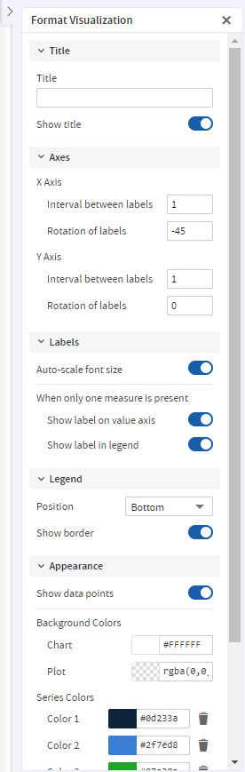

*Figure 1: Format Visualization Panel*

## Displaying the Measure Name/Label on the Value Axis

You can choose to display the measure name/label on the value axis. To show the measure name/label on the value axis, in the **Format Visualization** panel, in the **Labels** settings, click the **Show label on value axis** switch to turn the setting on.

!!! note

    By default, the **Show label on value axis** setting is on.

To remove the measure name/label from the value axis, click the **Show label on value axis** switch to turn the setting off.

## Restricting Label Display

By default, every field included in your chart has a label displayed along either axis. Measures show up as numeric values, often along the Y axis, and fields being measured shows up as text along the X axis. On some charts - especially those with many fields included - these labels may overlap, crowd together, or become difficult to read. You can alleviate this problem by "stepping", or reducing, the number of labels displayed on your chart.

To reduce the number of labels on your chart, in the **Format Visualization** panel, in the **Axis** settings:

-   For X Axis: Under **X Axis**, in the **Interval between labels** input, specify how often you want the axis label to appear.

-   For Y Axis: Under **Y Axis**, in the **Interval between labels** input, specify how often you want the axis label to appear.

    For instance:

    -   To display every second label, enter 2.
    -   To display every third label, enter 3, and so on.

To display every label, enter **1** in the **Interval between labels** inputs.

## Rotating Label Text

By default, the labels on your chart are displayed horizontally. Multiple labels, or very long ones, can be difficult to read. You can change the direction of these labels, on both the X and Y axes, to improve chart readability.

To rotate label text, in the **Format Visualization** panel, in the **Axes** settings:

-   For X Axis: Under the **X Axis**, in the **Rotation of labels** input, specify the degree of rotation to apply to labels.

-   For Y Axis: Under the **Y Axis**, in the **Rotation of labels** input, specify the degree of rotation to apply to labels.

    For instance:

    -   To rotate the labels clockwise 90 degrees, enter 90.
    -   To rotate the labels counter-clockwise 90 degrees, enter -90.
    -   To rotate the labels clockwise 45 degrees, enter 45, and so on.
    -   To return the labels to their original, horizontal position, enter **0** in the **Rotation of labels** inputs.

## Changing the Chart's Colors

You can choose the colors of your chart by defining a series of colors for it to use. You can also choose the background's colors.

To choose the chart's colors

1.  In the **Format Visualization** panel, go to the **Appearance** settings.

    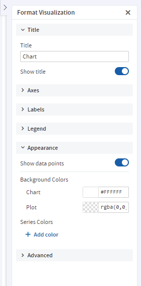

    *Figure 2: Appearance Settings*

2.  Under **Series Colors**, click **+ Add color** to add the first color.

    The color picker button appears. The button displays a color and a corresponding Hex value.

3.  Click the button to open the color picker window.

4.  Select the color that you want to use.

5.  Click outside the color picker window to close it.

6.  Click **+ Add color** to add additional colors.

    !!! note

        The order of the colors added to the chart is the order they appear in the series.

    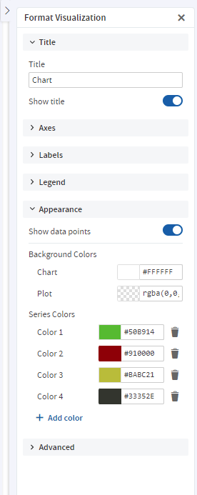

    *Figure 3: Appearance Settings with Multiple Colors in Series*

7.  You can change the colors of the chart background and plot using the color picker buttons under **Background Colors**.

    JasperReports Server reloads the chart with the new colors.

## Changing the Display Settings for Gauges

Gauges are circular and semi-arc charts. The length of the circle or semi-arc is based on a single data value in proportion to the minimum and maximum measurement amounts that you define.

Gauges have their own display settings under the **Appearance** settings, where you can select how they appear in the Ad Hoc view. You can specify the layout of the gauges on the canvas, the color stops, and the minimum and maximum values for the gauge's measure.

The settings under the Appearance settings apply to all gauges in the Ad Hoc view.

To edit a gauge's display settings

1.  In the **Format Visualization** panel, go to the **Appearance** settings.

    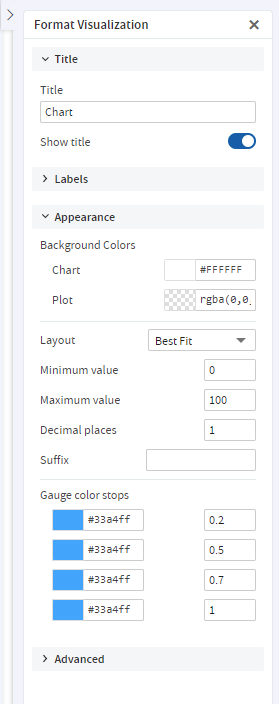

    *Figure 4: Appearance Settings*

2.  From the **Layout** dropdown menu, select the layout for displaying the gauges. By default, the layout is **Best Fit**, which displays all the gauges on the canvas in one or more rows. The gauges can also be displayed in a single vertical column or a single horizontal row.

3.  Enter the minimum and maximum values for the gauge's measure. For gauge and arc gauge charts, each measure added to the Ad Hoc view is displayed as its own gauge and the gauge's circle or arc represents how a single data value in the data source compares to the maximum measure. For multi-level gauge charts, each measure is displayed as concentric circles in the gauge. By default, the minimum is `0` and the maximum is `100`. The measures selected for the Ad Hoc view also determine whether to display the data as percentages or as numeric values.

4.  Enter the number of decimal places to show as part of the value displayed in the gauge. The maximum number of decimal places you can specify is 8.

5.  Enter a suffix string if you want to label the value displayed in the gauge.

6.  Enter a value for each color stop for the gauge. Color stops define a gradient progression for the gauge's colors in the Ad Hoc view. The default color stop values are `0.2`, `0.5`, `0.7`, and `1`.

    !!! note

        You can have a maximum of four color stops in your gauge. Each color selected is the specific color displayed at the corresponding stopping point. The colors displayed in the gauges are based on where the gauge's value falls on the defined gradient.

7.  Click the color picker button for each stop to open the color picker window and select the color.

    JasperReports Server reloads the Ad Hoc view's gauges with the new display settings.

## Creating and Changing the Display Settings for Pies

Pies are charts displayed in a circle. The circle is divided into slices to display numerical proportion. The length of a slice is proportional to the quantity that it represents.

You can create a pie using the **Fields** and **Measures**. You can select how they appear in the Ad Hoc view. You can specify columns and rows, use the **Drill Down** option, **Data Level** slider and **Format Visualization** panel to create a pie chart. The **New Ad hoc View** page lets you create and change the display settings of the pie chart.

To create a pie using Old Layout Band

1.  On the **New Ad hoc View** page, select **Pie** from the **Select Visualization Type** pop-up.

    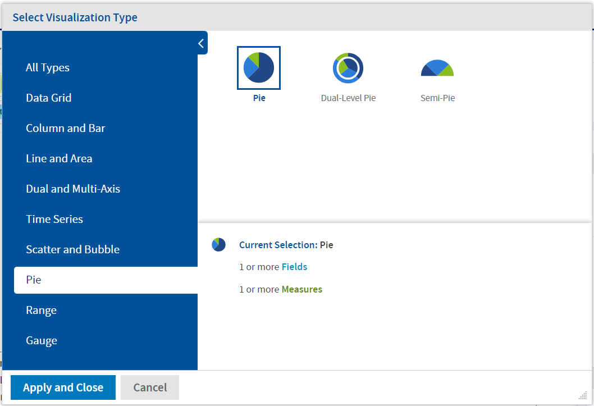

    *Figure 5: Select Pie*

2.  View the following sections on the page:

    -   **Fields** and **Measures**
    -   Chart canvas
    -   **Filters**
    -   **Format Visualization**

3.  Drag and drop the **Fields** and **Measures** in the **Rows** and **Columns** fields. The pie according to the selected **Columns** and **Rows** is displayed.

    The **Title** of the chart (if provided) is displayed at the top of the canvas.

    !!! note

        The **Title** can be provided either from the **Format Visualization** panel or by clicking **Click to add a title** on the canvas.

    The name of the pie is displayed at the top-left corner of the pie. The name consists of the names of **Measures** from **Columns**. The name may also consist of fields, if added to **Columns** (also depends on **Columns Data Slider**). The legend is displayed at the bottom of the canvas.

    !!! note

        The Legend is based on **Rows** only.

    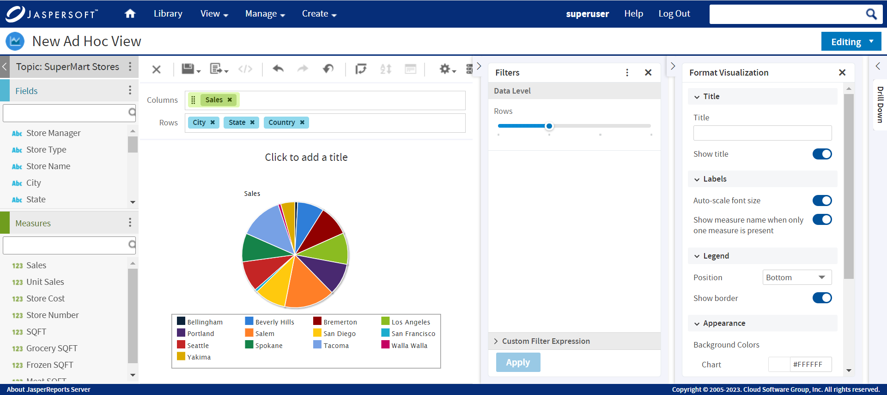

    *Figure 6: Select Columns and Rows*

    !!! note

        The number of pies depends on the number of **Measures** in **Columns**. If there are two **Measures** in **Columns**, then two pies are displayed.

        It also depends on the **Fields** added to the **Columns**. There may be one **Measure** but adding **Fields** and setting the **Data Level** slider can increase the number of pies.

4.  In the **Filters** section, drag the **Row** slider to control the values from the selected fields from **Rows**.

    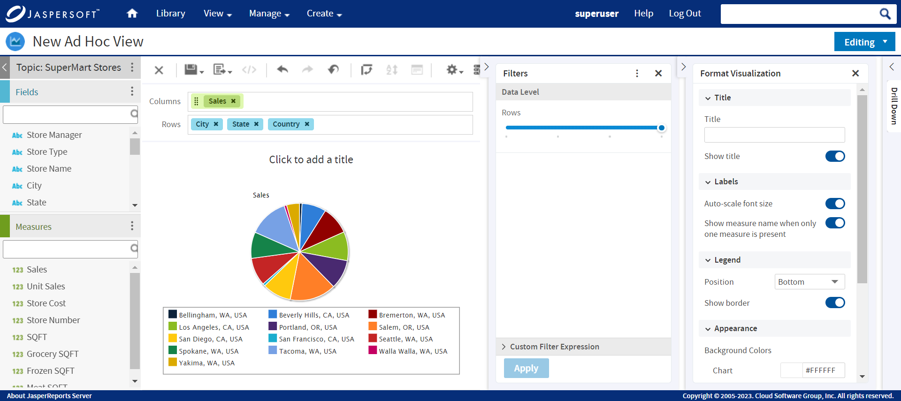

    *Figure 7: Row Data Level Slider*

    !!! note

        If there is more than one field selected in **Columns**, a **Column** slider is also displayed. Select the field, across all fields, which must be used to generate pies.

5.  Hover the mouse over the pie and view the tool-tip.

    

    *Figure 8: Tool-tip*

6.  In the **Format Visualization** panel, provide the information, and enable or disable the toggles in the **Title** and **Labels** sections.

    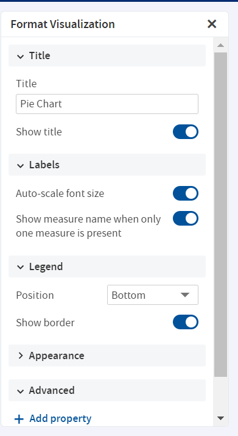

    *Figure 9: Format Visualization*

7.  In the **Legend** section, use the **Position** dropdown menu and select the position of the legend display. By default, the position is **Bottom,** which displays the legend below the pie. The legend can also be displayed at the top, left, and right. You may also choose not to display the legend.

8.  Go to **Appearance** settings. Click the color picker to select **Background Colors** and **Series Colors**. JasperReports Server reloads the Ad Hoc view's pie with the new display settings.

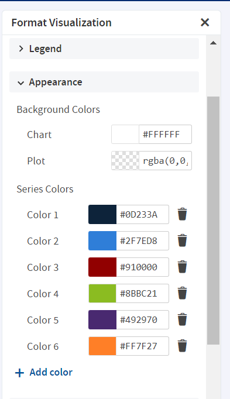

*Figure 10: Appearance Settings*

To create a pie using New Layout Band

1.  On the **New Ad hoc View** page, select **Pie** from the **Select Visualization Type** pop-up.

    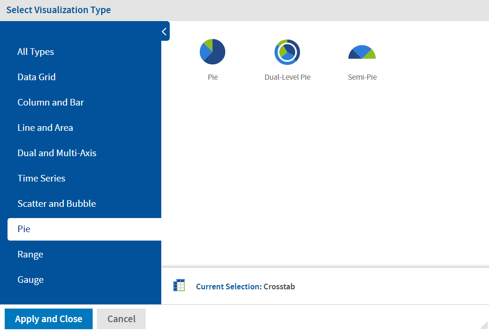

    *Figure 11: Select Pie*

2.  View the following sections on the page:

    -   **Fields** and **Measures**
    -   Chart canvas
    -   **Filters**
    -   **Format Visualization**

3.  Drag and drop the **Fields** and **Measures** in the **Slices** and **Multiples** fields. The pie according to the selected **Slices** and **Multiples** is displayed.

    The **Title** of the chart (if provided) is displayed at the top of the canvas.

    !!! note

        The **Title** can be provided either from the **Format Visualization** panel or by clicking **Click to add a title** on the canvas.

    The name of the pie is displayed at the top-left corner of the pie. The name consists of the names of **Measures** from **Multiples**. The name may also consist of fields, if added to **Multiples** (also depends on **Slices Data Slider**). The legend is displayed at the bottom of the canvas.

    !!! note

        The Legend is based on **Slices** only. 

    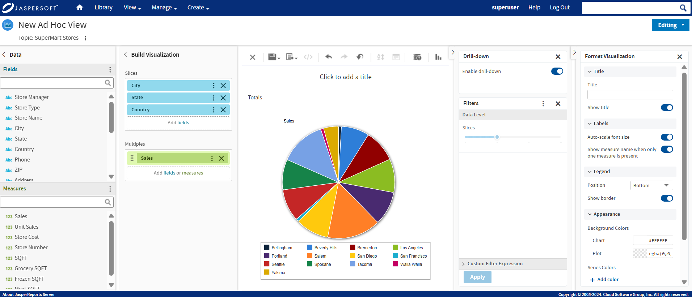

    *Figure 12: Select Multiples and Slices*

    !!! note

        The number of pies depends on the number of **Measures** in **Multiples**. If there are two **Measures** in **Multiples**, then two pies are displayed.

        It also depends on the **Fields** added to the **Multiples**. There may be one **Measure** but adding **Fields** and setting the **Data Level** slider can increase the number of pies.

4.  In the **Filters** section, drag the **Slices** slider to control the values from the selected fields from **Slices**.

    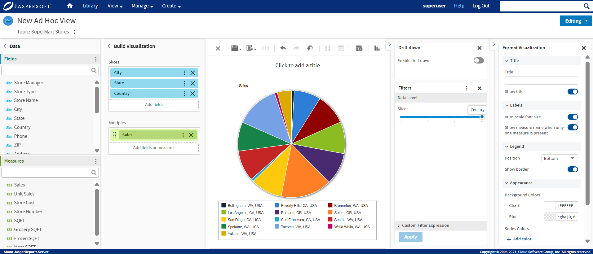

    *Figure 13: Row Data Level Slider*

    !!! note

        If there is more than one field selected in **Multiples**, a **Multiples** slider is also displayed. Select the field, across all fields, which must be used to generate pies.

5.  Hover the mouse over the pie and view the tool-tip.

    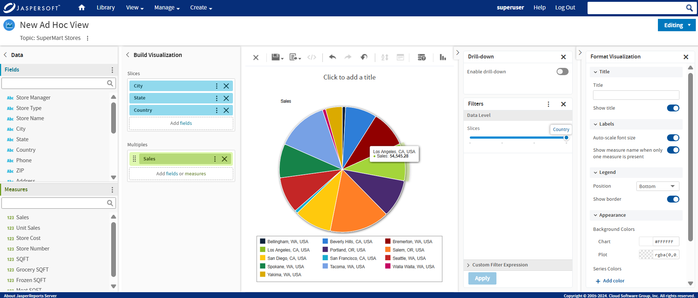

    *Figure 14: Tool-tip*

6.  In the **Format Visualization** panel, provide the information, and enable or disable the toggles in the **Title** and **Labels** sections.

    

    *Figure 15: Format Visualization*

7.  In the **Legend** section, use the **Position** dropdown menu and select the position of the legend display. By default, the position is **Bottom,** which displays the legend below the pie. The legend can also be displayed at the top, left, and right. You may also choose not to display the legend.

8.  Go to **Appearance** settings. Click the color picker to select **Background Colors** and **Series Colors**. JasperReports Server reloads the Ad Hoc view's pie with the new display settings.

    

    *Figure 16: Appearance Settings*

## Changing the Chart's Appearance Using Advanced Formatting

The **Advanced** settings in the **Format Visualization** panel gives you more control over the appearance of an Ad Hoc chart by allowing you to edit certain chart properties. For example, you can specify a list of colors for the chart, change the position of the legend, choose whether to display data values in the chart, and much more. You can find a full list of supported commands by clicking the **More Information** link on the **Advanced** tab or browsing to the [Advanced Chart Formatting page](http://community.jaspersoft.com/wiki/advanced-chart-formatting) on the Jaspersoft Community Site.

To edit the chart's properties

1.  In the **Format Visualization** panel, go to the **Advanced** settings.

2.  Click **Add property**.

3.  In the **Name** field, enter the chart property you want to format and then enter the values for the property. For instance: 

    -   To format the chart's colors, enter colors for the property and a comma-separated list of colors in brackets for the values, such as \["red", "blue", "green", "magenta", "purple", "black", "yellow"\].
    -   To change the vertical alignment of the legend, enter legend.verticalAlign for the property and "top" or "bottom" or "center" for the value.
    -   To display data values on the chart, enter plotOptions.series.dataLabels.enabled for the property and true for the value. 
        Click the **More Information** link to see a list of the properties you can edit.
    -   To ensure smaller bars or columns are visible by default, set the `plotOptions.series.minPointLength` property to a value of three or more. This is necessary because in Highcharts v11 the property's default value is 0. 

    !!! note

        The Ad Hoc Designer does not validate the property name or values. The chart ignores any invalid property that you enter.

4.  Click 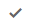 to save the property formatting.

    The chart is updated with the new formatting.

5.  To remove the formatting, click  next to the property you want to remove.
