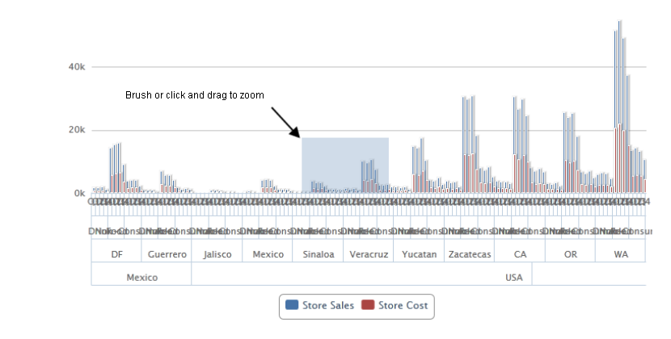
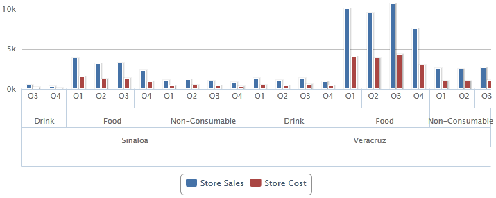
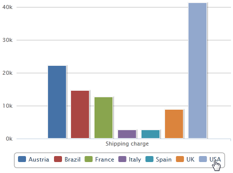
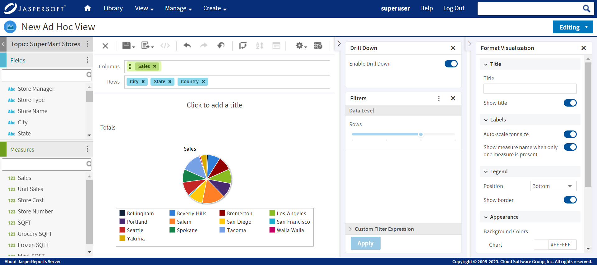
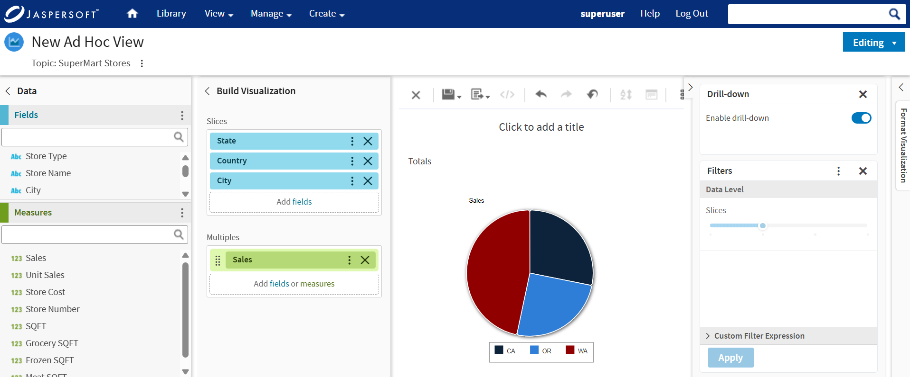
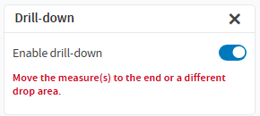

# Interacting with Charts

Once you have chosen rows and columns and selected the type of chart that you want, you can further explore your data using interactive features such as brushing an area of the chart to zoom in or clicking a legend to hide the members of a group.

## Zooming

Zooming lets you view a specific area of a chart more closely. Zooming is helpful when labels at the bottom of a chart are difficult to read. This is because only the labels corresponding to the selected area are displayed.

!!! note

    Zoom is a viewing feature of the Ad Hoc Editor. When you save an Ad Hoc view, or create a report from an Ad Hoc view, zoom is automatically reset to show the whole chart.

To zoom in on an area of a chart

-   Click and drag or brush the area you want to zoom in on. As you are dragging or brushing a pale blue area indicates your selection. When you release the mouse button, the view zooms in on the area you selected.

    To view the whole chart again

-   Click **Reset zoom** at the upper right of the canvas.

The following images show a bar chart before and after zooming:

*Figure 1 Selecting a Zoom Area*

*Figure 2 Area After Zooming*

## Hiding Group Members

Use the legends below the chart to hide or show group members.

-   To hide a group member, click the member name in the legend below the chart. The member is removed from the chart and the legend is grayed out.
-   To unhide a group member that has been hidden, click the grayed-out legend for the member.

*Figure 3 Hiding a Group Member*

!!! note

    Hidden members are a view feature of the Ad Hoc Editor. When you save an Ad Hoc view, or create a report from an Ad Hoc view, the chart is automatically reset to show all members.

## Using Drill Down

Use drill down to move from a higher level of data to a granular level. Click a data point in a chart that contains hierarchical data to view detailed data. You can view the data at different levels of detail using drill down. The hierarchy for drill down is based on the order of elements in the drop areas. For more information on the drop area mappings, see [Data Level Mappings for New Layout Band](adhoc-charts.md) table.

To use drill down, in the **Drill Down** section, enable the toggle. When enabled the level of the visualization changes to the first data point in the drill down axis and the slider of the axis is disabled.

*Figure 4 Enable Drill Down in Old Layout Band*

*Figure 5 Enable Drill Down in New Layout Band*

Drill down is an interactive viewer feature and the current path of drill down is not saved in the Ad Hoc View resource. Whenever an Ad Hoc View is open in the viewer or designer, the visualization starts from the first level of data point in the drill down axis.

Currently, only the fields in the **Row** axis are supported for drill down. If there are fields in the **Column** axis too, they do not participate in the drill down.

!!! note

     
    For **Old Layout Band**, when you try to drill down for any chart visualization, and a measure is placed between the fields, the drill down is done until the measure is encountered. The warning message then prompts to reposition the measure group to the beginning, or the end of the list, or to a different drop group area. Once the measure is moved, the drill down starts from the beginning. 
     
     

!!! note

    In the **New Layout Band**, when you add a measure in front of a field in the Columns drop area of a crosstab visualization, and then switch to Heat Map, the field is moved to the Unused drop area.

For more information on which drop area in New Layout Band corresponds to Row/ Column in Old Layout Band, see [Data Level Mappings for New Layout Band](adhoc-charts.md) table.

Charts that do not support drill down include:

-   Time Series (all four charts in the group)
-   Dual Level Pie
-   Gauge (all three charts in the group as all fields are in the column axis)
-   Range (all five charts in the group)
-   Tree Map and Parent Tree Map (has built-in drill down)

!!! note

    For Tree Map and Parent Tree Map, the **Back** button is replaced with breadcrumbs. This helps you to navigate from one data point to another easily.

When drill down is enabled, the legend of the chart displays only the values of the current level of the drill-down hierarchy.

Any changes to ad hoc resets drill-down to its initial state.
