# Working with Charts

Ad Hoc charts are a flexible, interactive way to explore your data graphically. You can choose different levels of aggregation for drop areas, change a field from a column to a row, pivot the entire chart, hide chart values, and zoom in to see chart details.

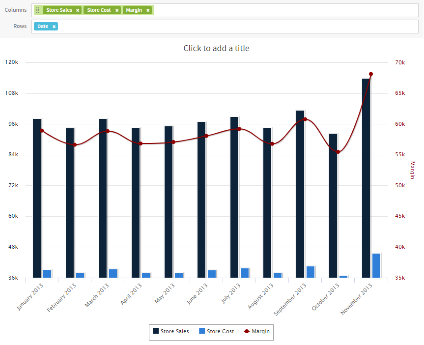

*Figure 1: Ad Hoc Editor’s Chart View for old layout band*

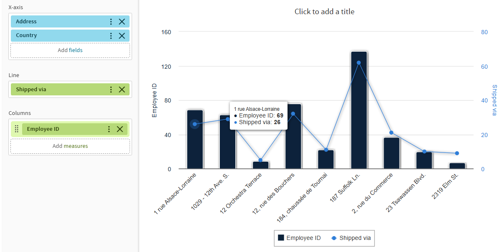

*Figure 2: Ad Hoc Editor’s Chart View for new layout band*

The following sections explain how to populate, edit, and format an Ad Hoc chart. Many tasks related to working with charts are identical (or very similar) to those for tables and crosstabs. For any tasks not discussed in this section, see the information in [Working with Tables](adhoc-tables.md).

## Using Fields and Measures in Charts

You must add at least one measure to view a chart. Before any measures are added to the chart, the Ad Hoc Editor displays a placeholder with the legend displaying a single entry: Add a measure to continue. As you add measures, the editor displays the grand total of each measure in the chart.

The initial display reflects only the measures you add. It does not change when you add fields or dimensions. For example, for each measure you add to a bar chart, you see a bar with the total value of the measure, regardless of how many fields you add. This means you can add, remove, and arrange measures and fields without waiting for the display to update. Once you have the fields and measures you want, you can use the sliders on the right to select the level of detail you want. See “Effect of the Slider on a Chart” for more information.

All available fields are listed in the Data Selection panel, as either standard fields or measures.

-   Standard fields can be added as:

    -   For Old Layout Band, to a column or row.
    -   For New Layout Band, to the supported drop areas according to the visualization type selected.

-   Measures contain summarized values. They are typically numeric fields that determine the length of bars, size of pie slices, location of points (in line charts), and height of areas. They can be added to the drop areas, but must all be in the same target — that is: 
    In Old Layout Band you can add one or more measures to the chart as columns, or add one or more measures to the chart as rows, but you cannot have one measure as a column and another as a row in the same chart. 
    In New Layout Band, for example in **Column** chart you can add fields to Y-axis and/ or Columns, and add one or more measures to the Y-axis, but you cannot add measures to the Columns. 

When creating a chart, keep in mind that the drop areas are arranged in hierarchies, with the highest member of the hierarchy on the left. For an Ad Hoc view based on an OLAP data source, you can change the order of distinct dimensions by dragging, but you cannot change the order of levels within a dimension. For an Ad Hoc view based on a non-OLAP data source, you can drag the field headings to rearrange the hierarchy; the highest level in a group should appear to the left; the lowest level in a group should appear to the right. For example, it doesn’t make sense to group first by postal code then by country, because each postal code belongs to only one country.

To add a field or measure to a row or column, for **Old Layout Band**:

1.  In the **Data Selection** panel, select the field you want to add to the chart as a group. Use Ctrl-click to select multiple items.
2.  Drag the selected item into the **Columns** or **Rows** box in the Layout Band.

To add a field or measure to a supported drop areas, for **New Layout Band**:

1.  In the **Data Selection** panel, select the field you want to add to the chart as a group. Use Ctrl-click to select multiple items.
2.  Drag the selected item into the supported drop areas according the visualization type selected.

### Setting Levels

When you add a field or dimension to the drop areas, a multi-level slider located at the top of the Filters pane allows you to set the level of aggregation to use for viewing the data. 
In Old Layout Band, the Data levels are rows and columns. 
In New Layout Band, the Data levels are the drop area that corresponds to the visualization type you select. 
The number of fields or dimensions in the drop areas, for example rows or column for any chart in Old Layout band, and Bars or X-axis, for Bar chart in New Layout Band, determines the number of levels on the slider. Measures are not reflected in the slider.

!!! note

    You cannot adjust levels on time series charts.

In Old Layout Band, the following figure shows the effect of the slider on a chart with one level of aggregation for both rows and columns.

<table>
<colgroup>
<col style="width: 33%" />
<col style="width: 33%" />
<col style="width: 33%" />
</colgroup>
<tbody>
<tr>
<td> </td>
<td>
Columns

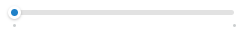
</td>
<td>
Columns

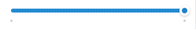
</td>
</tr>
<tr>
<td>
Rows

</td>
<td>
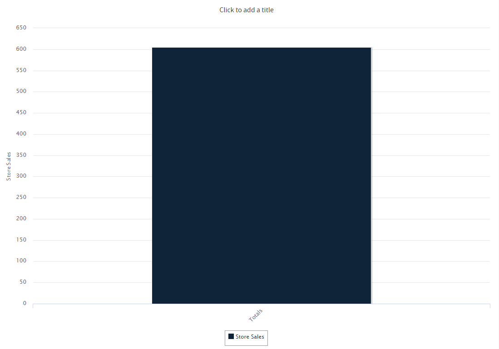
</td>
<td>
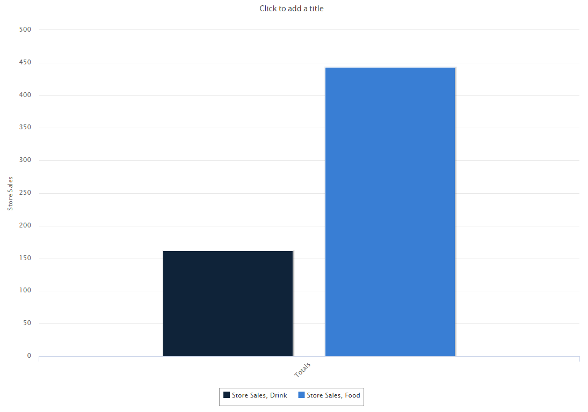
</td>
</tr>
<tr>
<td>
Rows

</td>
<td>
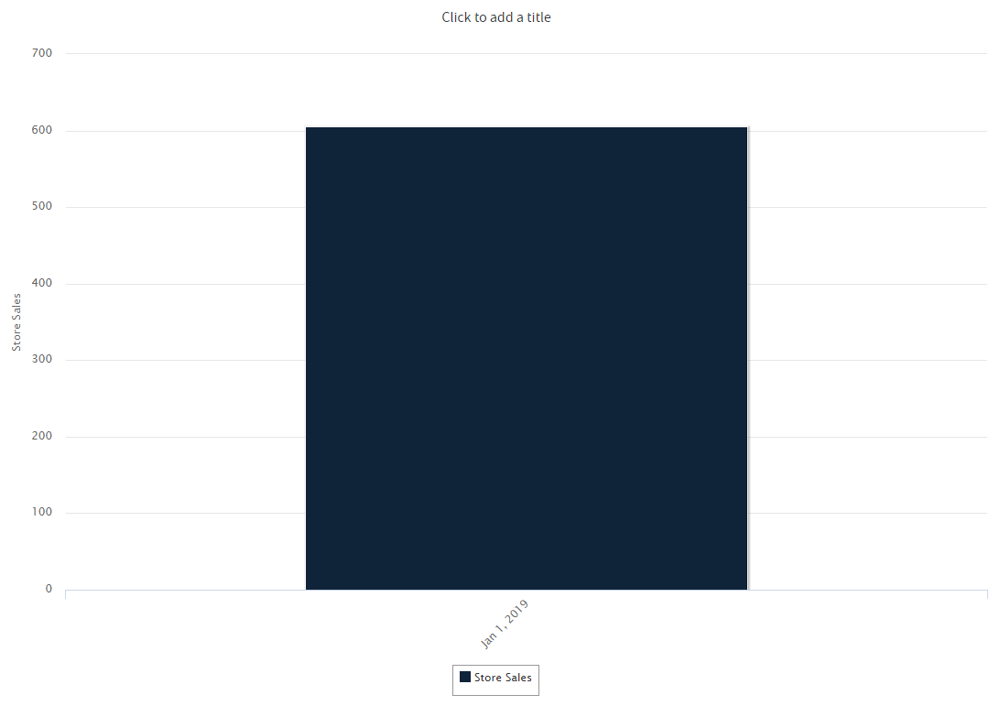
</td>
<td>
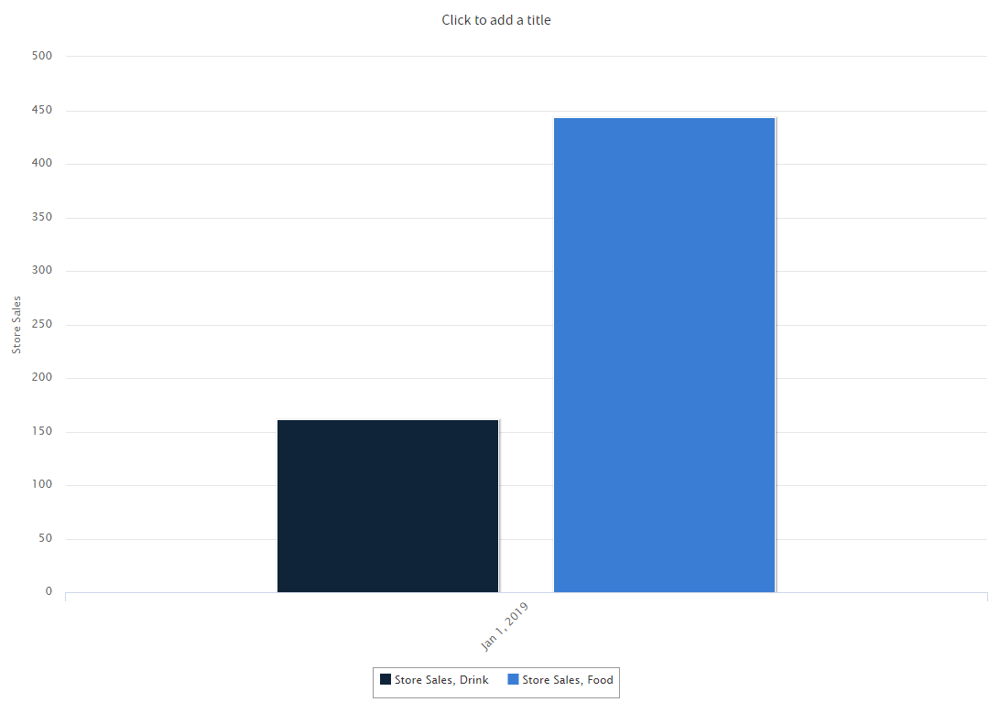
</td>
</tr>
</tbody><tfoot>
<tr>
<td colspan="3">
<em>Figure 3: Effect of the Slider on a Chart (Old Layout Band)</em>
</td>
</tr>
</tfoot>
&#10;</table>

In New Layout Band, the following figure shows the effect of the slider on a chart with one level of aggregation for both Y-axis and Columns for **Column** chart.

<table>
<colgroup>
<col style="width: 33%" />
<col style="width: 33%" />
<col style="width: 33%" />
</colgroup>
<tbody>
<tr>
<td></td>
<td>
Y-axis

</td>
<td>
Y-axis

</td>
</tr>
<tr>
<td>
Columns

</td>
<td>
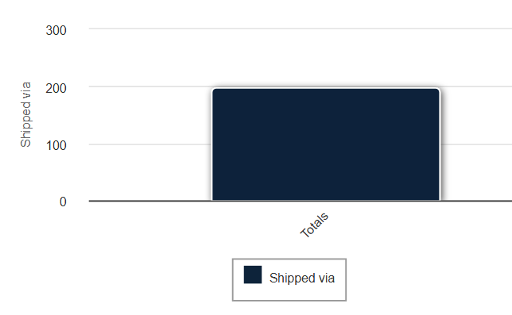
</td>
<td>
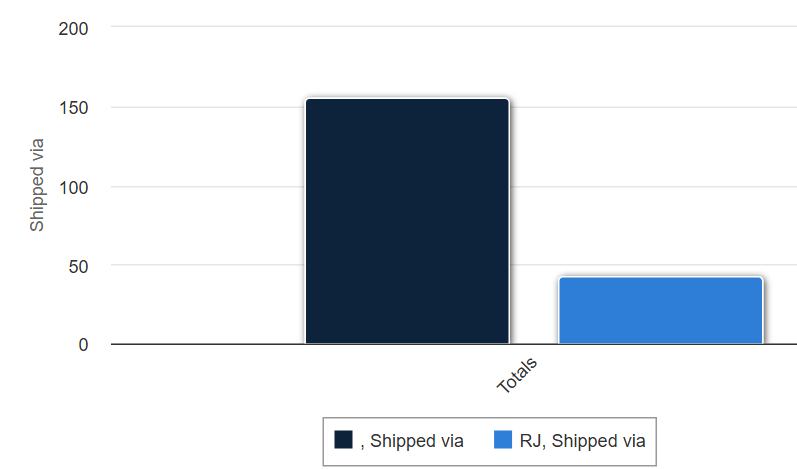
</td>
</tr>
<tr>
<td>
Columns 

</td>
<td>
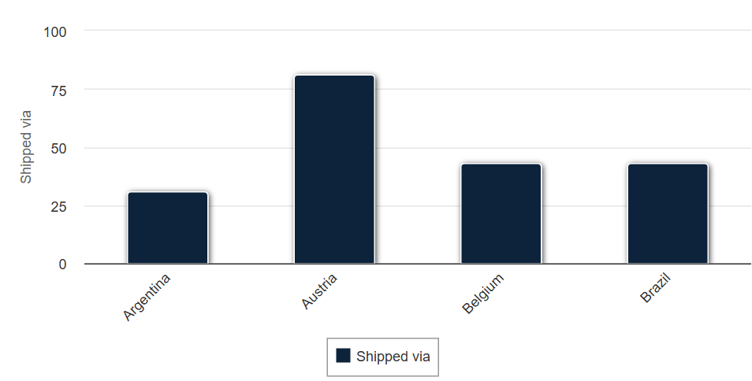
</td>
<td>
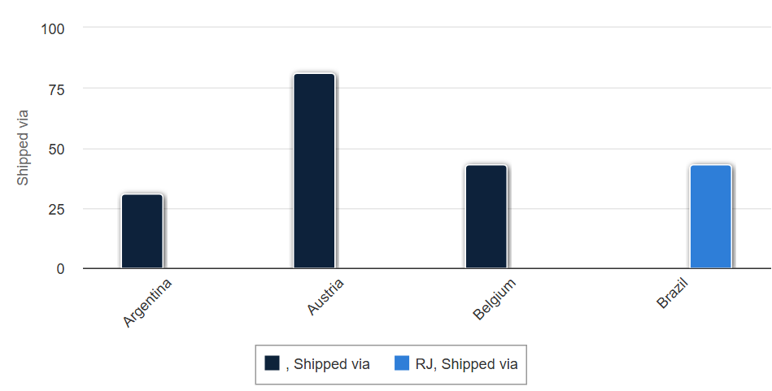
</td>
</tr>
</tbody><tfoot>
<tr>
<td colspan="3">
<em>Figure 4: Effect of the Slider on a Chart (New Layout Band)</em>
</td>
</tr>
</tfoot>
&#10;</table>

<table style="width:100%;">
<caption>
Data Level Mappings for New Layout band
</caption>
<colgroup>
<col style="width: 16%" />
<col style="width: 16%" />
<col style="width: 16%" />
<col style="width: 16%" />
<col style="width: 16%" />
<col style="width: 16%" />
</colgroup>
<thead>
<tr>
<th>
Visualization Group
</th>
<th>
Visualization Type
</th>
<th>Data Levels in Old Layout Band</th>
<th>Data Levels in New Layout Band</th>
<th>Mapping Old Layout Band drop areas to New Layout Band drop areas</th>
<th>Drill down supported drop areas</th>
</tr>
</thead>
<tbody>
<tr>
<td>
Data Grid
</td>
<td>Cross-tab</td>
<td>None</td>
<td>None</td>
<td>
Columns → Y-axis

Rows → Columns
</td>
<td>Does not support drill down.</td>
</tr>
<tr>
<td> </td>
<td>Table</td>
<td>None</td>
<td>None</td>
<td>
Columns →Y-axis

Rows → Columns
</td>
<td>Does not support drill down.</td>
</tr>
<tr>
<td>Column &amp; Bar</td>
<td>Column</td>
<td><ul>
<li>
Columns
</li>
<li>
Rows
</li>
</ul></td>
<td><ul>
<li>
Y-axis
</li>
<li>
Columns
</li>
</ul></td>
<td>Columns → Y-axis Rows → Columns</td>
<td>Columns</td>
</tr>
<tr>
<td> </td>
<td>Stacked Column</td>
<td>
Columns

Rows
</td>
<td>
Y-axis

Columns
</td>
<td>Columns → Y-axis Rows → Columns</td>
<td>Columns</td>
</tr>
<tr>
<td> </td>
<td>Percent Column</td>
<td>
Columns

Rows
</td>
<td>
Y-axis

Columns
</td>
<td>Columns → Y-axis Rows → Columns</td>
<td>Columns</td>
</tr>
<tr>
<td> </td>
<td>Bar</td>
<td>
Columns

Rows
</td>
<td><ul>
<li>
X-axis
</li>
<li>
Bars
</li>
</ul></td>
<td>Columns → X-axis Rows → Bars</td>
<td>Bars</td>
</tr>
<tr>
<td> </td>
<td>Stacked Bar</td>
<td>
Columns

Rows
</td>
<td><ul>
<li>
X-axis
</li>
<li>
Bars
</li>
</ul></td>
<td>Columns → X-axis Rows → Bars</td>
<td>Bars</td>
</tr>
<tr>
<td> </td>
<td>Percent Bar</td>
<td>
Columns

Rows
</td>
<td><ul>
<li>
X-axis
</li>
<li>
Bars
</li>
</ul></td>
<td>Columns → X-axis Rows → Bars</td>
<td>Bars</td>
</tr>
<tr>
<td> </td>
<td>Spider Column</td>
<td>
Columns

Rows
</td>
<td><ul>
<li>
Radial axis
</li>
<li>
Columns
</li>
</ul></td>
<td>Columns → Columns Rows → Radial axis</td>
<td>Radial axis</td>
</tr>
<tr>
<td>Line &amp; Area</td>
<td>Line</td>
<td>
Columns

Rows
</td>
<td><ul>
<li>
X-axis
</li>
<li>
Lines
</li>
</ul></td>
<td>Columns → Lines Rows → X-axis</td>
<td>X-axis</td>
</tr>
<tr>
<td> </td>
<td>Spline</td>
<td>
Columns

Rows
</td>
<td><ul>
<li>
X-axis
</li>
<li>
Lines
</li>
</ul></td>
<td>Columns → Lines Rows → X-axis</td>
<td>X-axis</td>
</tr>
<tr>
<td> </td>
<td>Area</td>
<td>
Columns

Rows
</td>
<td><ul>
<li>
X-axis
</li>
<li>
Areas
</li>
</ul></td>
<td>Columns → Areas Rows → X-axis</td>
<td>X-axis</td>
</tr>
<tr>
<td> </td>
<td>Stacked Area</td>
<td>
Columns

Rows
</td>
<td><ul>
<li>
X-axis
</li>
<li>
Areas
</li>
</ul></td>
<td>Columns → Areas Rows → X-axis</td>
<td>X-axis</td>
</tr>
<tr>
<td> </td>
<td>Percent Area</td>
<td>
Columns

Rows
</td>
<td><ul>
<li>
X-axis
</li>
<li>
Areas
</li>
</ul></td>
<td>Columns → Areas Rows → X-axis</td>
<td>X-axis</td>
</tr>
<tr>
<td> </td>
<td>Area Spline</td>
<td>
Columns

Rows
</td>
<td><ul>
<li>
X-axis
</li>
<li>
Areas
</li>
</ul></td>
<td>Columns → Areas Rows → X-axis</td>
<td>X-axis</td>
</tr>
<tr>
<td> </td>
<td>Spider Line</td>
<td>
Columns

Rows
</td>
<td><ul>
<li>
Radial Axis
</li>
<li>
Line
</li>
</ul></td>
<td>Columns → Lines Rows → Radial axis</td>
<td>Radial Axis</td>
</tr>
<tr>
<td> </td>
<td>Spider Area</td>
<td>
Columns

Rows
</td>
<td><ul>
<li>
Radial Axis
</li>
<li>
Area
</li>
</ul></td>
<td>Columns → Areas Rows → Radial axis</td>
<td>Radial Axis</td>
</tr>
<tr>
<td>Dual &amp; Multi Axis</td>
<td>
Column Line
</td>
<td><ul>
<li>
Rows
</li>
</ul></td>
<td><ul>
<li>
X-axis
</li>
</ul></td>
<td>Columns → Columns/Line Rows → X-axis</td>
<td>X-axis</td>
</tr>
<tr>
<td> </td>
<td>Column Spline</td>
<td><ul>
<li>
Rows
</li>
</ul></td>
<td><ul>
<li>
X-axis
</li>
</ul></td>
<td>Columns → Columns/Line Rows → X-axis</td>
<td>X-axis</td>
</tr>
<tr>
<td> </td>
<td>Stacked Column Line</td>
<td><ul>
<li>
Rows
</li>
</ul></td>
<td><ul>
<li>
X-axis
</li>
</ul></td>
<td>Columns → Columns/Line Rows → X-axis</td>
<td>X-axis</td>
</tr>
<tr>
<td> </td>
<td>Stacked Column Spline</td>
<td><ul>
<li>
Rows
</li>
</ul></td>
<td><ul>
<li>
X-axis
</li>
</ul></td>
<td>Columns → Columns/Line Rows → X-axis</td>
<td>X-axis</td>
</tr>
<tr>
<td> </td>
<td>Multi Axis Line</td>
<td><ul>
<li>
Rows
</li>
</ul></td>
<td><ul>
<li>
X-axis
</li>
</ul></td>
<td>Columns → Lines 
Rows → X-axis</td>
<td>X-axis</td>
</tr>
<tr>
<td> </td>
<td>Multi Axis Spline</td>
<td><ul>
<li>
Rows
</li>
</ul></td>
<td><ul>
<li>
X-axis
</li>
</ul></td>
<td>Columns → Lines 
Rows → X-axis</td>
<td>X-axis</td>
</tr>
<tr>
<td> </td>
<td>Multi Axis Column</td>
<td><ul>
<li>
Rows
</li>
</ul></td>
<td><ul>
<li>
X-axis
</li>
</ul></td>
<td>Columns → Columns Rows → X-axis</td>
<td>X-axis</td>
</tr>
<tr>
<td>Time Series</td>
<td>Time Series Line</td>
<td> </td>
<td><ul>
<li>
Lines
</li>
</ul></td>
<td>Columns → Lines 
Rows → Time axis</td>
<td>Does not support drill down.</td>
</tr>
<tr>
<td> </td>
<td>Time Series Spline</td>
<td> </td>
<td><ul>
<li>
Lines
</li>
</ul></td>
<td>Columns → Lines 
Rows → Time axis</td>
<td>Does not support drill down.</td>
</tr>
<tr>
<td> </td>
<td>Time Series Area</td>
<td> </td>
<td><ul>
<li>
Area
</li>
</ul></td>
<td>Columns → Areas 
Rows → Time axis</td>
<td>Does not support drill down.</td>
</tr>
<tr>
<td> </td>
<td>Time Series Area Spline</td>
<td> </td>
<td><ul>
<li>
Area
</li>
</ul></td>
<td>Columns → Areas 
Rows → Time axis</td>
<td>Does not support drill down.</td>
</tr>
<tr>
<td>Scatter &amp; Bubble</td>
<td>Scatter</td>
<td> </td>
<td><ul>
<li>
Values
</li>
<li>
Color by
</li>
</ul></td>
<td>Columns → X-axis/Y-axis/Color by 
Rows → Values</td>
<td>Values</td>
</tr>
<tr>
<td> </td>
<td>Bubble</td>
<td> </td>
<td><ul>
<li>
Values
</li>
<li>
Color by
</li>
</ul></td>
<td>Columns → X-axis/Y-axis/Size/Color by 
Rows → Values</td>
<td>Values</td>
</tr>
<tr>
<td>Pie</td>
<td>Pie</td>
<td> </td>
<td><ul>
<li>
Slices
</li>
<li>
Multiples
</li>
</ul></td>
<td>Columns → Multiples Rows → Slices</td>
<td>Slices</td>
</tr>
<tr>
<td> </td>
<td>Dual-level Pie</td>
<td><ul>
<li>
Data Level
</li>
</ul></td>
<td><ul>
<li>
Data Level
</li>
</ul></td>
<td>Columns → Value 
Rows → Levels</td>
<td>Does not support drill down.</td>
</tr>
<tr>
<td> </td>
<td>Semi-Pie</td>
<td> </td>
<td><ul>
<li>
Slices
</li>
<li>
Multiples
</li>
</ul></td>
<td>Columns → Multiples Rows → Slices</td>
<td>Slices</td>
</tr>
<tr>
<td>Range</td>
<td>Heat Map</td>
<td> </td>
<td><ul>
<li>
X-axis
</li>
<li>
Y-axis
</li>
</ul></td>
<td>Columns → Value/X-axis Rows → Y-axis</td>
<td>Does not support drill down.</td>
</tr>
<tr>
<td> </td>
<td>Time Series Heat Map</td>
<td>None</td>
<td>None</td>
<td>Columns → Value 
Rows → Time axis</td>
<td>Does not support drill down.</td>
</tr>
<tr>
<td> </td>
<td>Dual-Measure Tree Map</td>
<td>None</td>
<td>None</td>
<td>Columns → Size/Color Rows → Category</td>
<td>Does not support drill down.</td>
</tr>
<tr>
<td> </td>
<td>Tree Map</td>
<td> </td>
<td>Category</td>
<td>Columns → Size 
Rows → Category</td>
<td>
Category 

**Note** It has built-in drill down.
</td>
</tr>
<tr>
<td> </td>
<td>Parent Tree Map</td>
<td> </td>
<td>Category</td>
<td>Columns → Size 
Rows → Category</td>
<td>
Category 

**Note** It has built-in drill down.
</td>
</tr>
<tr>
<td>Gauge</td>
<td>Gauge</td>
<td> </td>
<td>Multiples</td>
<td>Columns → Values (measures)/Multiples (fields) 
Rows → Unused</td>
<td>Does not support drill down.</td>
</tr>
<tr>
<td> </td>
<td>Multi-Level Gauge</td>
<td> </td>
<td>Multiples</td>
<td>Columns → Values (measures)/Multiples (fields) 
Rows → Unused</td>
<td>Does not support drill down.</td>
</tr>
<tr>
<td> </td>
<td>Arc Gauge</td>
<td> </td>
<td>Multiples</td>
<td>Columns → Values (measures)/Multiples (fields) 
Rows → Unused</td>
<td>Does not support drill down.</td>
</tr>
</tbody>
</table>

To recreate this view

1.  Select **Create &gt; Ad Hoc View**.

2.  In the Select Data wizard, select **foodmart data for crosstab** and click **OK**.

3.  Click  to open the Visualization Selector.

4.  Click 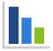 and then **Apply and Close**.

5.  Drag the following from the Fields panel to the Layout Band:

    -   Store Sales from **Measures** to **Columns**. The view changes to show a column with the total. No slider is added for measures.
    -   Product Family from **Fields** to **Columns**. The **Data Level** area is shown in the **Filters** panel, with a **Columns** slider added.
    -   Date from **Fields** to **Rows**. A **Rows** slider is added to the **Data Level** area in the **Filters** panel.

6.  Use the sliders to see how the view changes. 
    The sliders help you explore your data visually in a number of ways:

    -   The slider reflects the hierarchy of the row or column groups, as determined by the order in which fields are arranged in the Layout Band.
    -   Hovering over a setting on the slider shows the name of the field or dimension corresponding to that setting.
    -   When you pivot a chart, slider settings are preserved and applied to the new target. For example, if you have the **Row** slider set to Month, the **Column** slider is set to Month when you pivot. See Pivoting a Chart for more information.
    -   When you remove the currently selected level from a row or column, the slider is reset to the total; when you remove a field that is not selected, the level remains the same. When you add a field or dimension to a row or column, the number of levels of the slider changes to reflect your addition. When you change the order of the fields in a row or column, the level on the slider changes to reflect the new level of the field corresponding to the selection.

### Changing Date Grouping

If your chart includes data based on a date field, you can change the level of aggregation for the time data. To select the unit of time to chart:

-   Right-click on the date field in the Layout Band and select **Change Grouping**. Then select the time period you want from the cascading sub-menu:

    -   Year

    -   Quarter (examples: Q1, Q2, etc.)

        !!! note

            Quarter groups the data by quarter through the whole selected period. For example, if the period has 2 years selected, then you will see 4 quarters (Q1, Q2, Q3, Q4) and data for each year will be grouped under these 4 quarters **regardless of the year** it belongs to. When Quarter is the only categorizer used, the sorting order will always start from the first quarter. Also, if there is no data for a specific quarter then this quarter **will still be visible** with no data.

-   Quarter and Year (examples: Q1 2020, Q2 2020, etc.)

    !!! note

        As of version 9.0, *Quarter* is renamed to *Quarter and Year*. Quarter and Year groups the data by quarter and year. For example, if the period has 2 years selected, then you will see potentially 8 quarters (for example, Q1 2020, Q2 2020, Q3 2020, Q4 2020, Q1 2021, Q2 2021, Q3 2021, Q4 2021), and data for each year will be grouped under its own quarter which will **take into account the year** as well. Also, if there is no data for a specific quarter, then this quarter **will not be visible**.

This date is required in order to create PeriodToPeriod (PTP) and YearToDate (YTD) charts.

-   Month (examples: January, February, etc.)

-   Month and Year (examples, January 2020, February 2020, etc.)

    !!! note

        As of version 9.0, *Month* is renamed to *Month and Year*. This date is required in order to create PeriodToPeriod (PTP) and YearToDate (YTD) charts.

-   Day

-   Hour

-   Minute

-   Second

-   Hour By Day

-   Minute By Day

-   Second By Day

-   Millisecond By Day

-   Day of Week

The view updates to reflect the new date grouping. 

!!! note

    Time Series charts can use only day, or smaller, intervals.

### Changing the Summary Function of a Measure

You can get a new view of your data by changing the summary function of a measure, for example, from sum to average. To select a new summary function for a measure:

-   Right-click on the measure in the Layout Band and select **Change Summary Function**. Then select the function you want from the cascading submenu. The view updates to reflect the new summary function.

### Pivoting a Chart

You can pivot a chart in two ways:

-   Pivot the entire chart by clicking 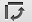. The row and column groups switch places; slider levels are maintained. The following figure shows the effect of pivoting a basic column chart.

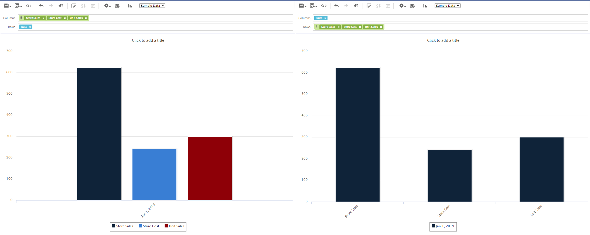

*Figure 5: Effect of Pivoting a Chart*

!!! note

    Pivoting a chart is only possible in the Old Layout Band, the New Layout Band does not allow pivoting an entire chart.

-   Pivot a single group: 
    For Old Layout Band

    -   To pivot a single row group, right-click it and select **Switch To Column Group**. You can also move any field or dimension by dragging. You cannot drag a measure to a different group.
    -   To pivot a single column group, right-click it and select **Switch To Row Group**. You can also move any field or dimension by dragging. You cannot drag a measure to a different group.

    For New Layout Band

    -   To pivot a single group, click  icon and select **Move to &lt;drop_area_name&gt;**. You can also move any field or dimension by dragging. You cannot drag a measure to a different group.

    !!! note

        In the **Move to &lt;drop_area_name&gt;** option, the *drop_area_name* depends on the visualization type you select.
