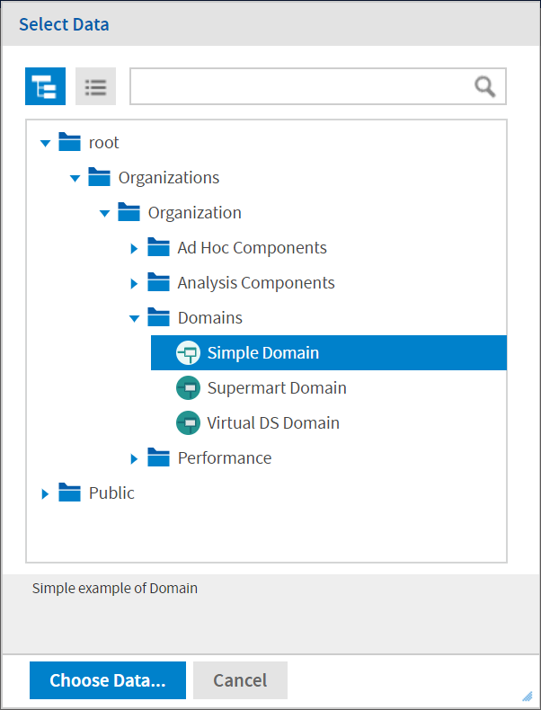

# Creating a View from a Domain

Like Topics and OLAP connections, administrators and data analysts create Domains for reuse to simplify access to data during view design. Domains give view makers more flexibility than Topics in choosing fields from the database and allow filtering of the data before it is included in a view and the subsequent report.

A view based on a Domain can prompt the user for input that determines what data is presented. For example, if a Domain includes all sales data for a company, the view can present detailed information grouped by postal code and prompt the user to select the geographic area, such as a US state. The view displays only the pertinent information.

For a more complete description of how to create Domains, see JasperReports Server Data Management Using Domains.

To begin create a basic view from a Domain

1.  On the Home page, click **Create \> Ad Hoc View**. The Select Data wizard opens.
2.  Click  and navigate to **Domains**. A description of the selected Domain appears at the bottom of the Domains tab.

*Figure 1: Simple Domain Selected in the Select Data Dialog*

3.  Select the domain you want to use.
4.  Click **Choose Data**. the Data Chooser opens to the Fields page. 
    You are now ready to configure your data using the Data Chooser Wizard.

## Referential Integrity

When you create an Ad Hoc view from a Domain, the two elements are connected - the data in the view is dependent on the Domain. This relationship affects users working with the Domain and the dependent view in a number of ways:

- When an item or items from the Domain are used in the dependent Ad Hoc view, removing the items from the Domain will result in a Missing Data error message when opening the Ad Hoc view in the editor. The user is prompted to remove the items from the Ad Hoc view. The removed items no longer appear in the Data Source Selection panel when the editor opens.
- Items not used in dependent views can be removed from the Domain by the Domain's administrator; those items no longer appear in the view's Available Fields list.
