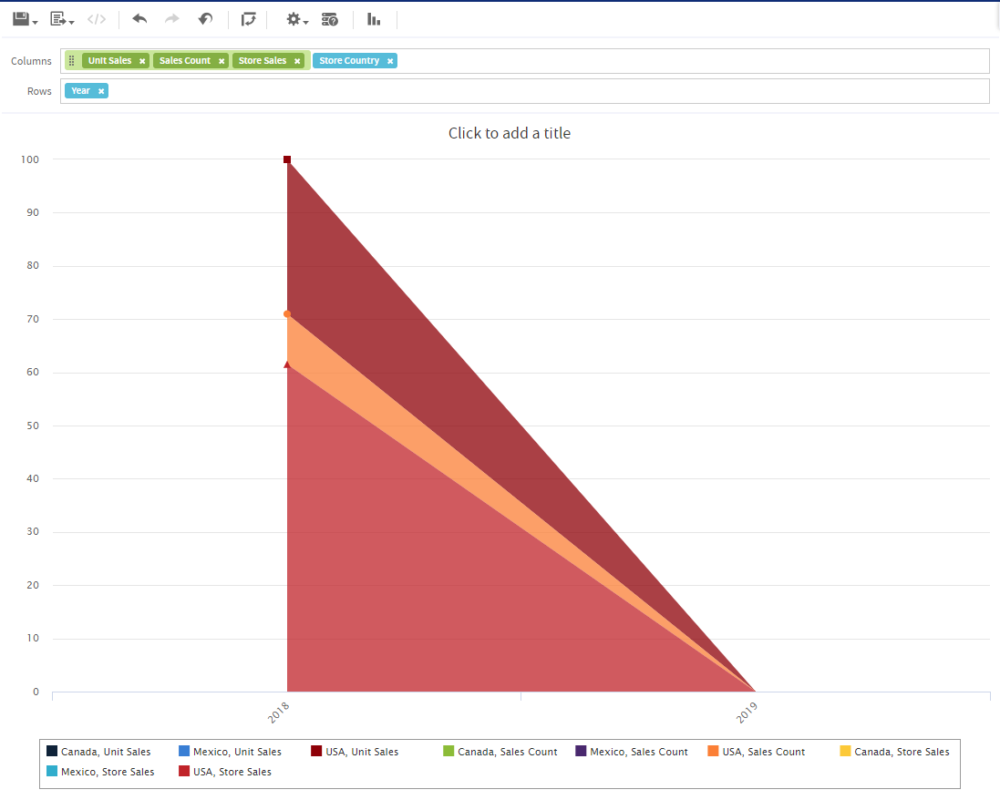

# Drilling Through Data

Drill-through functionality is available for crosstab data. A drill-through table displays the supporting details for the selected roll-up value.

To view the drill-through table for a value in your crosstab

1.  Click hyperlinked data to display additional columns related to that information.
2.  Use the page controls to navigate the table.

The drill-through table opens in its own window or tab, depending on your browser settings.

# Sorting

Like standard crosstabs, the rows and columns of an OLAP crosstab are sorted in alphabetical order of the group names.

To change the sorting of your OLAP crosstab

-   Right-click the heading you want to use for sorting and select one of these options:

    -   **Sort Ascending**
    -   **Sort Descending**
    -   **Don't Sort**

The crosstab is updated to reflect your sorting option. A blue dot appears in the context menu next to the currently applied sort option.

When the crosstab includes more than one row group or more than one column group, the inner groups are also sorted according to your selection. Only one measure can be used for sorting at any one time; changing the sort order for another measure resets all others to the default.

# Viewing the MDX Query

You may want to view the MDX query created for the OLAP connection used with your crosstab, to verify what data users are hitting. If this option is enabled, you can do this in the Ad Hoc Editor with the **View Query** button.

The query is read-only, but can be copied to a document for review.

To view the MDX query

-   In the tool bar, click . The View Query window opens, displaying the query.

# Working with Microsoft SSAS

The Ad Hoc Editor allows you to view data from Microsoft SQL Server Analytical Services (SSAS) to populate views and reports with multi-dimensional OLAP data. XML/A connections that point to your SSAS data are listed with the other OLAP connections when you create an Ad Hoc view, as in the following chart example.

*Figure 1 Search Results Listing*

For details, refer to the Jaspersoft OLAP User Guide.
