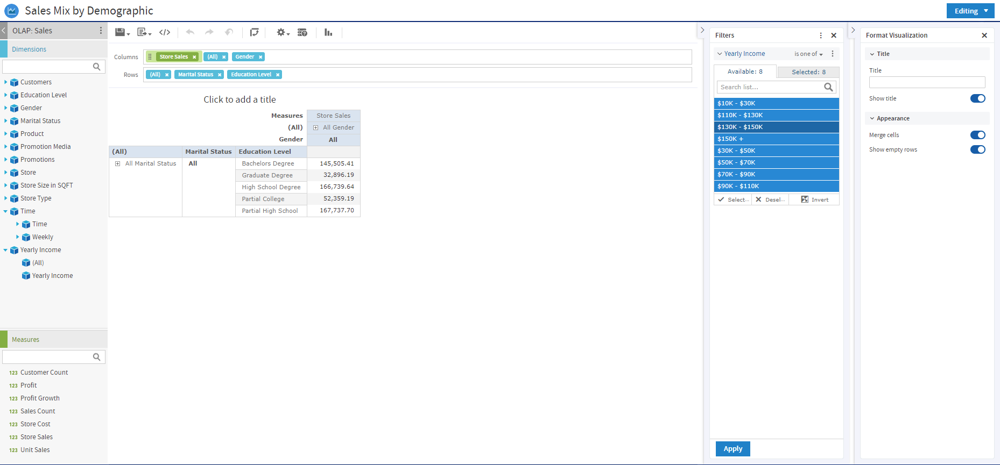

# Working with OLAP Connection-based Crosstabs

An OLAP connection is a definition for retrieving OLAP data for use in Ad Hoc views and reports. An OLAP connection is either a direct Java connection (Mondrian connection) or an XML-based API connection (XML/A connection). You must create OLAP client connections in order to use this functionality, which may be restricted by your license. For more information on creating OLAP client connections, as well as other administrative tasks regarding OLAP, refer to the Jaspersoft OLAP User Guide.

The Ad Hoc Editor displays a more focused tool bar when your Ad Hoc view is based on an OLAP connection. It contains a subset of the options available in the standard tool bar, including Display Mode, Redo, Undo All, Switch Group, Display Options, and View MDX Query. For a description of these options, see [the figure Ad Hoc Editor Tool Bar Icons](adhoc-data-source-selection.md).

*Figure 1: Ad Hoc Editor’s OLAP Connection-based Crosstab View*

## Dimensions and Measures

When you create a view based on an OLAP connection, the cube metadata defined in the connection’s OLAP schema is automatically applied to your data: the dimensions and measures in the cube are shown in the Data Source Selection panel.

Dimensions and measures describe your data in terms of these organizing principles and facts:

- **Dimension**: A categorization of the data in a cube. For example, a cube that stores data about sales figures might include dimensions such as time, product, region, and customer’s industry. A dimension is a hierarchical series of relationships in which each level has a parent and may also have children. Note that a level is a particular location within the dimension, whereas a member is a specific data element at a particular level. For example, if the dimension is Geography, then one of its levels might be Country; at the Country level, USA might be a member.

Some dimensions include a special level at the top of the hierarchy that includes every level in the dimension. This All member is used to display the summarized data across the dimension. The All member of dimensions is a common feature in many OLAP solutions.

- **Measure**: A field that displays the facts that constitute the quantitative data in a cube. For example, a cube that stores data about sales figures might include measures such as unit sales, store sales revenue, and store sales cost.

The items in the **Dimensions** section of the Data Source Selection panel may appear in a multi-level tree structure. You can add the entire dimension tree, or any sub-trees, to your crosstab by dragging the top-level name into the Layout Band. Individual items can be added to the crosstab in the same manner.

Items in the Measures section are organized into a single-level list. Any calculated measures are indicated by a calculation icon .

When working with OLAP connections, the Layout Band at the top of the Ad Hoc View panel allows you to drag and drop dimensions and measures into the crosstab. As you add columns and rows, the crosstab automatically builds on the panel. In the **Columns** and **Rows** fields, each item in your crosstab is represented as a token; drag tokens left and right to change their position on an axis or drag them between the fields to pivot them.

The cube metadata applied to your view provides structure to your crosstab: you can add a dimension with any number of levels, but it must follow the hierarchy defined in the cube. For example, if a dimension’s levels are Country, State, and City, you can place any one of them in the crosstab, but if you add two or more, their order (defined in the OLAP schema) is enforced. For example:

| Possible             | Impossible           |
|----------------------|----------------------|
| Country, State, City | State, Country, City |
| Country, City        | City, Country        |
| State, City          | City, State          |
| Country, State       | State, Country       |

In addition, you can’t mix members from different dimensions. For example, consider a crosstab that includes both a Geography dimension (Country, State, and City) and a Time dimension (Year, Quarter, and Month): you can’t insert the Year level between the Country and State levels. The levels of each dimension are always kept together.

All measures in the crosstab must be either rows or columns. You can’t have measures on both axes at the same time. To move measures between dimensions, right-click and select **Switch To Column Group** or **Switch To Row Group**. All the measures move to the other axis.
