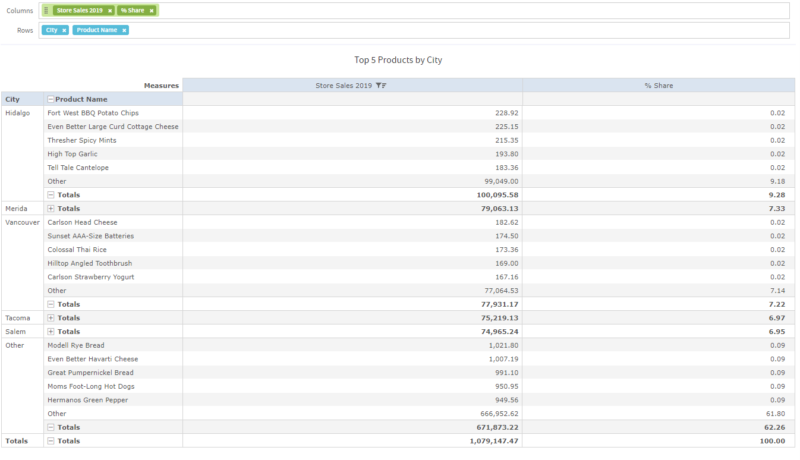
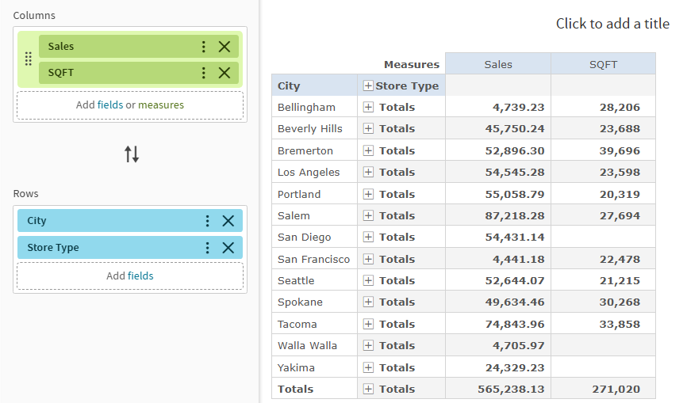
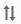
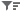
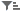

# Working with Standard Crosstabs

!!! note

    This section describes crosstabs based on Topics and Domains. For information about crosstabs based on OLAP connections, refer to [Working with OLAP Connection-based Crosstabs](adhoc-crosstabs-olap.md) and [Creating Topics](adhoc-topics.md).

Crosstabs have different data, layout, and format options than tables or charts.

*Figure 1 Ad Hoc Editor’s Standard Crosstab View for old layout band*

*Figure 2 Ad Hoc Editor’s Standard Crosstab View for new layout band*

If you selected Crosstab when you created a view, as described in [Ad Hoc View Types](adhoc-view-types.md), the following sections explain tasks specific to your crosstab development.

## Using Fields in Crosstabs

Fields can be added to crosstabs as row groups or column groups. Measures can be added to crosstab rows or columns as well, but all measures must be included as either a row or a column. This means that you can add one or more measures as columns, or add one or more measures as rows, but you cannot have one measure as a column and another as a row in the same crosstab.

### Crosstab Rows and Columns

When creating a crosstab view, keep in mind that row and column groups are arranged in hierarchies. Drag the group headings to rearrange the hierarchy; you can also right-click a heading and select a **Move** option from the context menu or press the cursor keys. Rearranging the groups may change the preview data in the editor.

To add a field or measure to a crosstab group

1.  In the **Data Source Selection** panel, click to select the fields you want to add to the crosstab as a group. Use Ctrl-click to select multiple items.
2.  Drag your selection into the **Columns** or **Rows** box in the Layout Band.

### Crosstab Measures

Measure labels are displayed in the crosstab based on their status as a row or column:

-   Measures included as rows appear in the crosstab below the **Measures** heading.
-   Measures included as columns appear in the crosstab to the right of the **Measures** heading.

You can right-click a measure in the crosstab to open a context menu that provides these options: 

-   **Change Summary Calculation**
-   **Change Time Balance Calculation**
-   **Change Data Format**
-   **Remove From Crosstab**
-   **Create Filter**
-   **Move Up** or **Move Down** or **Move Left** or **Move Right**

Measures are arranged in cells. You can add any number of measures. All the measures appear together in every cell. To rearrange the measures, drag them in the measure label area.

### Pivoting

You can pivot a crosstab in two ways:

-   In Old Layout Band, Pivot the entire crosstab by clicking . The row and column groups for switching places. For more information, see [Creating a View from a Domain](adhoc-create-view-from-domain.md). 
    In the New Layout Band, The fields or measures in the drop areas can be swapped by clicking the Switch icon between the two drop areas. 

-   Pivot a single group:

    -   To pivot a single row group, right-click it and select **Move To Columns**.
    -   To pivot a single column group, right-click it and select **Move To Rows**.

!!! note

    Pivoting removes any custom sorting applied to headings in your crosstab. It does not affect column or row sorts.

### Slicing

The slice feature lets you keep or exclude group members in a crosstab. To slice, right-click a group member and select:

-   **Keep Only** to remove all groups except the selected one from the crosstab.
-   **Exclude** to remove this group from the crosstab.

Use Ctrl-click and Shift-click to select multiple groups to keep or exclude.

!!! note

    You can select multiple row groups or multiple column groups; you cannot slice by both row groups and column groups at once. Compare slice to drill-through, drill to details, and filtering.

For more information about filtering, see [Using Filters and Input Controls](adhoc-filters-and-input-controls.md).

### Summarizing

All row and column groups are summarized automatically:

-   To turn off a group summary, right-click any heading in the group and select **Delete Row Summary** or **Delete Column Summary** from the context menu. To reapply the summary, right-click the heading and select **Add Row Summary** or **Add Column Summary.**

    !!! note

        The Delete Summary option is available only for the outermost group on either axis (that is, either the outermost row group or the outermost column group)

-   To select the summary function and data format for a measure, right-click the measure label and select from the context menu. Note that you cannot change the summary function on custom fields that calculate percents (Percent of Total, Percent of Column Group Parent, and Percent of Row Group Parent).

-   The summary functions for numeric fields are Sum, Average, Maximum, Minimum, Distinct Count, and Count All. Distinct Count is the number of different items in the row or column. Count All is the total number of items. For instance, if there are 3 widgets of type A and 3 widgets of type B, Distinct Count is 2 and Count All is 6.

### Collapsing and Expanding Members

By default, the editor displays each row and column group of a crosstab in a collapsed state. This means you can see the totals for the group, but not the measures for its individual members. To see measures for a group’s members, right-click the group label and select **Expand Members**.

When a group’s members are expanded, select **Collapse Members** from the same menu to hide the measures. Collapsing an outer group also collapses its inner groups. The **Expand Members** and **Collapse Members** options are available only for outermost groups, or for inner groups nested in an expanded outer group.

When you collapse a group, its summary is automatically displayed. This prevents invalid crosstab layouts in which there is nothing to display for some totals if the summary has been deleted previously.

### Merging and Unmerging Crosstab Cells

By default, the editor merges cells containing the same data into a larger, single cell to make the crosstab data easier to read.

To display all of the individual cells in the crosstab instead of merged cells, in the **Format Visualization** panel, in the **Appearance** settings, click the **Merge cells** switch to turn the setting off.

To merge the crosstab cells, click the **Merge cells** switch to turn the setting on.

### Adjust Crosstab Width

By default, the crosstab feature has **Use all available width** disabled. This means that the width of the crosstab columns automatically adjusts to the values they contain. To use all the page width in the Ad Hoc designer, enable the **Use all available width** option in the **Format Visualization** settings.

### Sorting

By default, the rows and columns of crosstabs are sorted in alphabetical order of the group names.

To sort your crosstab

-   Right-click the heading that you want to use for sorting and select one of these options:

    -   **Sort Ascending**
    -   **Sort Descending**
    -   **Don't Sort** 
        The crosstab is updated to reflect your sorting option. A blue dot appears in the context menu next to the currently applied sort option.

When the crosstab includes more than one row group or more than one column group, the inner groups are also sorted according to your selection. Only one measure can be used for sorting at any one time. Changing the sort order for another measure resets all others to the default.

To filter top or bottom N values

You can filter the numeric data shown in a crosstab to show only the rows with the top or bottom N values, where N is a number that you specify. For example, you can filter a crosstab to display only the top 10 values in a column.

1.  Right-click the heading that you want to use for filtering and select one of these options:

    -   **Filter Top N Values**
    -   **Filter Bottom N Values**
    -   **Don't Filter Values**

2.  Enter the number of values that you want to show in the crosstab.

3.  Select whether to show an aggregate of the unranked values in the crosstab.

4.  Select whether to apply the filter across all row groups.

5.  Click **OK**.

The crosstab is updated to reflect your filter option. The  icon appears in the heading when filtering a column for the top N values, while the  icon appears when filtering for the bottom N values. A blue dot appears in the context menu next to the currently applied filter option. Only one measure can be used for filtering at any one time. Changing the filtering or sort order for another measure resets the filtered column.

### Changing How Totals Are Calculated Using Time Balance

By default, crosstabs show the Totals of numeric values as the sum of the values in a column. For example, if the crosstab view displays product sales grouped by month, the crosstab displays the total sum sold during those months as the Totals value.

You can change the data that the crosstab displays as the Totals value for time using the Time Balance options. These options allow you to change the Totals to display the first and last numeric values for the period. For example, if you want to see the number of products left in your inventory at the end of a certain time period, use the Time Balance Last option and the Totals fields displays the last numeric value entered for the time period. If you want to see the number of products in your inventory at the beginning of the time period, use the Time Balance First option.

!!! note

    Changing the time balance calculation requires the crosstab to use the Date field. You cannot drill through the data when using a Time Balance option other than the default or when using Day of Week for the grouping.

To change the total calculation using the time balance

1.  In the Ad Hoc view, right-click the column or row header.

2.  Select **Change Time Balance** from the context menu.

3.  Select the option that you want to use. You can select one of the following:

    -   Time Balance Default. This option displays the sum of all the numeric data for a period of time as the Total value.
    -   Time Balance First. This option displays the first numeric value for a period of time as the Total value. For example, if the period of time is a month, the crosstab displays the first numeric value entered for the month.
    -   Time Balance Last. The option displays the last numeric value for a period of time as the Total value. For example, if the period of time is a month, the crosstab displays the last numeric value entered for the month.

The crosstab is updated to show the new Total values.

### Changing the Data Format

You can change the formatting for rows and columns containing numeric data, such as dates and monetary amounts. By default, non-integer fields use the -1,234.56 data format; integers use -1234.

To change the data format for a column

1.  In the Ad Hoc view, right-click the column or row header.
2.  Select **Change Data Format** from the context menu.
3.  Select the format that you want to use. These options vary depending on the type of numeric data contained in the column. 
    The data in the column or row now appears in the new format.

### Resizing and Layout

Many of the layout and formatting options that are set manually in tables are set automatically in crosstabs. In particular, row and column sizes are fixed and no spacer is available.

### Drilling Through Data

Drill-through functionality is available for crosstab data. A drill-through table displays the supporting details for the selected roll-up value.

To view the drill-through table for a value in your crosstab

-   Click hyperlinked data to display additional columns from that specific fact data.

By default, the drill-through table opens in its own window or tab, depending on your browser settings.
