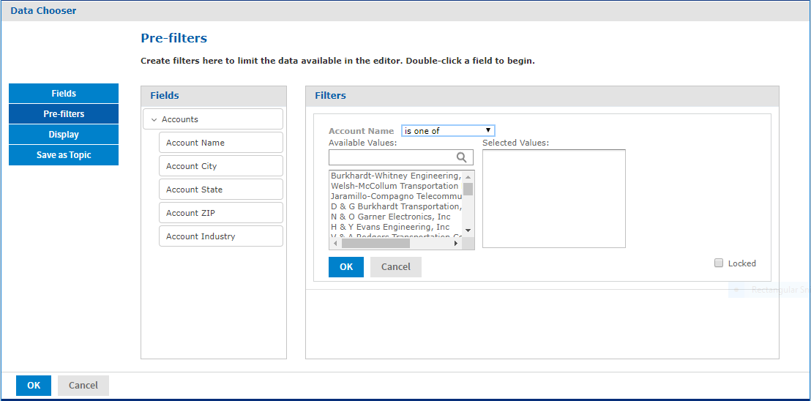
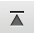
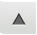
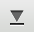

# Using the Data Chooser Wizard

To design a Domain Topic or a view based on a domain, use the Data Chooser wizard. To open the Data Chooser wizard:

1.  Click **Create** &gt; **Ad Hoc View**.

2.  Click  and browse to a Domain, then click **Choose Data** to access the following pages of the Data Chooser:

    -   [The Select Fields Page](#the-select-fields-page) – Choose the fields to make available in the Ad Hoc Editor.
    -   [The Pre-filters Page](#the-pre-filters-page) – Define a filter on any field, with the option of prompting for user input, or to compare fields.
    -   [The Display Page](#the-display-page) – Change the order and names of fields that appear in the Ad Hoc Editor.
    -   [The Save as Topic Page](#the-save-as-topic-page) – Save the settings as a Domain Topic.

Start by selecting some fields on the Select Fields page, but the other three pages are optional and can be completed in any order. Click **Table, Chart,** or **Crosstab** at any time to begin designing a view based on the chosen data.

## The Select Fields Page

Use this page to choose fields and sets of fields to use in the view or make available in the Domain Topic:

*Figure 1 The Fields Page of the Data Chooser*

-   The Source panel displays the sets of fields in the Domain. Use  and  to collapse or expand each set.

-   The Selected Fields panel shows the items that you selected. You can move a field or set back and forth between the panels by dragging, double-clicking, or selecting the item and clicking an arrow button, such as .

-   When you select any field from a set in the Source panel, the set name appears with the field in the Selected Fields panel. If you do not want sets, then use the settings on the Display page.

-   Some Domains define sets that are not joined, also called data islands. When you select a field from such a set, the behavior on the Select Fields page depends on how the joins were created in the Domain:

    -   If the Domain uses basic joins, the unjoined sets are not available. The Domain Designer only creates basic joins.
    -   If the Domain uses advanced joins, all joins are available regardless of the join set of the fields you add. In this case, you must manually make sure that you do not add fields that are in different data islands to a single Ad Hoc view. Otherwise you receive errors when attempting to work with the view.

## The Pre-filters Page

You can pre-filter the data in the Data Chooser before launching the Ad Hoc Editor or creating a Domain Topic. Pre-filtering data limits the data choices available in a Domain Topic or the fields that ultimately appear in the Ad Hoc view. You can also define a filter on a field that does not appear in the final report. The filter is still applied and only data that satisfies all defined filters appear in the final report. For example, you can filter data to select a single country, in which case it does not make sense for the Country field to appear as a row, column, or group. You can also design reports that prompt users to input data to use as a filter.

The Pre-filters page provides powerful functionality for designing views within the server.

*Figure 2 Condition Editor in the Filters Panel on the Pre-filters Page*

To define a filter

1.  In the Data Chooser, click **Pre-filters**.

2.  Expand the options in the **Fields** panel.

3.  Double-click to select a field in the **Fields** panel. Choices appear for filtering the selected field:

4.  Choose a comparison operator.

    Text fields have both substring comparison operators such as “starts with” or “contains” and whole string matching such as “equals” or “is one of ”. When you select a whole string matching operator, a list appears to show all existing values for the chosen field retrieved in real time from the database.

    In the Filters panel, a dropdown appears to contain the account names from which you can select multiple values.

5.  Click each value for comparison in Available Values to move it to Selected Values. The account names appear in Selected Values.

    !!! note

        If there are more than 50 Available Values, click  to search for the value. The maximum number of items that can be displayed in Available Values is configurable. For details, see the JasperReports Server Administrator Guide.

6.  To limit the view design to the four account names in Selected Values, check the **Locked** checkbox.

    By default, the **Locked** checkbox is unchecked, making the filter available to end users running the report.

    In the Report Viewer, users can click the **Options** button to enter a comparison value for this condition. When the user clicks **Apply** or **OK**, the report preview refreshes with data that match the condition. The condition is available as a prompt even if the filtered field does not appear in the report. For example, the final report might present data for a single country, but the country is chosen by the user. Once defined, filter prompts can be modified in the Ad Hoc Editor, as explained in [Using Input Controls](adhoc-input-controls.md).

    Note that when the **Locked** checkbox is checked, the filter is not available to end users running the report. The condition can be removed from the view, if needed, but not edited.

7.  Click **OK** to create the filter. 
    The **Filters** panel shows the filters that you have defined.

8.  In the **Filters** panel, click **Change** to modify the condition. Click **OK** to save the changes. After selecting a row, you can also click **Remove** to delete it from the list.

    !!! note

        Data rows must match all conditions. In other words, the overall filter applied to the data is the logical AND of all conditions you have defined.

## The Display Page

Use the Display page to change the default label and order of the fields as they should appear in the list of fields in the Ad Hoc Editor. You can always change the field labels and order in the Ad Hoc Editor, but setting them here makes them available in a Domain Topic. The page includes these options:

-   To change the order of fields, click once anywhere in a field’s row and use the **Move to top**, **Move up**, **Move down**, or **Move to bottom** buttons:

    , , , and 

    Fields may be moved only within their set, but sets as a whole may also be moved.

-   By default, the field name becomes the display label for the row, column, or measure that you create from it. To change the default display label of a field or set, double-click anywhere in the row and type the new label in the text box.

-   Sets and the fields they contain appear in the list of fields in the Ad Hoc Editor. Sets are not used in views, but can be used to add all their fields at once, expediting view creation.

-   If you do not want to use sets in the Ad Hoc Editor, select **Flat List** at the top of the Data Source Selection panel. You can now relabel the fields and reorder them.

## The Save as Topic Page

Here you can enter a name and a description to save the Data Chooser settings as a Domain Topic. Thereafter, you can create different views from the Domain Topic, using its fields, filters, and display label settings. You can also edit the Domain Topic to change the settings.

If an administrator has enabled the Data Staging feature, you can turn data staging on for your domain topic. With data staging, the entire dataset for a Domain Topic is indefinitely cached in the server's Ad Hoc cache. Ad Hoc views and reports from that Domain Topic run faster because they fetch data from the local cache, not by querying the production database. To keep data fresh, you can specify a refresh interval, and the server will periodically access the database in the background to reload the entire dataset.

-   By default, Domain Topics are saved in the standard Topics folder. This corresponds to the **Ad Hoc Components &gt; Topics** location in the repository; JRXML Topics and Domain Topics in this folder appear on the **Topics** tab when you start a view. Do not modify this folder name.
-   The description text appears with the Domain Topic in the repository and at the bottom of the **Topics** tab on the Ad Hoc Source dialog. Enter an informative description that helps users understand the nature and purpose of this Domain Topic.
