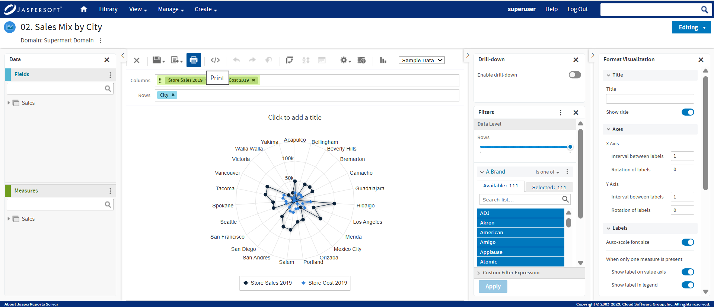

# The Data Source Selection Panel

The Data Source Selection panel contains a list of available fields in the chosen Topic or Domain. If you are using a Domain, fields may appear in nested sets. Use the arrow beside the set name to expand or collapse a set of fields.

Available fields may be divided into two sections in the panel, **Fields** and **Measures**. You can use the search field in each section to locate a specific field or measure.

To hide this panel, click **\<** in the top-left corner. This is helpful when arranging content in a large Ad Hoc view. Click the same icon on the minimized panel to expand it.

The tooltip content for the available Fields and Measures include:

- **Field Path** (for example: Sales \> Stores \> Regions \> City) for Domain-based Ad Hoc
- **Original name** (from the domains)
- **Formula** (for calculated fields and calculated measure only)
- **Description**
- **Data Type** (Possible values are string, number, date, time, timestamp, boolean)
- **Field type** (Field, Measure, Calculated Field, Calculated Measure)
- **Default summary calculation**

For more information on working with fields, see [Using Fields in Tables](adhoc-tables.md), [Using Fields and Measures in Charts](adhoc-charts.md), and [Using Fields in Crosstabs](adhoc-crosstabs-standard.md).

# The Ad Hoc View Panel

The Ad Hoc View panel provides tools that allow you to control what data is included in a view, and how it is organized.

Along the top of the panel, there is a tool bar and a dropdown menu.

The dropdown menu contains options for displaying a subset of the available data (**Sample Data**), all available data (**Full Data**), or none of the available data (**No Data**) in the view. Using the sample data can make the design process quicker by loading less data. Use the subset for initial design; use the full set for refining layout elements such as column width.

By default, the editor displays only a smaller, sample set of the data in the view. Use the dropdown menu to select **Full Data** to view the full set of data.

!!! note

    Depending on its configuration, JasperReports Server may load a Topic, Domain, or OLAP connection’s entire result set into memory when you edit the view, or run a report from it. If the data policies and other options that control JasperReports Server’s memory are disabled, ensure that each Topic, Domain, or OLAP connection returns a manageable amount of data, given the environment’s load capacity. Alternately, you can change the server’s configuration

The tool bar at the top of the panel provides access to many functions of the Ad Hoc Editor. The toolbar is described in Ad Hoc Editor Tool Bar Icons.

<table>
<caption>
Ad Hoc Editor Tool Bar Icons
</caption>
<colgroup>
<col style="width: 33%" />
<col style="width: 33%" />
<col style="width: 33%" />
</colgroup>
<thead>
<tr>
<th>
Icon
</th>
<th>
Name
</th>
<th>
Description
</th>
</tr>
</thead>
<tbody>
<tr>
<td>

</td>
<td>
Save
</td>
<td>
Place the cursor over this icon to open a menu of save options.
</td>
</tr>
<tr>
<td>

</td>
<td>
Export
</td>
<td>
Place the cursor over this icon to open a menu of export options. You can export the Ad Hoc View in the following formats:

<ul>
<li>PDF Document (.pdf)</li>
<li>Comma Separated Values (.csv)</li>
<li>Microsoft Word (.docx)</li>
<li>Rich Text Format (.rtf)</li>
<li>OpenDocument Text (.odt)</li>
<li>OpenDocument Spreadsheet (.ods)</li>
<li>Microsoft Excel - Paginated (.xlsx)</li>
<li>Microsoft Excel (.xlsx)</li>
<li>Microsoft PowerPoint (.pptx) 
</li>
</ul></td>
</tr>
<tr>
<td></td>
<td>Get Embed Code</td>
<td>Click to display the Ad Hoc View Embed Code dialog. See <a href="adhoc-get-embed-code.md">Getting the Embed Code for Visualizations</a> for more information.</td>
</tr>
<tr>
<td>

</td>
<td>
Undo
</td>
<td>
Click this icon to undo the most recent action.
</td>
</tr>
<tr>
<td>

</td>
<td>
Redo
</td>
<td>
Click this icon to redo the most recently undone action.
</td>
</tr>
<tr>
<td>

</td>
<td>
Undo All
</td>
<td>
Click this icon to revert the view to its state when you last saved.
</td>
</tr>
<tr>
<td>

</td>
<td>
Switch Group
</td>
<td>
Click this icon to change the way groups are displayed. For more information, refer to <a href="adhoc-create-view-from-domain.md">Creating a View from a Domain</a>.

**Note** Switch Group is not available for New Layout Band.
</td>
</tr>
<tr>
<td>

</td>
<td>
Sort
</td>
<td>
When working with tables, click this icon to view the current sorting and to select fields for sorting data. For more information, refer to <a href="adhoc-tables.md">Sorting Tables</a>.
</td>
</tr>
<tr>
<td>

</td>
<td>
Input Controls
</td>
<td>
Click this icon to see the input controls applied to this view. For more information, refer to <a href="adhoc-input-controls.md">Using Input Controls</a>.
</td>
</tr>
<tr>
<td>

</td>
<td>
Page Options
</td>
<td>
Place the cursor over this icon to open a menu of page-level options. You can change whether to display the Layout Band.
</td>
</tr>
<tr>
<td>

</td>
<td>
View SQL/MDX Query
</td>
<td>
For more information on viewing SQL queries, see Viewing the SQL Query.

For more information on viewing MDX queries, see <a href="adhoc-crosstabs-olap-drilling-through.md">Viewing the MDX Query</a>.
</td>
</tr>
<tr>
<td></td>
<td>Select Visualization Type</td>
<td>Click this icon to select the type of table, chart, or crosstab you want to use in your Ad Hoc view. For information on all the types of visualizations available, see <a href="adhoc-select-chart-type.md">Selecting a Visualization for the Ad Hoc View</a> for more information.</td>
</tr>
<tr>
<td></td>
<td>Close Ad Hoc View</td>
<td>Click to close the Ad Hoc View and return to the previous screen.</td>
</tr>
<tr>
<td></td>
<td>Print</td>
<td>Click the Print icon to print the Ad Hoc view. The print dialog opens and then click <strong>Print</strong>.</td>
</tr>
</tbody>
</table>

## Viewing the SQL Query

You may want to look at the SQL query for your view, to verify what data users are hitting. If you have the proper permissions, you can do this in the Ad Hoc Editor with the **View Query** button.

The query is read-only, but can be copied onto a clipboard or other document for review.

To view the SQL query

- In the tool bar, click . 
  The View Query window opens, displaying the SQL query.

## Printing Ad Hoc View

You can print an Ad Hoc View and save it to your computer as a PDF.

To print an Ad Hoc View

- Hover over the Print button, and select Print.

 

!!! note

    The available print format is PDF (.pdf) only.
