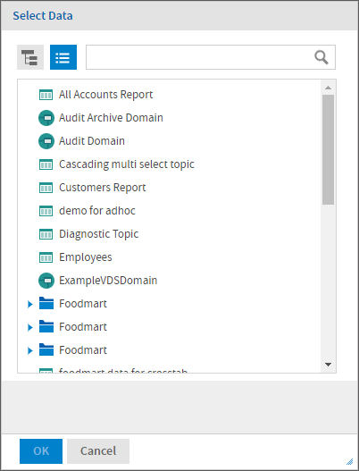
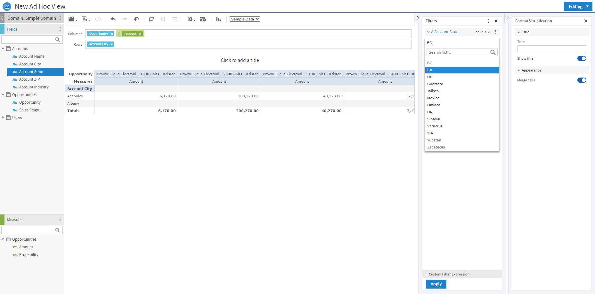

# Overview of the Ad Hoc Editor

The Ad Hoc Editor is an interactive tool for creating views for various types of reports: tables, crosstabs, and charts. You create these views by simply dragging and dropping elements. You can add and summarize fields, define groups, label and title the report, and format data for each field. The effects of your changes are evident immediately, and you can adjust the display to highlight the most relevant and compelling aspects of your data.

The Ad Hoc Editor provides analysis options (such as slice, pivot, and filter) to help you recognize trends and outliers in your data. You can drill into specific details or analyze your data at a very high level.

To open the Ad Hoc Editor

1.  Click **Create &gt; Ad Hoc View**. This opens the **Select Data** dialog.
2.  Choose your data source from the list and click **OK**.

*Figure 1 List of Data Sources in the Select Data Dialog*

The Ad Hoc Editor contains the following panels, from left to right:

-   **Data Source Selection,** which contains the fields, dimensions, and measures available in the source Domain, Topic, or OLAP connection.

-   **Ad Hoc View**, the main view design panel.

-   **Filters**, which defines a subset of data to retrieve from the data source.

-   **Format Visualization**, which displays the properties specific to the selected visualization type.

*Figure 2 User Interface of the Ad Hoc Editor*

We’ll discuss how to use these panels to create an Ad Hoc view later in this section.
