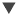

# Using Filters

Filters can be defined at three levels:

-   In the Domain Designer.
-   When creating a view from a Domain (with the Data Chooser).
-   In the Ad Hoc Editor (even when the view is based on a JRXML Topic or OLAP connection).

In this section, we discuss how to define filters in the Ad Hoc Editor. For information on defining filters in the Domain Designer, see JasperReports Server Data Management Using Domains. For information on defining filters in the Data Chooser, see [The Pre-filters Page](adhoc-data-chooser.md).

In addition, you can control how and what filters are applied to a field or fields by using custom expressions. For more information, see [Custom Filtering](#custom-filtering).

To create a filter in the Ad Hoc Editor

1.  Right-click a field in the **Data Source Selection** panel and select **Create Filter**. A new filter appears in the Filters panel. If the Filters panel was hidden, it appears when you create a new filter.

    !!! note

        If the results are empty and you do not understand why, check for an incompatible combination of filters and input controls. Click  to compare the input controls with the filters in the Filters panel.

2.  Use the fields in the filter to change its value. Depending on the datatype of the field you selected, the filter maybe multi-select, single-select, or text input.

3.  Click  and select **Minimize All Filters** or **Maximize All Filters** to toggle expansion of the items in the filter.

4.  Click  and select **Remove All Filters** to remove the filters.

5.  Click  to hide the filter’s details. Click  to display them again.

6.  Hover over the Fields or Measures to view the tooltip information. For more information on tooltip, see [The Data Source Selection Panel.](adhoc-data-source-selection.md)

7.  Click the **Select All** checkbox (if it appears in the Filters panel) to select all values currently available in the dataset. The **Select All** checkbox does not appear in the Filters panel for numbers and dates.

    Note that the **Select All** checkbox does not guarantee that all values are selected every time the report runs. Instead, the checkbox is a shortcut to help you quickly select all the values currently available in the dataset. To ensure that all values appear in the view whenever it is edited or a report is run, remove the filter entirely. On the panel, you can also create a filter from the right-click context menu of a column in a table. On the **Chart** tab, you must right-click the field in the **Data Source Selection** panel.

When you change a filter, the server uses the filter's new value to determine what data to display. If you change only the operator in a filter, you must deselect the value in that filter, then reselect it to apply the updated filter.

For filters with multiple values, you do not need to reselect all values. After changing the operator, use Ctrl-click to deselect just one of the values, then Ctrl-click to reselect that value.

## Relative Dates

You can filter information in your view based on a date range relative to the current system date. You can accomplish this using date-based filters, and entering a text expression describing the relative date or date span you want to display, using the format `<Keyword>+/-<Number>` where:

-   **Keyword**: Indicates the time span that you want to use. Options include: DAY, WEEK, MONTH, QUARTER, SEMI, and YEAR. An option used by itself (without `+/-<Number>`) gives the current value for that option.
-   **+** or **-** : Indicates whether the time span occurs before or after the chosen date.
-   **Number**: Indicates the number of the above-mentioned time spans you want to include in the filter.

For example, if you want to look at all Sales for the prior week, your expression would be: WEEK-1.

To create a relative date filter

1.  Following the instructions in [Using Filters](#using-filters), create a filter based on a date field. The filter appears in the Filters panel.

2.  In the filter’s first text entry box, enter an expression describing the relative date or date span you want to display.

3.  In the filter’s second text entry box, enter the date you want to base your filter on.

    For instance, if you want to display all the sales numbers for one month before the current date, enter MONTH-1 in the first text entry box, and enter today's date in the second box.

    !!! note

        When you right-click a group member in a crosstab and select **Keep Only** or **Exclude**, you create complex filters. When you create a filter against an inner group, the filter that appears may be created as a complex filter. You cannot edit a complex filter, but you can remove it. Complex filters also appear in the Ad Hoc Editor if a Data Chooser filter was created and locked.

## Custom Filtering

When you create multiple filters they are, by default, connected with an implicit AND operator. That is, the data displayed in your table, chart, or crosstab is what remains after all your filters are applied.

However, with the custom filter functionality, you can exercise greater control over the displayed data by applying a custom expression that includes more complex, nested AND, OR, and NOT operators, as well as by applying multiple filters to a single field.

!!! note

    Custom filters are not available for Ad Hoc views created from OLAP connections.

Custom filters are useful in a number of situations, including:

-   **When using the AND operator is not sufficient**. Consider an international company that wants to view data for stores located on the Pacific Rim; they may create a custom expression with the following criteria:

    -   Country is USA

        AND

    -   State is California OR Washington OR Oregon OR Hawaii OR Alaska.

        OR

    -   Country is Japan OR Indonesia

        Using the AND operator for all of these criteria returns an empty view, as no store is located in all of those areas.

-   **When you need to eliminate some results in a field.** For example, if your food and beverage distribution company wants to view sales for all drinks except for high-price items, you might include the following criteria in a custom expression:

    -   Product Group is Beverages

        NOT

    -   Price is greater than 39.99

        This filter displays all items in the Beverage Product Group, but filters out those with prices over $39.99

These are only two scenarios where custom filters can hone your results and make your view more precise. There are, of course, many other situations where they can be applied.

In this section, we take you through these tasks:

-   Creating a custom expression

-   Editing a custom expression

-   Removing a custom expression

-   Applying multiple filters to a single field

    !!! note

        Custom filters are applied to views, but filter details do not appear on previews or on the report generated from that view.

To create and apply a custom filter

1.  Create two or more filters for your data, as described in [Using Filters](#using-filters). These can be standard field-based filters, or **Keep Only** and **Exclude** filters. 
    Note that as you create the filters for use in a custom expression, you may find that the data in your view disappears, since most (if not all) of the data will not meet all of the filter criteria. When you create your custom expression and change some of the ANDs to ORs and NOTs, the data reappears in the panel.

2.  At the bottom of the Filters panel, expand the **Custom Filter Expression** section.

3.  In the text entry box, enter a filter expression using the letter designations, and including the following operators:

    -   **AND** narrows your results and includes only fields that meet the criteria of both filters before and after the operator.

    -   **OR** broadens your results and includes fields that meet the criteria of either filter before or after the operator.

    -   **NOT** excludes results that match the criteria.

    -   **Parentheses** combine multiple filters into a single item in the expression.

        !!! note

            Filter letter designations are case-sensitive, and must be UPPERCASE.

4.  Click **Apply**. Your view is updated to reflect the newly applied filter criteria.

After creating a custom filter, you may want to add another filter to the expression or remove one already included in the expression.

!!! note

    If the simple filter you want to delete is part of a custom filter, you must first remove it from the custom filter expression. Otherwise deleting the filter deletes the custom filter expression.

To add a new filter to an existing custom expression

1.  If necessary, create the new filter in the **Filter** panel.
2.  In the **Custom Filter Expression** section, click inside the text entry box to edit the expression.
3.  Add the new filter to the expression.
4.  Click **Apply** to apply the new filter criteria.

To remove a filter from a custom expression

1.  Expand the **Custom Filter Expression** section.
2.  In the text entry box, remove the unwanted filter from the expression and adjust the expression as needed.
3.  Click **Apply** to apply the new filter criteria.

When working with custom expressions, you may decide to delete an expression and create a new one.

To remove a custom expression from a view

1.  Expand the **Custom Filter Expression** section.
2.  Clear the expression from the text entry box.
3.  Click **Apply**. The expression is removed, leaving the remaining filters intact.

When you refine your custom expression, you may also want to delete unused filters from the Filters panel.

-   If the filter you want to remove is not part of the custom filter, hover your mouse over  in the filter’s title bar and select **Remove Filter**.
-   If you want to remove all existing filters, including the custom expression, hover your mouse over  in the upper right corner of the Filters panhandle and select **Remove All Filters**.

You can apply multiple simple filters to a single field, if needed further to refine your custom filter results. For example, a user may want to view the data in the Shipping Cost field, but only when it meets certain criteria combinations:

-   When shipping costs to French cities with postal codes that begin with the number 5 are under five Euros.

-   When shipping costs to German cities with postal codes that begin with the number 1 are under five Euros.

    !!! note

        You can recreate the scenario below using the **demo for an ad hoc** topic.

In the following example a user has a table including the following columns:

-   Country

-   Postal Code

-   Shipping Charge

    To analyze the specific shipping costs described above, the user creates the following (simple) filters - including two filters each for the Country and Postal code fields:

-   A. Country equals France.

-   B. Postal code starts with 5.

-   C. Country equals Germany.

-   D. Postal code starts with 1.

-   E. Shipping Charge is less than 5.

    Then, to display only the information she needs, she creates the following custom expression:

-   ((A and B) or (C and D)) and E

    This translates to:

-   ((FRANCE and POSTAL CODES THAT START WITH 5) or (GERMANY and POSTAL CODES THAT START WITH 1)) and SHIPPING CHARGES LESS THAN 5 EUROS.
