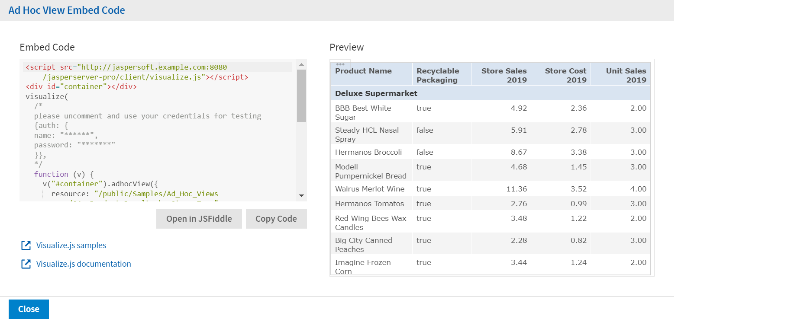

# Getting the Embed Code for Visualize.js

Visualize.js is the JavaScript library available with JasperReports Server to embed dashboards and reports in custom web apps. If you create an app with Visualize.js, this feature gives you the JavaScript code needed to embed the current dashboard in your app. You can then write additional code to interact with the dashboard programmatically, for example to update a filter depending on other actions in your app. For more information, see the *JasperReports Server Visualize.js Guide*.

You can get the embed code for an Ad Hoc view from the Ad Hoc editor in design mode. When in display mode, click the **Viewing** button and select **Editing** to switch to the design mode.

To get an Ad Hoc view embed code

1.  On the Ad Hoc viewer toolbar, click  to open the **Ad Hoc View Embed Code** dialog.

    

    *Figure 1 Ad Hoc View Embed Code Dialog*

    The dialog shows the Visualize.js code and a preview of the dashboard as it is saved.

2.  Click the **Copy Code** button to copy the embed code to the clipboard.

3.  Click the **Open in JSFiddle** button to load the embed code into JSFiddle, an online JavaScript viewer, and interactive editor.

4.  Click the **Close** button to return to the Ad Hoc view.
