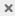

# Using Input Controls

In the Ad Hoc Editor, you can display the input controls defined in the Topic as visible to users. You can accept the controls’ default values or enter other values. The Ad Hoc Editor indicates that the view has input controls by displaying an input control icon  as active on the tool bar. Click this icon to select new values or to save values as the new defaults for this view.

There are two types of input controls: Single-select and multi-select. The input control type is determined by the operator that you use. In turn, the available operators are determined by the field type (date, text, numeric, or boolean) you use as a filter.

Single select controls present a calendar or dropdown list of values, from which you can choose a single value. To create this type of input control select one of the following operators:

-   equals

-   is not equal to

-   is greater than

-   is less than

-   is greater or equal to

-   is less or equal to

-   contains

-   does not contain

-   starts with

-   does not start with

-   ends with

-   does not end with

-   is before

-   is after

-   is on or before

-   is on or after

    Multi-select controls display a calendar or dropdown list of values, from which you can choose multiple values. You can click to select individual values or shift-click to select multiple sequential values. You can also search for values,  select all available values,  deselect all available values, or  invert the selection. A **Selected** tab shows only items that are selected and allows you to delete them. To create this type of input control select one of the following operators:

-   is one of

-   is not one of

-   is between

-   is not between

To add an input control to the view using a filter

1.  Create a new filter or use an existing one in the Filters panel.
2.  In the Filters panel, click the operator dropdown menu in the filter's title bar.
3.  Select an operator from the dropdown. The operator you select determines whether the input control is single-select or multi-select.
4.  Click **Apply**. The filter appears as an input control when the view is used to run the report.
5.  Place your cursor overand select **Save Ad Hoc View as**.
6.  Name the view, select a location, and click **Save**.
7.  On the tool bar, click .

Only the input controls defined in the topic appear here. Again, if no input controls were defined in the topic, the button appears inactive. You can create a report and open it in the Report Viewer to see a filter listed as an input control.

To edit the values for a view’s input controls

1.  On the tool bar, click . A window listing the input controls defined in the Topic appears.

    !!! note

        The Parametrized Report Topic already includes three input controls created when the report was uploaded: Country, RequestDate, and OrderId.

2.  Select new values. For example, select USA from the **Country** dropdown.

3.  To change default values of input controls, select the checkbox, **Set these values as defaults when saving your view**. The selected values become the default values when you save the view.

4.  Click **OK**. The Ad Hoc view shows USA data.
