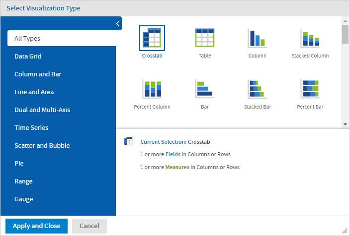
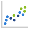

# The Visualization Selector

The Visualization Selector lets you switch between Ad Hoc view types, allowing you to choose the best way to represent your information in the Ad Hoc view, including:

- Table, which displays values corresponding to the rows and columns in the data source.

- Crosstab, which compares one or more values across multiple sets of related fields.

- Column, which compares values displayed as columns.

- Bar, which compares values displayed as bars.

- Line, which compares values displayed as points connected by lines.

- Area, which compares values displayed as shaded areas.

- Spider, which compares three or more values on a series of spokes. Spider charts can use columns, lines, or areas to display values.

- Dual- and Multi-Axis, which display values using two or more measures.

- Time Series, which compares time intervals displayed as points connected by lines. The Time Series chart type is only available for non-OLAP charts.

- Scatter, which compares values as individual points arrayed across both axes of a chart.

- Bubble, which compares three measures displayed as circles of varying sizes arrayed across both axes of a chart.

- Pie, which compares values displayed as slices of a circular graph.

- Range, which displays values such as heat and tree maps. Only the Heat Map chart is available for OLAP data sources.

- Gauge, which displays values as a radial or arc gauge, based on a defined minimum and maximum measure setting.

!!! note

    JasperReports Server has limited support for scatter charts created in some older versions. You can use the Ad Hoc views for those scatter charts to generate new reports, but you cannot edit them

To select a new visualization type

1.  In the Ad Hoc Editor tool bar, click the  icon to display the **Select Visualization Type** window.

    

    *Figure 1: Select Visualization Type Window, for Old Layout Band*

    

    *Figure 2: Select Visualization Type Window, for New Layout Band*

2.  Click the type of visualization that you want to apply to your report. The selected visualization type is outlined in blue. The Visualization Selector displays a description of the selected visualization and the number of fields and measures that it uses.

3.  Click **Apply and Close** to use the visualization type.

The following table describes the available visualization types, and the rules (if any) affecting their use:

<table>
<caption>
HTML5 Visualization Types
</caption>
<colgroup>
<col style="width: 50%" />
<col style="width: 50%" />
</colgroup>
<thead>
<tr>
<th>
Icon
</th>
<th>
Description
</th>
</tr>
</thead>
<tbody>
<tr>
<td>
<strong>Data Grid</strong>
</td>
<td><strong>Data grids display values from the data source in columns and rows as either individual or aggregate values.</strong></td>
</tr>
<tr>
<td></td>
<td>
<strong>Crosstab</strong> - Compares one or more measures across multiple sets of related fields.

For both Old and New Layout Band:

<ul>
<li>
Add fields and measures to Columns and Rows.
</li>
<li>
The crosstab will appear after the first measure is added.
</li>
</ul></td>
</tr>
<tr>
<td></td>
<td>
<strong>Table</strong> - Displays values corresponding to the columns and rows in the data source.

For both Old and New Layout Band:

<ul>
<li>
Add fields and measures to Columns.
</li>
<li>
Place fields in Groups to categorize rows by one or more shared column values."
</li>
</ul></td>
</tr>
<tr>
<td>
<strong>Column and Bar</strong>
</td>
<td><strong>Column charts compare values displayed as columns and bars.</strong></td>
</tr>
<tr>
<td>

</td>
<td>
<strong>Column</strong> - Multiple measures of a group are depicted as individual columns.

For Old Layout Band:

<ul>
<li>
Add zero or more fields to the Rows.
</li>
<li>
Add one or more fields and measures to Columns.
</li>
</ul>

For New Layout Band:

<ul>
<li>
Add fields to Y-axis and or Columns.
</li>
<li>
Add measures to Y-axis.
</li>
</ul>

The drop areas are same for <strong>Stacked Column</strong>, and <strong>Percent Column</strong>.
</td>
</tr>
<tr>
<td>

</td>
<td>
<strong>Stacked Column</strong> - Multiple measures of a group are depicted as portions of a single column whose size reflects the aggregate value of the group.
</td>
</tr>
<tr>
<td>

</td>
<td>
<strong>Percent Column</strong> - Multiple measures of a group are depicted as portions of a single column of fixed size.
</td>
</tr>
<tr>
<td>

</td>
<td>
<strong>Spider Column</strong> - Multiple measures of a group are depicted as portions of individual "columns" along a spoked chart.

For Old Layout Band:

<ul>
<li>
Add zero or more fields to Rows.
</li>
<li>
Add one or more measures to Columns.
</li>
</ul>

For New Layout Band:

<ul>
<li>
Add fields to Radial axis and/or Columns.
</li>
<li>
Add measures to Columns.
</li>
</ul></td>
</tr>
<tr>
<td>

</td>
<td>
<strong>Bar</strong> - Multiple measures of a group are depicted as individual bars.

For Old Layout Band:

<ul>
<li>
Add one or more fields and or measures to Columns.
</li>
<li>
Add zero or more fields to Rows.
</li>
</ul>

For New Layout Band:

<ul>
<li>
Add fields to X-axis and/or Bars.
</li>
<li>
Add measures to X-axis.
</li>
</ul>

The drop areas are same for <strong>Stacked Bar</strong>, and <strong>Percent Bar</strong>.
</td>
</tr>
<tr>
<td>

</td>
<td>
<strong>Stacked Bar</strong> - Multiple measures of a group are depicted as portions of a single bar whose size reflects the aggregate value of the group.
</td>
</tr>
<tr>
<td>

</td>
<td>
<strong>Percent Bar</strong> - Multiple measures of a group are depicted as portions of a single bar of fixed size.
</td>
</tr>
<tr>
<td>
<strong>Line and Area</strong>
</td>
<td><strong>Line charts compare values displayed as points connected by lines.</strong></td>
</tr>
<tr>
<td>

</td>
<td>
<strong>Line</strong> - Displays data points connected with straight lines.

For Old Layout Band:

<ul>
<li>
Add one time or date field in Rows.
</li>
<li>
Add zero or more fields in Columns.
</li>
<li>
Add one or more measures to Columns.
</li>
</ul>

For New Layout Band:

<ul>
<li>
Add one time or stage-based field to X-axis.
</li>
<li>
Add fields or measures to Lines.
</li>
</ul></td>
</tr>
<tr>
<td>

</td>
<td>
<strong>Spline</strong> - Displays data points connected with a fitted curve.

For Old and New Layout Band the drop areas are same as the Line chart.
</td>
</tr>
<tr>
<td>

</td>
<td>
<strong>Spider Line</strong> - Displays data points connected with straight lines on a spoked chart.

For Old Layout Band:

<ul>
<li>
Add zero or more fields in Rows.
</li>
<li>
Add one or more measures in Columns.
</li>
</ul>

For New Layout Band:

<ul>
<li>
Add fields to Radial axis and/or Lines.
</li>
<li>
Add measures to Lines.
</li>
</ul></td>
</tr>
<tr>
<td>

</td>
<td>
<strong>Area</strong> - Displays data points connected with a straight line and a color below the line. Groups are displayed as transparent overlays.

For Old Layout Band:

<ul>
<li>
Add one Time or Date fields in Rows.
</li>
<li>
Add zero or more fields in Columns.
</li>
<li>
Add one or more measures in Columns.
</li>
</ul>

For New Layout Band:

<ul>
<li>
Add time or stage-based fields to X-axis.
</li>
<li>
Add fields or measures to Areas.
</li>
</ul>

The drop areas are same for <strong>Stacked Area</strong>, <strong>Percent Area</strong>, and <strong>Area spline</strong>.
</td>
</tr>
<tr>
<td>

</td>
<td>
<strong>Stacked Area</strong> - Displays data points connected with a straight line and a solid color below the line. Groups are displayed as solid areas arranged vertically, one on top of another.
</td>
</tr>
<tr>
<td>

</td>
<td>
<strong>Percent Area</strong> - Displays data points connected with a straight line and a solid color below the line. Groups are displayed as portions of an area of fixed size, and arranged vertically one on top of another.
</td>
</tr>
<tr>
<td>

</td>
<td>
<strong>Area Spline</strong> - Displays data points connected with a fitted curve and a color below the line. Groups are displayed as transparent overlays.
</td>
</tr>
<tr>
<td>

</td>
<td>
<strong>Spider Area</strong> - Displays data points connected with straight lines and a solid color between the line and the center of a spoked chart. Groups are displayed as transparent overlays.

For Old Layout Band:

<ul>
<li>
Add zero or more fields in Rows.
</li>
<li>
Add one or more measures in Columns.
</li>
</ul>

For New Layout Band:

<ul>
<li>
Add fields to Radial axis and/or Areas.
</li>
<li>
Add measures to Areas.
</li>
</ul></td>
</tr>
<tr>
<td>
<strong>Dual and Multi-Axis</strong>
</td>
<td><strong>Dual and multi-axis charts compare two or more measures, using multiple charting types or multiple axes.</strong></td>
</tr>
<tr>
<td>

</td>
<td>
<strong>Column Line</strong> - Displays leftmost measures as columns, last measure as a line.

For Old Layout Band:

<ul>
<li>Requires two or more measures.</li>
<li>Measures must be placed in the Columns drop area.</li>
<li>Fields and dimensions can be placed only in the Rows drop area.</li>
</ul>

For New Layout Band:

<ul>
<li>Requires two or more measures.</li>
<li>Measures must be placed in the Columns and Lines drop area.</li>
<li>Fields and dimensions can be placed only in the X-axis drop area.</li>
</ul></td>
</tr>
<tr>
<td>

</td>
<td>
<strong>Stacked Column Line</strong> - Displays leftmost measures as stacked bars, last measure as a line.

For Old Layout Band:

<ul>
<li>Requires three or more measures.</li>
<li>Measures must be placed in the Columns drop area.</li>
<li>Fields and dimensions can be placed only in the Rows drop area.</li>
</ul>

For New Layout Band the drop areas are same as <strong>Column Line chart</strong>.
</td>
</tr>
<tr>
<td>

</td>
<td>
<strong>Column Spline</strong> - Displays leftmost measures as columns, last measure as a spline.

For Old Layout Band:

<ul>
<li>Requires two or more measures.</li>
<li>Measures must be placed in the Columns drop area.</li>
<li>Fields and dimensions can be placed only in the Rows drop area.</li>
</ul>

For New Layout Band the drop areas are same as <strong>Column Line chart</strong>.
</td>
</tr>
<tr>
<td>

</td>
<td>
<strong>Stacked Column Spline</strong> - Displays leftmost measures as stacked columns, last measure as a line.

<ul>
<li>Requires three or more measures.</li>
<li>Measures must be placed in the Columns drop area.</li>
<li>Fields and dimensions can be placed only in the Rows drop area.</li>
</ul>

For New Layout Band the drop areas are same as <strong>Column Line chart</strong>.
</td>
</tr>
<tr>
<td>

</td>
<td>
<strong>Multi-Axis Line</strong> - Displays each measure as a separate axis line.

For Old Layout Band:

<ul>
<li>Requires two or more measures.</li>
<li>Measures must be placed in the Columns drop area.</li>
<li>Fields and dimensions can be placed only in the Rows drop area.</li>
</ul>

For New Layout band:

<ul>
<li>Requires two or more measures.</li>
<li>Measures must be placed in the Lines drop area.</li>
<li>Fields and dimensions can be placed only in the X-axis drop area.</li>
</ul></td>
</tr>
<tr>
<td>

</td>
<td>
<strong>Multi-Axis Spline</strong> - Displays each measure as a separate axis spline.

For Old Layout Band:

<ul>
<li>Requires two or more measures.</li>
<li>Measures must be placed in the Columns drop area.</li>
<li>Fields and dimensions can be placed only in the Rows drop area.</li>
</ul>

For New Layout Band the drop areas are same as <strong>Multi-Axis Line</strong> chart.
</td>
</tr>
<tr>
<td>

</td>
<td>
<strong>Multi-Axis Column</strong> - Displays each measure as a separate axis column.

For Old Layout Band:

<ul>
<li>Requires two or more measures.</li>
<li>Measures must be placed in the Columns drop area.</li>
<li>Fields and dimensions can be placed only in the Rows drop area.</li>
</ul>

For New Layout Band:

<ul>
<li>Requires two or more Measures.</li>
<li>Measures must be placed in the Columns drop area.</li>
<li>Fields can be placed only in the X-axis drop area.</li>
</ul></td>
</tr>
<tr>
<td>
<strong>Time Series</strong>
</td>
<td><strong>Time Series charts illustrate data points at successive time intervals.</strong>

**Note** Set the grouping option for the time or date field to “Day” or smaller interval.
</td>
</tr>
<tr>
<td>

</td>
<td>
<strong>Line</strong> - Displays date and time data points connected with straight lines.

For Old Layout Band:

<ul>
<li>Requires a single Date/Time field in the Rows drop area.</li>
</ul>

For New Layout Band:

<ul>
<li>The fields Date/Time must be placed in Time axis drop area.</li>
<li>Fields or measures must be placed in the Lines drop area.</li>
</ul></td>
</tr>
<tr>
<td>

</td>
<td>
<strong>Spline</strong> - Displays date and time data points connected with a fitted curve.

For Old Layout Band:

<ul>
<li>Requires a single date/time field in the Rows drop area.</li>
</ul>

For New Layout Band the drop areas are same as <strong>Time Series Line</strong>.
</td>
</tr>
<tr>
<td>

</td>
<td>
<strong>Area</strong> - Displays date and time data points connected with a straight line and a color below the line. Groups are displayed as transparent overlays.

For Old Layout Band:

<ul>
<li>Requires a single date/time field in the Rows drop area.</li>
</ul>

For New Layout Band:

<ul>
<li>Time or Date field must be placed in Time axis.</li>
<li>Fields and Measures can be placed in the Areas drop area.</li>
</ul></td>
</tr>
<tr>
<td>

</td>
<td>
<strong>Area Spline</strong> - Displays date and time data points connected with a fitted curve and a color below the line. Groups are displayed as transparent overlays.

For Old Layout Band:

<ul>
<li>Requires a single date/time field in the Rows drop area.</li>
<li>The field must be set to the "day" group function.</li>
</ul>

For new Layout Band:

<ul>
<li>Time or Date field must be placed in Time axis.</li>
<li>Fields and Measures can be placed in the Areas drop area.</li>
</ul></td>
</tr>
<tr>
<td>
<strong>Scatter</strong>
</td>
<td><strong>Shows the correlation between two or three measures.</strong></td>
</tr>
<tr>
<td>

</td>
<td>
<strong>Scatter</strong> - Displays first measure as the x-axis, the second measure as the y-axis. Other fields and dimensions in the column group become data points.

For old Layout Band:

<ul>
<li>Requires exactly two measures.</li>
<li>Measures must be placed in the Columns drop area.</li>
</ul>

For New Layout Band:

<ul>
<li>Measures must be placed in the X-axis and Y-axis drop area.</li>
<li>Fields must be placed in the Values and Color By drop area.</li>
</ul></td>
</tr>
<tr>
<td></td>
<td>
<strong>Bubble</strong> - Displays the first measure as the x-axis, the second measure as the y-axis, and the third measure determines the size of the disk.

For Old Layout Band:

<ul>
<li>Requires exactly three measures in the Columns drop area.</li>
<li>The measures cannot be placed between other fields.</li>
</ul>

For New Layout Band:

<ul>
<li>Three Measures must be placed in the X-axis, Y-axis and Size drop area.</li>
<li>Fields can be placed in the Values and Color By drop area.</li>
</ul></td>
</tr>
<tr>
<td>
<strong>Pie</strong>
</td>
<td><strong>Pie charts display values as slices of a circular graph.</strong></td>
</tr>
<tr>
<td>

</td>
<td>
<strong>Pie</strong> - Multiple measures of a group are displayed as sectors of a circle.

For Old Layout Band:

<ul>
<li>
Add one or more fields
</li>
<li>
Add one or more measures to Columns and, or Rows
</li>
</ul>

For New Layout Band:

<ul>
<li>
Add fields to Slices and Multiples.
</li>
<li>
Add measures to Multiples.
</li>
</ul></td>
</tr>
<tr>
<td>

</td>
<td>
<strong>Dual Pie</strong> - Multiple measures of a group are displayed as sectors of concentric circles.

For Old Layout Band:

<ul>
<li>Requires at least one measure and one field.</li>
<li>Fields must be placed in the Rows drop area. Only one field can be placed in the Rows drop areaif it contains a measure.</li>
<li>Two fields can be placed in the Rows location if it contains no measures.</li>
<li>Multiple measures are allowed in the Rows drop area, but only one measure is allowed in the Columns drop area.</li>
</ul>

For New Layout Band:

<ul>
<li>Requires two fields to the Levels drop area</li>
<li>One Measure can be placed in the Value drop area.</li>
</ul></td>
</tr>
<tr>
<td></td>
<td>
<strong>Semi-Pie</strong> - Multiple measures of a group are displayed as sectors of a half-circle.

For Old Layout Band:

<ul>
<li>
Add one or more fields
</li>
<li>
Add one or more measures to Columns and, or Rows
</li>
</ul>

For New Layout Band:

<ul>
<li>
Add fields to Slices and Multiples.
</li>
<li>
Add measures to Multiples
</li>
</ul></td>
</tr>
<tr>
<td>
<strong>Range</strong>
</td>
<td><strong>Range charts display values as heat maps.</strong></td>
</tr>
<tr>
<td></td>
<td>
<strong>Heat Map</strong> - Individual values are represented as colors.

For old Layout Band:

Non-OLAP:

<ul>
<li>One field, followed by one Measure, required in the Columns drop area.</li>
<li>One field is required in the row drop area.</li>
</ul>

OLAP:

<ul>
<li>One Dimension level, followed by one Measure, required in the Columns location.</li>
<li>One Dimension level is required in the Rows drop area.</li>
</ul>

For New Layout Band:

<ul>
<li>Requires one Field to X-axis and one to Y-axis drop area.</li>
<li>One Measure can be placed to Value drop area.</li>
</ul></td>
</tr>
<tr>
<td></td>
<td>
<strong>Time Series Heat Map</strong> - Individual values across dates/times represented as colors.

For Old Layout Band:

<ul>
<li>One Measure required in the Columns drop area.</li>
<li>One Date/Time field is required in the Rows drop area.</li>
<li>Only available for non-OLAP data sources.</li>
</ul>

For New Layout Band:

<ul>
<li>Requires one Date/Time Field to the Time Axis drop area.</li>
<li>One Measure can be placed in the Value drop area.</li>
</ul></td>
</tr>
<tr>
<td></td>
<td>
<strong>Dual Measure Tree Map</strong> - Displays data as color-coded rectangles. The size of each rectangle is proportional to the first measure and the color represents the second measure.

<ul>
<li>Two Measures are required in the Columns drop area.</li>
<li>One field is required in the Rows drop area.</li>
<li>Only available for non-OLAP data sources.</li>
</ul>

For New Layout Band:

<ul>
<li>Requires one Measure each to the Size and Color drop area.</li>
<li>One Field is required in the Category drop area.</li>
</ul></td>
</tr>
<tr>
<td></td>
<td>
<strong>Tree Map</strong> - Displays data as rectangles. The size of each rectangle is proportional to the measure of the data that it represents. The tree map displays nested rectangles when you have more than one field. The parent rectangle represents the leftmost measure while the nested rectangles represent the current level of aggregation. Click a parent rectangle to drill down to the nest rectangles.

For Old Layout Band:

<ul>
<li>One Measure required in the Columns drop area.</li>
<li>One or more fields required in the Rows drop area.</li>
<li>Only available for non-OLAP data sources.</li>
</ul>

For New Layout Band:

<ul>
<li>One Measure is required in the Size drop area.</li>
<li>One or more Fields required in the Category drop area.</li>
</ul></td>
</tr>
<tr>
<td></td>
<td>
<strong>Parent Tree Map</strong> - Displays data as nested rectangles. The size of each rectangle is proportional to the measure of the data that it represents. The nested rectangles represent the current level of aggregation while the larger rectangle represents the parent level in the hierarchy. Click a parent rectangle to drill down to the nest rectangles.

For Old Layout Band:

<ul>
<li>One Measure required in the Columns drop area.</li>
<li>Two or more Fields required in the Rows drop area.</li>
<li>Only available for non-OLAP data sources.</li>
</ul>

For New Layout Band:

<ul>
<li>One Measure is required in the Size drop area.</li>
<li>Two or more Fields required in the Category drop area.</li>
</ul></td>
</tr>
<tr>
<td>
<strong>Gauges</strong>
</td>
<td><strong>Gauges display values as a portion of a radial or arc gauge.</strong></td>
</tr>
<tr>
<td></td>
<td>
<strong>Gauge</strong> - Displays a single data value as a portion of a circle. The length of the circle is the data's numeric value proportional to the maximum size defined for the measure.

For Old Layout Band:

<ul>
<li>One or more Measures required in the Columns drop area.</li>
<li>One or more Fields required in the Columns drop area.</li>
<li>Define the minimum and maximum sizes, color stops, and layout on the Appearance tab.</li>
</ul>

For New Layout Band:

<ul>
<li>One or more Measure is required in the Values drop area.</li>
<li>One or more Fields required in the Multiples drop area.</li>
</ul></td>
</tr>
<tr>
<td></td>
<td>
<strong>Multi-level Gauge</strong> - Displays one or more data values as concentric circles. Each circle represents a measure and the length of the circle is the data's numeric value proportional to the maximum size defined for the measures.

<ul>
<li>Two or more Measures required in the Columns drop area.</li>
<li>One or more Fields required in the Columns drop area.</li>
<li>Define the minimum and maximum sizes, color stops, and layout on the Appearance tab.</li>
</ul>

For New Layout Band:

<ul>
<li>Two or more Measure are required in the Values drop area.</li>
<li>One or more Fields required in the Multiples drop area.</li>
</ul></td>
</tr>
<tr>
<td></td>
<td>
<strong>Arc Gauge</strong> - Displays a single data value as a portion of a semi-circular arc. The length of the arc is the data's value proportional to the maximum size defined for the measure.

For Old Layout Band:

<ul>
<li>One or more Measures required in the Columns drop area.</li>
<li>One or more Fields required in the Rows drop area.</li>
<li>Define the minimum and maximum sizes, color stops, and layout on the Appearance tab.</li>
</ul>

For New Layout Band:

<ul>
<li>One or more Measure is required in the Values drop area.</li>
<li>One or more Fields is required in the Multiples drop area.</li>
</ul></td>
</tr>
</tbody>
</table>
