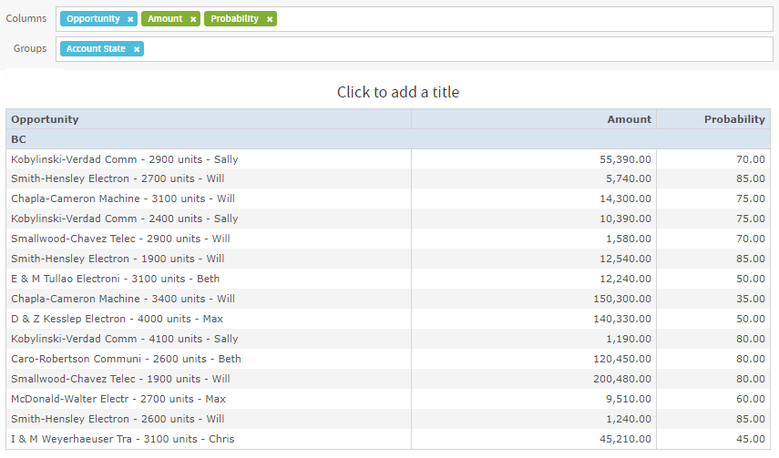
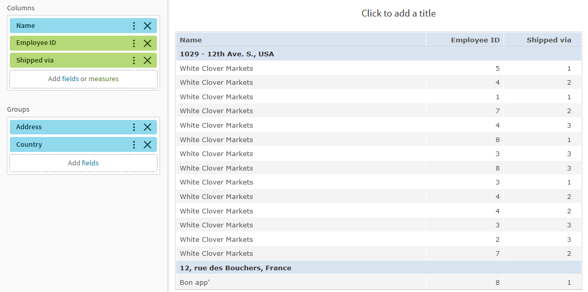
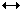
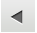

# Working with Tables

The following sections explain how to populate, edit, and format your table-type view.

*Figure 1 Ad Hoc Editor’s Table View for old layout band*

*Figure 2 Ad Hoc Editor’s Table View for new layout band*

## Using Fields in Tables

Insert data into your table by adding fields. All available fields are listed in the **Data Source Selection** panel, on the left side of the Ad Hoc Editor.

The available fields are divided into two sections in the panel:

-   **Fields**, which can be added to the table as columns or groups.

-   **Measures**, which are specialized fields that contain data values.

To add fields and measures as columns to a table.

1.  In the **Data Source Selection panel**, click to select the field or measure you want to add to the table. Use **CTRL-click** or **SHIFT-click** to select multiple items.
2.  Drag the selected item into the **Columns** box in the Layout Band.

The field is added to the view as a column in the table.

To remove a field or measure from a table

For Old Layout Band

-   In the Layout Band, click the **x** next to the field or measure’s name.

For New Layout Band

-   Click  **Token Context Menu** and select **Remove from Columns**. Or click **X** next to the field or measure name.

## Groups

Groups allow you to create detailed data rows. For example, if you have a table that lists the suppliers for a national restaurant chain, you can group the suppliers by the State field. The suppliers’ names are then rearranged so that all suppliers located in Maine, for instance, are located under a “Maine” header row; suppliers in Maryland are together under a “Maryland” header row, and so on.

You can use multiple fields to make more specific nested groups. By adding a group based on the “City” field to the table described above, the restaurant suppliers are arranged by City within the State groups. Under the “Maine” header row, new header rows for Augusta, Bangor, and Portland are added, and the names of the Maine-based suppliers appear under their respective cities. Under the “Maryland” header row, header rows for Annapolis, Baltimore, and Silver Spring are added, and the names of Maryland-based suppliers appear under those headers, and so on.

Only fields can be applied to a table as a group; measures cannot.

Data is grouped in the table according to the order that they were defined. You can change the order by dragging the groups into position if needed.

To create a group

1.  In the **Data Source Selection** panel, click to select the field you want to add to the table as a group.

2.  Drag the field to the **Groups** box in the Layout Band. 
    The Ad Hoc view refreshes and displays the data grouped under a new header row.

    !!! note

        You can also add a group to the table by right-clicking a field and selecting **Add to Groups**.

To remove a group

For Old Layout Band

-   In the Layout Band, click the **X** next to the field’s name in the **Groups** box.

For New Layout Band

-   Click the  **Token Context Menu** and select **Remove from Groups** or click **X** next to the field name.

To move the grouping order up or down in a table

-   In the Old Layout Band, drag the name of the group you want to move into its new position.

-   In the New Layout Band

    -   Using Move Up or Down or use drag and drop. For more information see, [The Layout Band](the-layout-band.md).

## Summaries

You can display summary data for any column in your table. Summary data may be in the form of various functions, such as:

-   Sum

-   Count

-   Distinct Count

-   Average

For example, in a table with a list of stores, grouped by City and Country, you can display the number of stores in each City, and in each Country, using this function.

By default, the summary function for each field is defined by the data source, OLAP, or domain definition.

To add a summary to a specific column

-   In the table, right-click the column you want to calculate a summary for, and select **Add Summary**.

-   The summary information is added to the group header, or is added to the bottom of a column if no groups are included in the table.

To remove a summary from a specific column

-   In the table, right-click the column with the summary you want to remove, and select **Remove Summary**.

-   The summary information is removed from the table.

To add or remove summaries from all columns

In the **Format Visualization** panel, in the **Appearance** settings, click the **Data Detail** dropdown menu and select the following:

-   To add summaries to all columns: **Details and Totals**
-   To remove summaries from all columns: **Details**

## Column and Header Labels

You can edit a column or header label directly in the Ad Hoc Editor.

To edit a column or header label

1.  On the Ad Hoc view panel, right-click the column or group header you want to rename.
2.  Select **Edit Label** from the context menu. The Edit Label window opens.
3.  In the text entry box, delete the existing name and enter the new name.
4.  Click **Submit**.

If space is at a premium, you can remove labels from the view. When you delete a label, it still appears when you look at the view in the Ad Hoc Editor, but does not appear when you run the report.

To delete a column or header label

1.  On the Ad Hoc view, right-click the column or header label you want to remove.
2.  Select **Delete Label** from the context menu.

To re-apply a label

1.  Right-click the column or header label that you want to replace.
2.  Select **Add Label** from the context menu. The Edit Label window opens.
3.  Enter the label name, if needed.
4.  Click **Submit**.

## Managing Column Size and Spacing

You can change the size of, and spaces between, columns to manage the appearance of your table or use space more efficiently.

To resize a column

1.  In the Ad Hoc View panel, click to select the column you want to resize.
2.  Move the cursor to the right edge of the column.
3.  When the cursor changes to the resize icon (), click and drag the column edge right or left until the column is the needed size.

Spacers can be added to a table to arrange columns farther apart, or add margins to a table.

To change the spacing between columns

1.  In the **Data Source Selection** panel, in the Measures section, click **Spacer**.
2.  Drag the spacer into the **Columns** box in the Layout Band between the names of the two columns that you want to move apart. 
    A spacer column, labeled , appears in the table.
3.  Repeat this action to add space as needed between columns.
4.  To remove a spacer, right-click the spacer column and select **Remove from Columns**.

To use spacers to create table margins

1.  In the **Data Source Selection** panel, click to select **Spacer**.
2.  Drag the spacer into the **Columns** box in the Layout Band.
3.  Repeat until the margins are as wide as needed.
4.  Repeat the steps above, adding the spacer to the right edge of the table.

### Using "FallbackColumnWidth" Property

The following property, *fallbackColumnWidth*, exists in \`applicationContext-adhoc.xml\` to the bean \`tableDefaults\`. This is a fallback value in case of an attempt to set the column width to zero. The default value is \`-1\`, which disables the fallback. When/if the column width is 0, the fallbackColumnWidth value can be changed to get it enabled and set column width to the desired value.

## Reordering Columns

You can move columns to the right or left to reorder the data in your table.

To reorder a column

1.  In the Ad Hoc View panel, right-click the column you want to move.
2.  Select **Move Right** or **Move Left** from the context menu.

### Sorting Tables

In the Ad Hoc Editor, you can sort the rows of a table by any field, using a number of different methods.

To sort a table

1.  Click . The Sortwindow appears. If the table is already sorted, the window shows the fields used.

2.  To add a field to sort on, double-click the field in **Available Fields**. The Available Fields panel now lists only fields not currently in Sort On. Hover over the fields in the Available fields panel to view the tooltip information. For more information on tooltip, see [The Data Source Selection Panel](adhoc-data-source-selection.md).

3.  Select one or more fields to sort by. You can also use Ctrl-click to select multiple fields.

4.  Click .

5.  To arrange the sorting precedence of the fields, select each field in the Sort window and click **Move to top**, **Move up**, **Move down**, or **Move to bottom**: , , , and .

6.  To remove a field, select it and click .

7.  Click **OK**. The table updates to display the rows sorted by the selected fields. 
    You can also sort a table using the following methods:

    -   Right-click a field in the Fields section of the **Data Source Selection** panel, and select **Use for Sorting** from the context menu. In this case, the table is sorted by a field that is not in the table; you may want to note the sorting fields in the title.
    -   Right-click a column header on the Canvas of the **Ad Hoc View** panel, and select **Use for Sorting** from the context menu.

!!! note

    If a column is already being used and you want to stop using it or change the sorting, then right-click the column and select **Change Sorting** from the context menu.

## Adding a Title

1.  Above the table, click the text **Click to add a title**.
2.  Enter the new table title in the text entry box.

Alternatively, in the **Format Visualization** panel, in the **Title** setting, in the **Title** field, enter the table title.

## Changing the Data Format

You can change the formatting for columns containing numeric data, such as dates and monetary amounts. The format is applied to all rows as well as the group- and view-level summaries. By default, non-integer fields use the -1,234.56 data format; integers use -1234.

To change the data format for a column

1.  In the Ad Hoc view, right-click the column header.
2.  Select **Change Data Format** from the context menu.
3.  Select the format that you want to use. These options vary depending on the type of numeric data contained in the column. 
    The data in the column now appears in the new format.

## Changing the Data Source

You may need to select a new data source for your table. This is a simple task, but you should keep in mind that all view data and formatting are lost when you select a new Topic, Domain, or OLAP connection. Any changes to the view are also lost if you navigate to another page using the browser navigation buttons, the main menu, or the **Search** field. To preserve changes, accept the current Topic or click **Cancel**.

To change the table’s data source

1.  At the top of the **Data Source Selection** panel, click  and select **Change Source.**
2.  Select a different Topic, Domain, or OLAP connection.
3.  Click **Table** to apply the new data source.
4.  Click **Cancel** to return to the editor without changing the Topic.

## Controlling the Data Set

You can control the data displayed in the table using the **Appearance** settings in the **Format Visualization** panel.

Your options are:

-   **Data Detail**:

    -   **Details**, which displays table detail only. For instance, in a table listing sales in dollars for all stores in a region for a given month, the amount sold by each store that month is displayed.
    -   **Totals**, which displays the table totals only. In the table described above, the total amount of all sales at all regional stores that month is displayed.
    -   **Details and Totals, which display** both the individual store sales numbers, as well as the total sales numbers at the bottom of the store sales column.

-   **Show Duplicate Rows**, which displays only the distinct values in your table if you choose to hide the duplicate rows. By default, the **Show Duplicate Rows** setting is on. See [Showing Distinct Values](#showing-distinct-values) for more information. 
    Select the option that you want to apply to your table.

## Showing Distinct Values

Tables sometimes contain duplicate values in multiple rows, making it difficult to find relevant data. You can choose to show only distinct values in your tables by choosing to hide duplicate rows, making the table shorter and easier to read.

To show only the distinct values in a table, in the **Format Visualization** panel, in the **Appearance** settings, click the **Show Duplicate Rows** switch to turn the setting off.

When you choose to hide duplicate rows, all columns are sorted in ascending order based on their distinct values by default, but columns explicitly sorted in ascending or descending order by the user will have higher priority. Sorting by hidden fields have no effect.

## Field / Measure Conflict

When the visualization type is changed from a table to a crosstab, the same field may function as both a field and a measure simultaneously within the crosstab, an outcome that cannot be achieved by building a crosstab visualization from scratch.

This occurs because fields from the table's columns area are being implicitly converted into measures for the crosstab visualization.

The automatic conversion of the fields and measure cannot happen while switching between the visualization type.
