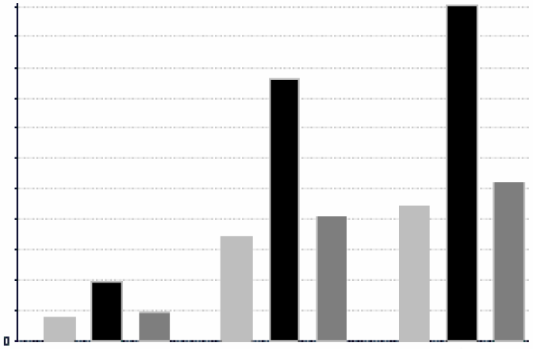
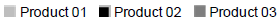

# Ad Hoc View Types

The Ad Hoc Editor allows you to select from three view types:

-   Tables , which are used to view values in the database and to summarize the values in columns.
-   Charts , which compare one or more measures across multiple sets of related fields.
-   Crosstabs , which aggregate data across multiple dimensions.

This section provides an overview of each view type. The design and content tasks for working with each type of view are discussed in more detail in the following sections:

-   For more information on table views, see .
-   For more information on chart views, see [Working with Charts](adhoc-charts.md).
-   For more information on crosstab views, see [Working with Standard Crosstabs](adhoc-crosstabs-standard.md).

## Tables

The architecture of a table view consists of columns, rows, and groups.

Columns in a table correspond to the columns in the data source. They are included by adding fields or measures to the table in the Ad Hoc view.

Rows correspond to rows in the database. The information in each row depends on what columns are included in the table.

Using groups, rows can be grouped by identical values in any field with intermediate summaries for each grouped value. For example, a table view of product orders might contain columns to show the dates and amounts of each order, and its rows might be grouped by city and product.

<table>
<thead>
<tr>
<th></th>
<th>
Date Placed
</th>
<th>
Date Filled
</th>
<th>
Payment Received
</th>
</tr>
</thead>
<tbody>
<tr>
<td colspan="4">
City A
</td>
</tr>
<tr>
<td colspan="4">
Product 01
</td>
</tr>
<tr>
<td></td>
<td>
Date
</td>
<td>
Date
</td>
<td>
Amount
</td>
</tr>
<tr>
<td></td>
<td>
Date
</td>
<td>
Date
</td>
<td>
Amount
</td>
</tr>
<tr>
<td>
Product 01 totals:
</td>
<td></td>
<td>
Count
</td>
<td>
Sum
</td>
</tr>
<tr>
<td colspan="4">
Product 02
</td>
</tr>
<tr>
<td></td>
<td>
Date
</td>
<td>
Date
</td>
<td>
Amount
</td>
</tr>
<tr>
<td></td>
<td>
Date
</td>
<td>
Date
</td>
<td>
Amount
</td>
</tr>
<tr>
<td>
Product 02 totals:
</td>
<td></td>
<td>
Count
</td>
<td>
Sum
</td>
</tr>
<tr>
<td colspan="4">
Product 03
</td>
</tr>
<tr>
<td></td>
<td>
Date
</td>
<td>
Date
</td>
<td>
Amount
</td>
</tr>
<tr>
<td></td>
<td>
Date
</td>
<td>
Date
</td>
<td>
Amount
</td>
</tr>
<tr>
<td>
Product 03 totals:
</td>
<td></td>
<td>
Count
</td>
<td>
Sum
</td>
</tr>
<tr>
<td>
City A totals:
</td>
<td></td>
<td>
Count
</td>
<td>
Sum
</td>
</tr>
<tr>
<td colspan="4">
City B
</td>
</tr>
<tr>
<td colspan="4">
Product 01
</td>
</tr>
<tr>
<td></td>
<td>
Date
</td>
<td>
Date
</td>
<td>
Amount
</td>
</tr>
<tr>
<td></td>
<td>
Date
</td>
<td>
Date
</td>
<td>
Amount
</td>
</tr>
<tr>
<td></td>
<td>
Date
</td>
<td>
Date
</td>
<td>
Amount
</td>
</tr>
<tr>
<td></td>
<td>
...
</td>
<td>
...
</td>
<td>
...
</td>
</tr>
</tbody>
</table>

For more information on working with tables, see [Working with Tables](adhoc-tables.md).

## Charts

Charts summarize the data graphically. Types of charts include bar chart, line chart, and pie chart, among others. With the exception of time series and scatter charts, each type of chart compares summarized values for a group. For example, the **Chart** tab might show the data in a bar chart that compared the sum of Payments Received for each of the products in each of the cities.

<table>
<tbody>
<tr>
<td colspan="3">
Total Payments Received
</td>
</tr>
<tr>
<td colspan="3">

</td>
</tr>
<tr>
<td>
<strong>City A</strong>
</td>
<td>
<strong>City B</strong>
</td>
<td>
<strong>City C</strong>
</td>
</tr>
<tr>
<td colspan="3">

</td>
</tr>
</tbody>
</table>

Time series and scatter charts use time intervals to group data.

For more information on working with charts, see [Working with Charts](adhoc-charts.md).

## Crosstabs

Crosstabs are more compact representations than tables. They show only aggregate values, rather than individual database values. Columns and rows specify the dimensions for grouping. Cells contain the summarized measurements. For instance, the example above could be displayed in a crosstab with columns grouped by sales manager and year.

<table>
<tbody>
<tr>
<td colspan="2" rowspan="2"></td>
<td colspan="3">
Tom
</td>
<td colspan="3">
Harriet
</td>
<td rowspan="2">
Manager Totals
</td>
</tr>
<tr>
<td>
2012
</td>
<td>
2013
</td>
<td>
Year Totals
</td>
<td>
2012
</td>
<td>
2013
</td>
<td>
Year Totals
</td>
</tr>
<tr>
<td rowspan="4">
City A
</td>
<td>
Product 01
</td>
<td>
Payment Received
</td>
<td>
Payment Received
</td>
<td>
Payment Received
</td>
<td>
Payment Received
</td>
<td>
Payment Received
</td>
<td>
Payment Received
</td>
<td>
Payment Received
</td>
</tr>
<tr>
<td>
Product 02
</td>
<td>
Payment Received
</td>
<td>
Payment Received
</td>
<td>
Payment Received
</td>
<td>
Payment Received
</td>
<td>
Payment Received
</td>
<td>
Payment Received
</td>
<td>
Payment Received
</td>
</tr>
<tr>
<td>
Product 03
</td>
<td>
Payment Received
</td>
<td>
Payment Received
</td>
<td>
Payment Received
</td>
<td>
Payment Received
</td>
<td>
Payment Received
</td>
<td>
Payment Received
</td>
<td>
Payment Received
</td>
</tr>
<tr>
<td>
Product Totals
</td>
<td>
Payment Received
</td>
<td>
Payment Received
</td>
<td>
Payment Received
</td>
<td>
Payment Received
</td>
<td>
Payment Received
</td>
<td>
Payment Received
</td>
<td>
Payment Received
</td>
</tr>
<tr>
<td rowspan="2">
City B
</td>
<td>
Product 01
</td>
<td>
Payment Received
</td>
<td>
Payment Received
</td>
<td>
Payment Received
</td>
<td>
Payment Received
</td>
<td>
Payment Received
</td>
<td>
Payment Received
</td>
<td>
Payment Received
</td>
</tr>
<tr>
<td>
...
</td>
<td>
...
</td>
<td>
...
</td>
<td>
...
</td>
<td>
...
</td>
<td>
...
</td>
<td>
...
</td>
<td>
...
</td>
</tr>
<tr>
<td colspan="2">
City Totals
</td>
<td>
Payment Received
</td>
<td>
Payment Received
</td>
<td>
Payment Received
</td>
<td>
Payment Received
</td>
<td>
Payment Received
</td>
<td>
Payment Received
</td>
<td>
Payment Received
</td>
</tr>
</tbody>
</table>

For more information on working with crosstabs, see [Working with Standard Crosstabs](adhoc-crosstabs-standard.md).

OLAP connection-based crosstabs behave differently than those created from Topics or Domains. See [Creating Topics](adhoc-topics.md).
