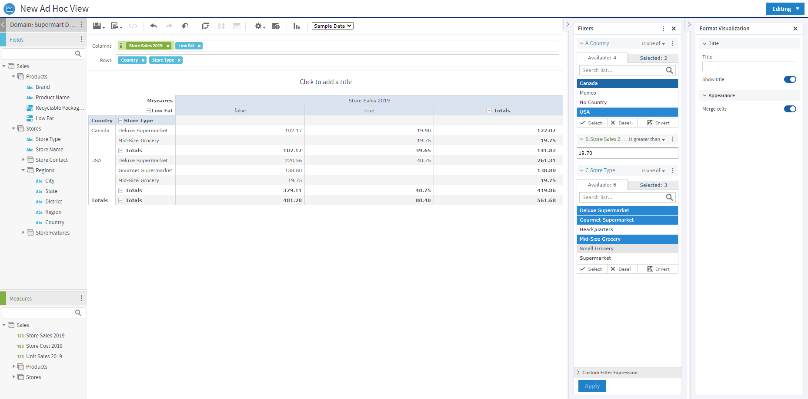
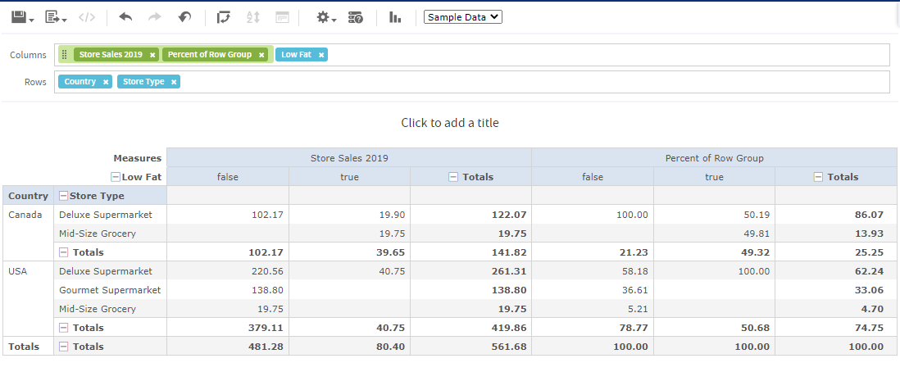

# Aggregate Functions

Aggregate functions in calculated fields perform calculations based on groups of rows, rather than on single rows. For example, it doesn't make sense to use Sum or Average on a single value; instead, you want to take the sum or average over a row or column group or over the total set. In many cases, aggregate functions in the Ad Hoc Editor are analogous to SQL functions that can be used with the GROUP BY clause in a SELECT statement.

The aggregate functions are as follows:

|               |           |         |                 |
|---------------|-----------|---------|-----------------|
| Average       | Median    | Range   | WeightedAverage |
| CountAll      | Min       | StdDevP |                 |
| CountDistinct | Mode      | StdDevS |                 |
| Max           | PercentOf | Sum     |                 |

Because aggregate functions already operate on groups, their use is restricted in the following ways:

-   You can use aggregate functions only in calculated measures; aggregates should not be used to create non-measure fields.
-   You cannot add an aggregate function to a group.
-   You should not use an aggregate function as a filter.
-   Only Aggregate Formula, Custom, or None are supported as summary calculations for aggregate functions. Custom appears in the **Change Summary** right-click menu only if you have defined a custom function in the **Create Calculated Field** dialog box.
-   A calculated field will always be calculated in memory, if you have an aggregate expression, and the calculated field itself also has an aggregate expression. It's no longer necessary to set the **inMemory** setting to *true*.

## Levels in Aggregate Functions

Many aggregate functions accept an optional level to specify the grouping of the aggregate. A level used in an aggregate, must be enclosed in straight quotes ('), for example, `'RowGroup'`.

The available levels are as follows:

-   `Current` (default) — use the current value when at a looking at detail rows in a table view.
-   `RowGroup` — use the parent values from a row location.
-   `RowTotal` — use the grand total value from a row location.
-   `ColumnGroup` — use the parent values from a column location.
-   `ColumnTotal` — use the grand total value from a column location.
-   `Total` — use the grand total value from a cross tab and the RowTotal from a Table.

The following example shows how RowGroup works with the PercentOf() function.

Setting up the Ad Hoc view

The examples in this section uses the Ad Hoc view created in [section 1.0.0.1, “Creating a Calculated Field,” on page 1](calc-fields-creating.md). The initial view for these examples can be set up as follows:

1.  Select Crosstab from the Visualization Selector.

2.  Add Store Sales 2019 and Low Fat to the Columns entry bar.

3.  Add Country and Store Type to the Rows Entry Bar.

4.  To make the example clearer, the data has been restricted. To do this, create three filters:

    1.  Expand Regions in the Fields Picker, right-click on Country, and select **Create Filter**. In the Filters pane, set the filter to **is one of** then select Canada and USA.
    2.  Create a filter for Store Sales 2013. In the Filters pane, set the filter to **is greater than**, and enter 19.70.
    3.  Right-click on Store Type and select **Create Filter**. In the Filters pane, set the filter to **is one of** then select Deluxe Supermarket, Gourmet Supermarket, and Mid-Size Grocery.

*Figure 1 Base Example for Levels*

RowGroup example

To create the layout for this example:

1.  Click  at the top right of the **Measures** section of the Data Source Selection panel and select **Create Calculated Measure...** from the context menu.
2.  In the Create Calculated Measure dialog box, enter Percent of Row Group for the name, and enter `PercentOf("Store Sales 2019",'RowGroup')` in the Formula entry box. Then click **Create Measure**.
3.  Drag the measure you just created to the Columns bar, between Store Sales 2019 and Low Fat.

The crosstab appears as shown in the following figure.

*Figure 2 Example for RowGroup*

Look at the Low Fat values for "false" in the Canada group. The only non-null value under Store Sales 2019 is in the first row, for Deluxe Supermarket. This value, 102.17, is 100% of the row group total of 102.17 on the third line of the crosstab. This percentage is shown in the "false" subcolumn of the Percent of Row Group column.

Compare this to the "true" entry under Store Sales for the same (first) row. There, the value is 19.90, and the row group total is 39.65. The corresponding percentage shown in the "true" sub-column of Percent of Row Group is 50.19%.
