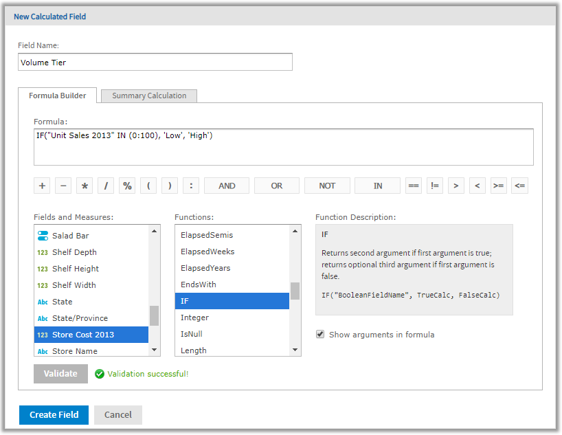
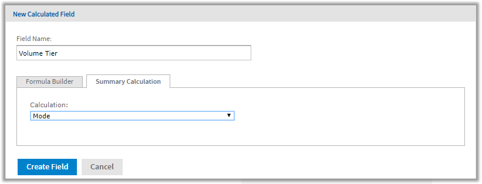

# Creating a Calculated Field

To create a calculated field

1.  First, create the Ad Hoc view to use. To do this, select **Create** &gt; **Ad Hoc View** from the menu. The **Select Data** wizard appears.

2.  Click  and navigate to **Domains**.

3.  Select **Supermart Domain**. Click **Choose Data**. The Data Chooser window appears.

4.  In the Data Chooser window, double-click **Sales** to select it and click **OK**. A new Ad Hoc view opens.

5.  In the Ad Hoc view, click  at the top right of the **Fields** section and select **Create Calculated Field...** from the context menu. The New Calculated Field dialog box appears, displaying the Formula Builder.

    

    *Figure 1 Formula Builder Tab in New Calculated Measure Dialog Box*

6.  Enter Volume Tier for the **Field Name**.

    Creating the formula

    This section shows how to create a simple text formula that says Low when the Unit Sales amount is under 100 and High otherwise.

    Formulas must use the following syntax:

    1.  Labels for fields and measures must be in double quotes ("): "Customer ID", "Date ordered".
    2.  Text must be in single quotes ('): '--'.
    3.  Levels must be in single quotes ('): 'ColumnGroup', 'Total'.

7.  Make sure **Show arguments in formula** is selected.

8.  Now create the formula. Double-click IF() in the **Functions** list. 
    Because **Show arguments in formula** is selected, `IF("BooleanFieldName", TrueCalc, FalseCalc)` is entered in the Formula Builder.

9.  Double-click `BooleanFieldName` to select it, then double-click Unit Sales 2013 in the **Fields and Measures** list. 
    The Formula Builder displays `IF("Unit Sales 2013", TrueCalc, FalseCalc)`.

10. Edit the expression in the Formula Builder to read as follows: `IF("Unit Sales 2013" IN (0:100), 'Low', 'High')`.

11. Click **Validate** to verify that the formula does not have any syntax errors.

    Creating a summary calculation

    The Ad Hoc Editor creates a default summary calculation based on the type of formula you have entered. This section shows how to select a different summary function.

12. Click the **Summary Calculation** tab.

    

    *Figure 2 Summary Tab in New Calculated Measure Dialog Box*

13. Select Mode from the **Calculation** menu.

14. Click **Create Field**. 
    The calculated field appears in bold text at the bottom of the list of available fields. A special icon indicates it is a calculated field .

If you have installed the samples, the Ad Hoc view **10. Calculated Fields and Measures** includes examples of calculated fields and measures (indicated by ). You can explore their formulas by right-clicking the field or measure name and selecting **Edit**. You can also create tables, charts, or crosstabs to see how these calculations work in views.
