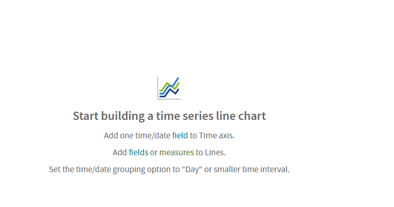

# The Layout Band

The Layout Band is designed to seamlessly support both old and new layout band configurations. While maintaining core functionality, the new iteration introduces enhanced visual elements and aiming to provide a more intuitive and engaging experience. This update ensures backward compatibility with existing layout, allowing for a smooth transition, while also incorporating subtle feature refinements to optimize work flow.

#### The Old Layout Band

Directly beneath the tool bar is the Layout Band. Here there are two fields. These fields have different labels and functions, depending on the type of view you are creating:

- For tables, these fields are **Columns** and **Groups**.

- For charts, these fields are **Columns** and **Rows**.

- For crosstabs, these fields are **Columns** and **Rows**.

You can drag and drop fields and measures into these boxes to populate your view.

#### The New Layout Band

The new feature is introduced that is the New Layout Band. By default the New Layout Band is enabled. To enable the old Layout Band, follow the steps mentioned under [To Enable Old Layout Band](https://community.jaspersoft.com/documentation/jasperreports-server/tibco-jasperreports-server-administration-guide/v1000/jasperreports-server-admin-guide-_-configuration-_-configuring_ad_hoc/#Query_Settings) in the JasperReports® Server Administrator Guide.

Directly beside the tool bar is the New Layout Band. There are two drop-areas fields and measures with different labels, depending on the type of band you have selected in the Server Settings.

1.  For tables, these fields are **Columns** and **Groups**.

2.  For charts, these fields depend on the type of visualization you select.

3.  For crosstabs, these fields are **Columns** and **Rows**.

In the New Layout Band:

- You can **collapse or expand** the **Build Visualization** tab by clicking the icon beside the **Build Visualization**.

- The tootlip gives the information about the drop areas in the **Build Visualization** tab.

- The Empty Canvas area gives the information about the drop areas according to the visualization type that you select.

  

  *Figure 1: Ad Hoc Editor’s Empty Canvas Area View*

- The fields or measures can be **swapped** only for the **Cross-tab** visualization type only, by clicking the **Switch** icon between the two drop ares.

  

  
Note

  <strong>Switch the Groups</strong> button is only present in the Old Layout Band, and not the New Layout Band.
  

- For the **Unused tokens**, after you select the visualization type, the fields and measures that cannot be used in any of the drop areas are moved to the **Unused** box.

  To clear the unused fields or measure, click the **X** icon. You can also refer the tool-tip for **Unused** box.

- **Invalid tokens** are displayed in drop areas, When a field or measure token displays in a drop box that does not allow that type of token. This usually happens when you add the fields and measures and then change the visualization type or open an Ad Hoc View created in an older version of JasperReports Server.

  You can delete the invalid tokens or move them to the supported drop areas.

- In the **Select Visualization Type** dialog, the description area below the visualization type, shows the currently selected visualization type. The criteria for creating a visualization are displayed on the empty canvas area.

- In **Build Visualization** tab, you can change the position of fields or measures, within their drop areas by:

  - Moving Up or Down through kebab menu, click  icon and select **Move Up** or **Move Down** to move the fields or measures in the drop areas.

  - Drag field or measures and drop them to the new location.
