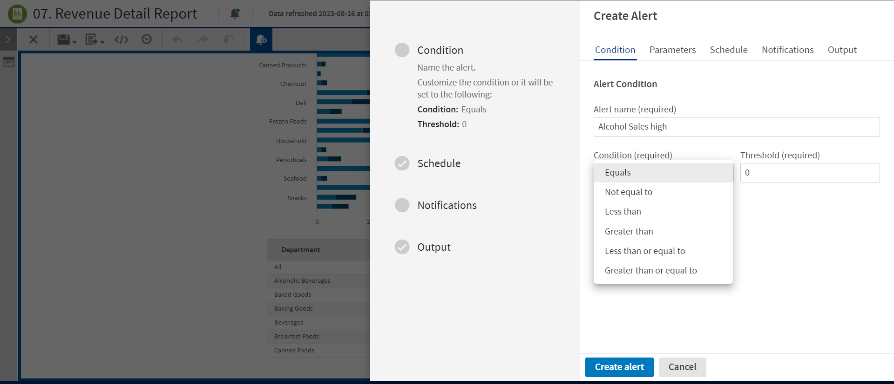

# Setting Condition

On the **Condition** tab, you can change the following settings:

-   **Alert name** - The name of your alert. You can save the duplicate alert name without any error.

-   **Condition** - You can choose one of the following conditions for an alert:

    -   Equals
    -   Not equal to
    -   Less than
    -   Greater than
    -   Less than or equal to
    -   Greater than or equal to 

By default, the Condition is set to Equals.

-   **Threshold** - The threshold is the limit that you set to notify about the alert. The threshold value can be an integer, decimal point, or negative value. By default, the Threshold is set to 0.

*Figure 1 Condition Tab*
