# List of Alerts

All scheduled alerts that you have defined appear on the **View &gt; Schedules and Alerts &gt; Alerts** tab. You can also click the **View Alert List** icon  of the Report title bar to view scheduled alerts in the Alerts panel.

!!! note

    Currently in the **View &gt; Schedules and Alerts &gt; Alerts** tab, the Alerts page is a new beta feature that might not be fully stable or supported. For more information about the Alerts beta feature, see [Admin Console Beta](https://community.jaspersoft.com/wiki/admin-console).

Typical users see only the alerts that they have defined in the **View &gt; Schedules and Alerts &gt; Alerts** tab. Administrators can see the alerts defined by all users in the Alerts page.

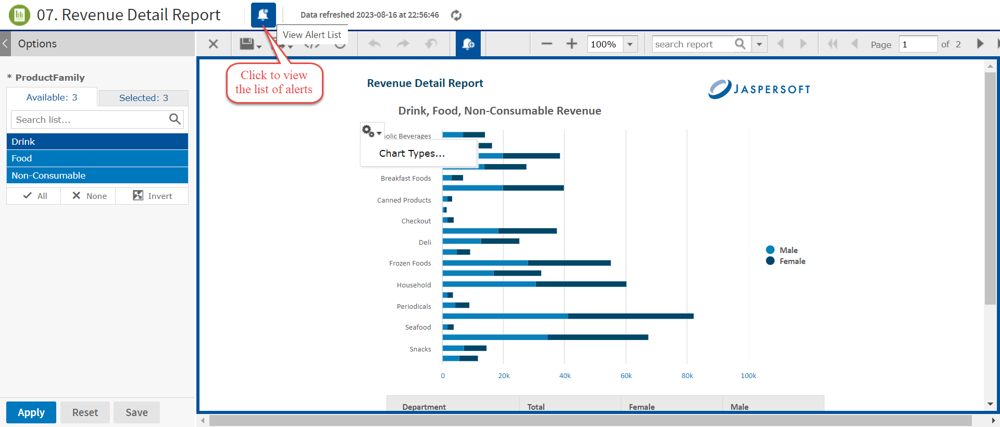

*Figure 1: View Alert List*

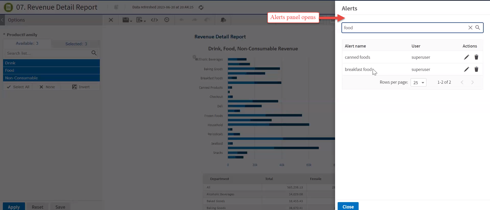

*Figure 2: List of Alerts in the Alerts Panel*

In the above figure, `superuser` has set two alerts for the product. If there are no alerts for a report, the Alerts panel contains a message with instructions on how to create an alert. To create an alert, see [Creating an Alert](create-alert.md).

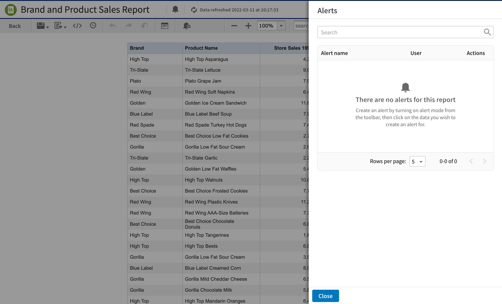

*Figure 3: Empty Alerts Panel*

The Alerts panel shows the Alert name, the User (owner) who created the alert, and alert Actions.

The Alerts panel includes the following controls:

| Alert Panel Controls | Description |
|----|----|
|  | Search the alert by alert name. |
|  | Clears or cancels the search term. |
|  | Edits the alert. |
|  | Deletes the alert. |
|  | Displays the previous page in the Alerts panel. |
|  | Displays the next page in the Alerts panel. |
| 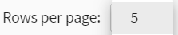 | Displays the alert records. You can select the number of rows with alert records to view in the Alerts panel. The default value is set to 5 rows per page. |

# Searching an Alert

You can search an alert by alert name in the Alerts panel.

To search for an alert:

1.  In the Report Viewer tool bar, click the **View Alert List** icon . The Alerts panel opens.

2.  In the Alerts panel, enter an alert name in the **Search** icon  to search for an alert.

    !!! note

        Only the specific alert name that meets with the search criteria of the Alert name column is displayed in the Alerts panel.

    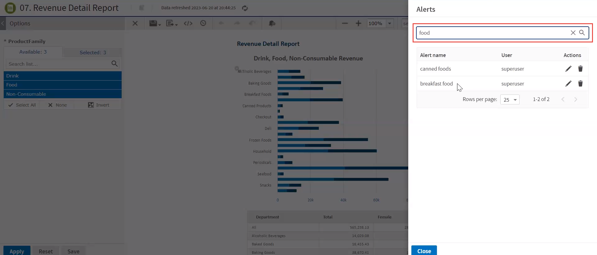

    *Figure 4: List of alerts found in Alerts Panel*

3.  If no alert name matches with your search term, then the list remains empty with a message, as shown in the following figure. Click the **Cancel** icon  to clear or cancel the search term.

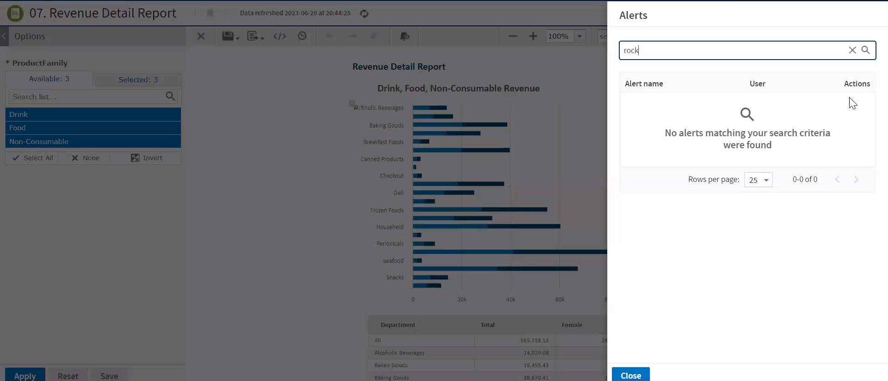

*Figure 5: No Alerts found in Alerts Panel*

The Alerts panel can display 5, 10, 25, or 100 alert records or row in the page. By default, five rows per page are displayed. You can change the number of rows per page to 5, 10, 25, or 100. Based on your selection, records are displayed in the Alerts panel.

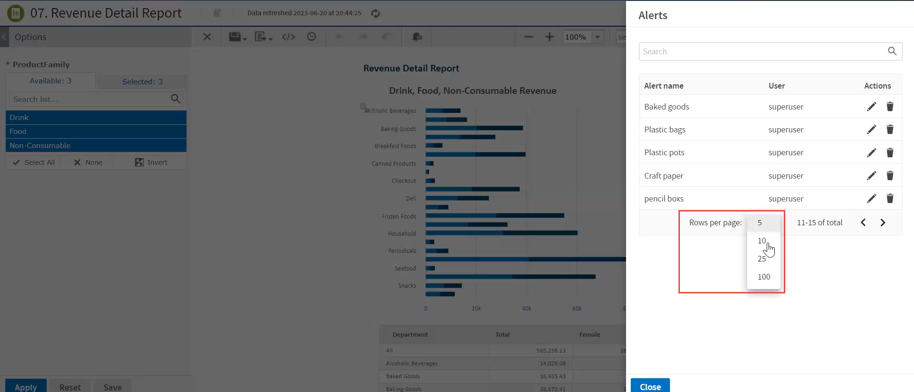

*Figure 6: List of Rows in Alerts Panel*

The total count of records in the Alerts panel is equivalent to the number of rows selected per page.

For example, consider you want to view 10 alerts with 5 rows per page in the Alerts panel. Click the **Rows per page** to view 10 alerts in the Alerts panel. The Alerts panel displays records in two sets of pages. The first page displays five records with the total count of 1-5 rows per page. The remaining five alert records are displayed in the second page with the total count of 6-10 rows per page. For more details, see the below figure.

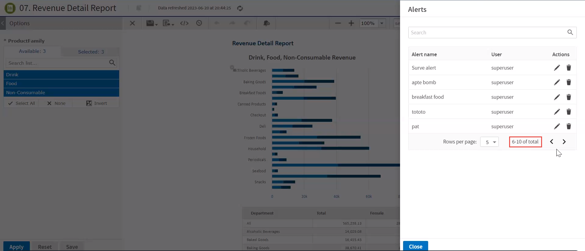

*Figure 7: Row per page in Alerts Panel*

# Editing an Alert

You can edit an alert from the Alerts panel.

To edit an alert

1.  Click the **View Alert List** icon  to view the alerts in the Alerts panel.

2.  Click the **Edit** icon  in the row of the alert that you want to update.

3.  In the **Edit Alert** panel, modify the **Condition**, **Parameters**, **Schedule**, **Notifications**, and **Output** tabs.

    !!! note

        After editing the values, validation happens for the modified values of each tab. Click anywhere outside the field name of any tab or switch between any tabs to enable the **Apply changes** button.

4.  Click **Apply changes** to save your changes or click **Cancel** to cancel the added details. On selecting **Apply changes**, the update occurs immediately and the Alerts panel opens with the list of updated alerts. 

    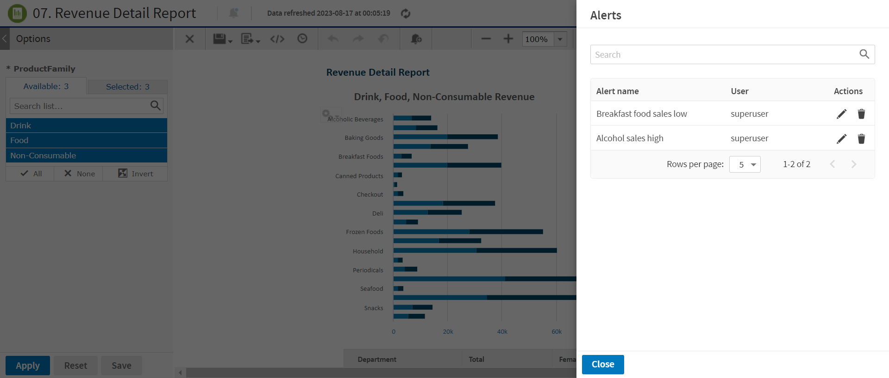

    *Figure 8: List of Updated Alerts*

5.  Click **Close** to close the Alerts panel.

# Deleting an Alert

You can delete an alert from the Alerts panel.

To delete an alert

1.  Click the View Alert List  to view the alerts in the Alerts panel.

2.  Click the delete icon  to delete the corresponding alert. A confirmation dialog with a warning message appears to confirm if you want to delete this alert.

    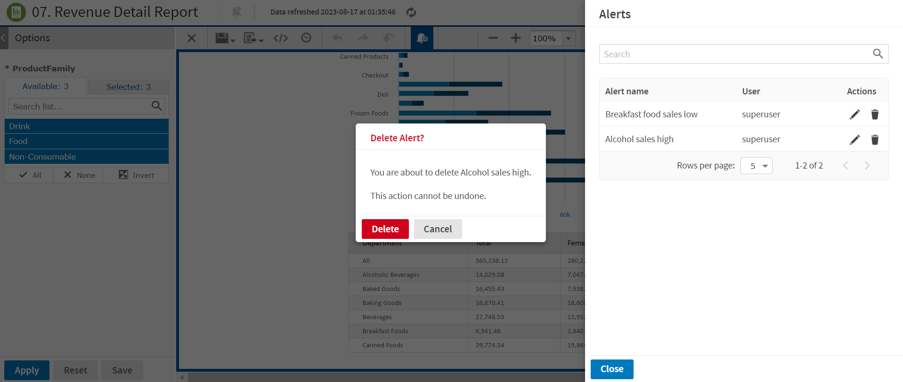

    *Figure 9: Deleting Alert*

3.  Click **Delete** to delete the alert else click **Cancel** to cancel the delete action.

4.  Click **Close** to close the Alerts panel.

# Disabling Alerts Feature

You can disable the alerting feature using the configuration, this disables alerts feature and purge existing alerts in the system.

1.  By default, the alerting feature is enabled. To disable the feature, see the steps mentioned in the Disabling the Alerts chapter of JasperReports Server Administrator Guide.

Once the alerts are disabled, you can see the below changes to the UI.

-   The **View alerts**  and **Turn-on Alert mode** buttons  gets hidden.

    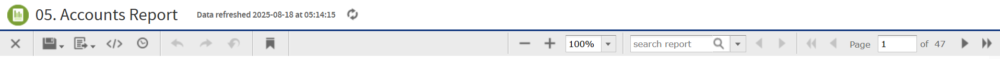

-   The **Alerts tab** on **the Admin Console** is hidden when the Alert feature is disabled.

    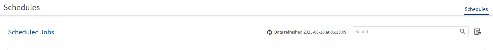

-   The **Schedules and Alerts** menu option is changed to **Schedules**.

    **Alerts tab** is hidden on **Schedules and Alerts** page.

    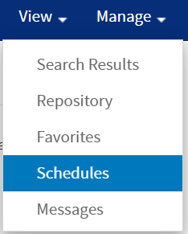
