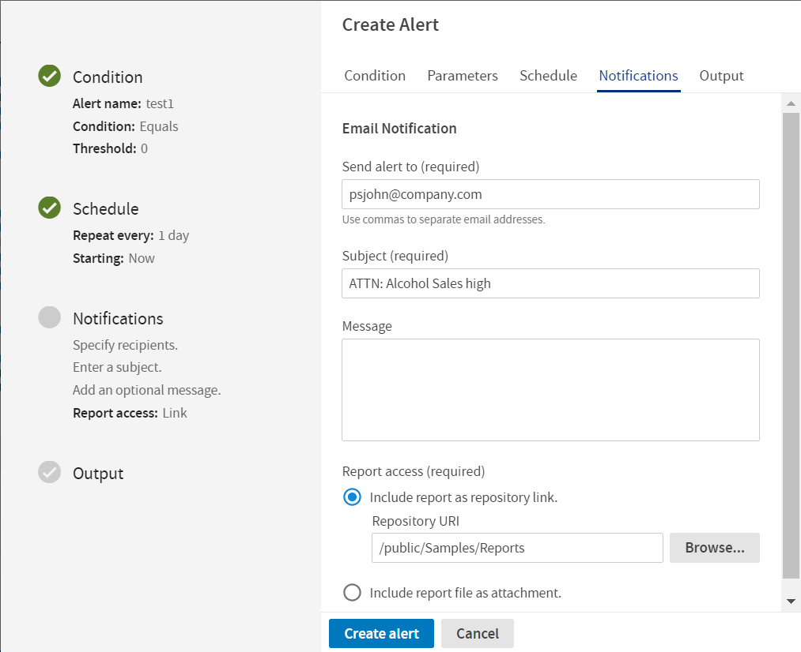

# Setting Notifications

On the **Notifications** tab, you can set up email notifications to the recipients of the report. On the **Notifications** tab, you can change the following settings:

-   **Send alert to** - One or more email addresses separated by commas for sending the alert email notification when an alert condition is met.

-   **Subject** - The subject line of the notification email.

-   **Message** - The message for the body of the alert email. This is an optional field.

-   **Report access** - The output of the report to be sent in the notification email can either be a repository link or an attachment.

    -   **Include report as repository link** - The output is sent as a repository link of the chosen folder path in the email body. You can browse to choose the folder path in the Repository Content where you want the output to be saved. Click the repository link to navigate to the folder location where the output is saved.

        !!! note

            The Browse button gets enabled only on choosing the Include report as repository link option.

    Admin users (`superuser`) have access to all the folders in the Repository Content. Other users do not have access to all the folders in the Repository Content. With the Report access field in the Notifications tab, a user can now save output to the selected folder having permissions.

    -   **Include report file as attachment** - The output is sent as the file attachment in the notification mail body. You get an attachment of the selected output format in the notification email.

        !!! note

            The output attachments are sent in the email body and are not in the folder path of the Repository Content.

*Figure 1: Notifications Tab*

!!! note

    If you have trouble receiving alerts to your email, then please contact your administrator. For more information, see JasperReports Server Administrator Guide.
