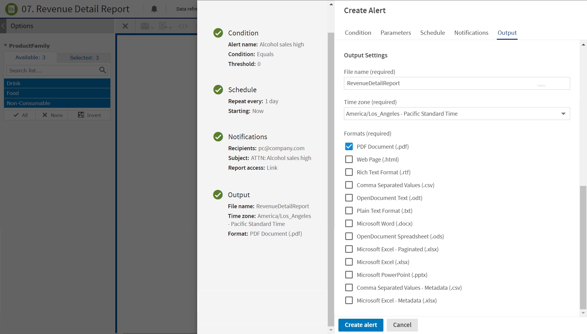

# Setting Output

On the **Output** tab, you can change these settings:

-   **File name** - The base name for the output file in the repository. The default file name is the resource ID of the output file in the repository.
-   **Time zone** - The output time zone for generating the report. The default value is the time zone that you are currently logged in.
-   **Formats** - The available output formats. Select one or more formats. The output is generated in the chosen format. The default format is PDF. When you select more than one, the output file is generated for each format.

*Figure 1 Output Tab*
