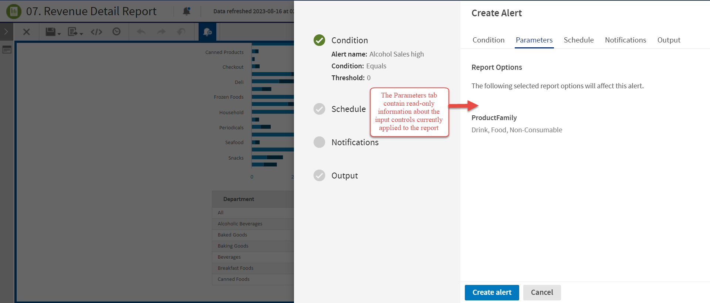
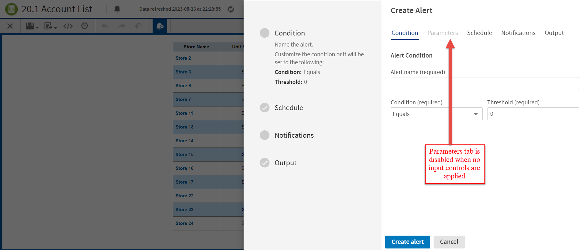

# Viewing Parameters

On the **Parameters** tab, you can view the input controls that are currently applied to the report.

*Figure 1: Parameters Tab Enabled*

*Figure 2: Parameters Tab Disabled*

!!! note

    - This tab contains read-only information.
    - To modify the input control values, close the Create Alert panel, open the input controls for the report, select the required values, and apply changes.
    - The Parameters tab is disabled when the report does not have any input controls applied.
