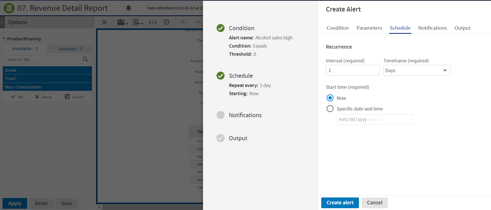
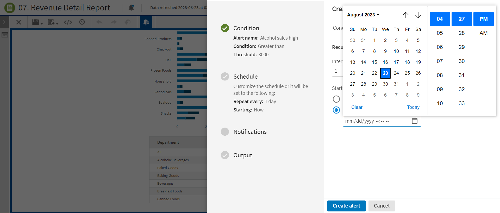

# Setting Schedule

On the **Schedule** tab, you can change these settings:

- **Interval** - The required recurrence interval value. The recurrence interval must be an integer greater than 0. By default, the interval value is set to 1.

- **Timeframe** - Schedule the alert to recur at a regular interval, specified in hours, days, or weeks. By default, the timeframe value is set to Days.

- **Start time** - Set a start time, choosing whether to start now or on a specific date and time. On selecting a specific date and time, the calendar option is enabled. Click the calendar icon  to select a start date and time.

  

  
Note

  <ul><li>By default, the <strong>Specific date and time</strong> remains disabled. You can choose this option to select a start date and time.</li><li>The start date and time must be in the future.</li></ul>
  

*Figure 1: Schedule Tab*

*Figure 2: Schedule Tab with Specific Date and Time enabled*
