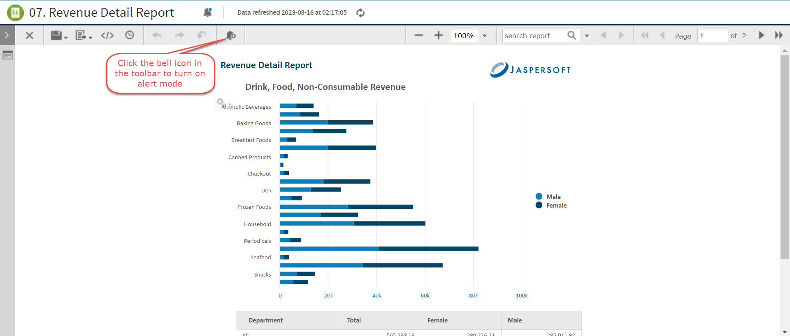
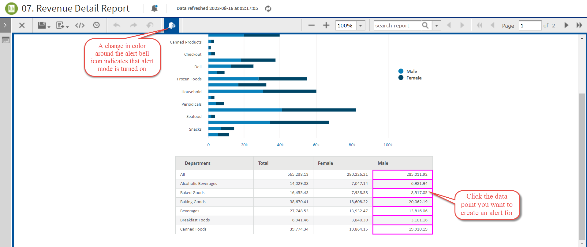
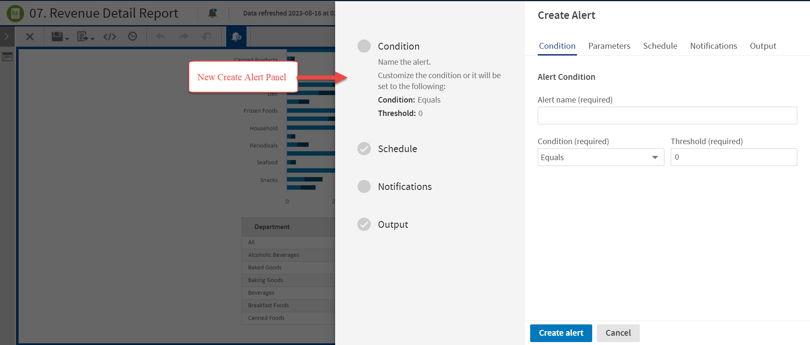

# Creating an Alert

To create an alert

1.  On the Report Viewer toolbar, click the Turn on alert mode icon . This enables the numeric values or data points.

    

    *Figure 1 Enabling Alert mode*

    

    *Figure 2 Alert Mode Enabled*

2.  Click any data point to open the new **Create Alert** panel.

    

    *Figure 3 Create Alert Panel*

    The **Create Alert** panel has Condition, Parameters, Schedule, Notifications, and Output tabs. For more information about the tabs, see [Alert Overview](alerts-introduction.md).

3.  Click the Condition tab to set the condition for the alert as described in [Setting Condition](alerts-condition.md).

4.  Click the Parameters tab to view the parameters for the alert as described in [Viewing Parameters](alerts-parameter.md).

5.  Click the Schedule tab to set the recurrence and start time for the alert as described in [Setting Schedule](alerts-schedule.md).

6.  Click the Notifications tab and set up email notifications, as described in [Setting Up Notifications](alerts-notifications.md).

7.  Click the Output tab and set the output format and location, as described in [Setting Output](alerts-output.md).

8.  Click **Create alert** to add and save the alert.

9.  Click the View Alert List icon  in the Report Viewer to view the new alert or list of alerts.

    !!! note

        The list of alerts in the Alerts panel is only available for the report in which the alert is set up.

The alert mode in the report remains enabled even after closing the Create Alert panel. To disable the alert mode, click the Turn off alert mode icon  in the toolbar. The change in color around the alert bell icon indicates that alert mode is turned off.
