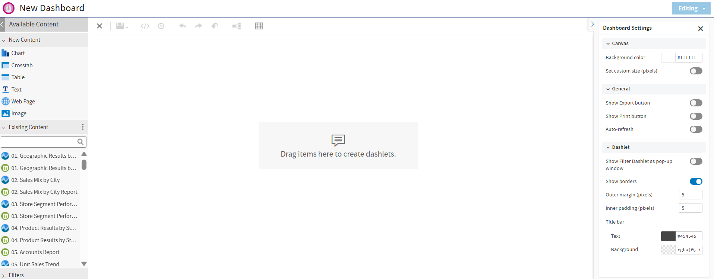
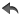
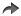
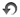
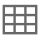
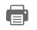
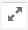

# Overview of the Dashboard Designer

The Dashboard Designer is a web-based UI for embedding reports, Ad Hoc views, and other BI objects into a single, interactive space. You can compile dashboards that include pre-existing elements, such as reports and views, and create new charts, tables, and crosstabs from your data sources directly from the designer.

Each element on your dashboard is called a **Dashlet**. Dashlets have unique names and resource IDs, and editable settings that vary depending on the Dashlet type.

Your permissions to access the repository may limit the content you can add and the location where you can save the dashboard.

This section includes:

-   [The Dashboard Designer Interface](#the-dashboard-designer-interface)

-   [Dashlets and Dashboard Elements](#dashlets-and-dashboard-elements)

-   [Previewing a Dashboard](#previewing-a-dashboard)

-   [Dashboard Properties](dashboard-properties.md)

-   [Dashlet Properties](dashboard-properties.md)

-   [Parameter Mapping](dashboard-properties.md)

## The Dashboard Designer Interface

The following figure shows the basic layout of the Dashboard Designer.

*Figure 1 The Dashboard Designer UI*

The Dashboard Designer UI includes the following panels:

-   **Available Content**. From here, you can drag content onto the Dashboard Canvas. This panel includes the following sections:

    -   **New Content**, which lists the content elements you can create for your dashboard.

    -   **Existing Content**, which lists the Ad Hoc views and reports you can access from the Repository.

    -   **Filters, which list** all filters associated with any resource added to the dashboard.

-   **Toolbar Buttons**. See the table below for details.

<table>
<colgroup>
<col style="width: 33%" />
<col style="width: 33%" />
<col style="width: 33%" />
</colgroup>
<thead>
<tr>
<th>
Icon
</th>
<th>
Name
</th>
<th>Description</th>
</tr>
</thead>
<tbody>
<tr>
<td>

</td>
<td>
Save Dashboard/Save Dashboard As
</td>
<td>Hover the cursor over the icon to open a menu of save options.</td>
</tr>
<tr>
<td></td>
<td>Undo the last change</td>
<td>Click to undo the most recent action.</td>
</tr>
<tr>
<td></td>
<td>Redo the last change</td>
<td>Click to redo the most recent undone action.</td>
</tr>
<tr>
<td>

</td>
<td>
Reset the dashboard to its last saved state
</td>
<td>Click to revert the dashboard to the most recently saved state.</td>
</tr>
<tr>
<td></td>
<td>Show parameter mapping dialog</td>
<td>Click to open the Parameter Mapping dialog. See <a href="dashboard-properties.md">Parameter Mapping</a> for more information.</td>
</tr>
<tr>
<td></td>
<td>Show/hide grid overlay</td>
<td>Click to display or hide a grid.</td>
</tr>
<tr>
<td></td>
<td>Toggle Filter Group Pop-up</td>
<td>Click to display or hide a filter pop-up window. This button only appears when you enable filter dashlet pop-ups in Dashboard Settings.</td>
</tr>
<tr>
<td></td>
<td>Get Embed Code</td>
<td>Click to display the Dashboard Embed Code dialog. See <a href="dashboards-get-embed-code.md">Getting the Embed Code for Visualizations</a> for more information.</td>
</tr>
<tr>
<td></td>
<td>Schedule dashboard</td>
<td>Click to display the New Schedule dialog. See <a href="dashboards-scheduling.md">Scheduling a Dashboard</a> for more information.</td>
</tr>
<tr>
<td></td>
<td>Close Dashboard</td>
<td>You can use this button to close the dashboard and return to the page from where a dashboard is accessed.</td>
</tr>
<tr>
<td></td>
<td>Print</td>
<td>
In the Dashboard Settings, the <strong>Show Print button</strong> must be enabled, to show the Print button in the title bar of the dashboard. You must be in dashboard viewer or dashboard designer Viewing mode to see the Print button for a dashboard.

Click the <strong>Print</strong> icon. The print dialog opens and then click <strong>Print</strong>.
</td>
</tr>
</tbody>
</table>

-   **Dashboard Canvas**. This is where you create and edit your dashboard. It includes the following sections:

    -   **Title Bar**, which displays the name of the dashboard (in the figure above, the name is "New Dashboard"). It also includes the **Editing/Viewing** button, which allows you to switch between editing the dashboard and displaying it as viewed by the end user.

    -   **Main Creation Area**, where you build your dashboard. Drag elements from the Available Content panel here to get started.

-   **Dashboard Settings**. This section displays the properties specific to the dashboard. See [Dashboard Properties](dashboard-properties.md) for more information.

## Dashlets and Dashboard Elements

Each element added to your dashboard is called a Dashlet.

To add a Dashlet to your dashboard, simply select a content element and drag it onto the dashboard canvas. Certain content, such as charts and crosstabs, open an embedded Ad Hoc editor, which is the same editor used to create Ad Hoc views. See [Overview of the Ad Hoc Editor](../adhoc/adhoc-editor-overview.md) for more information.

Dashlets can include the following elements, which you can access from the **Available Content** panel:

-   **New Content**:

    -   **Chart**: It allows you to create a chart using an embedded Ad Hoc editor.

    -   **Crosstab**: It allows you to create a crosstab using an embedded Ad Hoc editor.

    -   **Table**: It allows you to create a table using an embedded Ad Hoc editor.

    -   **Text**: A free-form text entry field. Use free text items to add titles and instructional text to the dashboard.

    -   **Web Page**. Any URL-addressable web content. The dashboard can point to web content.

    -   **Image**: An image from the repository or that is accessible by a web address URL. For example, you might include a dashlet that displays your corporate logo. The logo's image file can be either in your repository or on the server of your corporate website.

-   **Existing Content**: Reports and Ad Hoc views are accessible to you.

-   **Filters**: If a dashlet you include on the dashboard is designed to use input controls or filters, you can add that capability to the dashboard. The server maps input controls to one or more dashlets.

-   **Title Bar**: You can enable a title bar in the Dashlet Settings. The title bar includes the following elements:

    -   The Dashlet name, as entered in the Dashlet Settings.

    -   Dashlet toolbar, which can contain the following:

| Icon | Name | Description |
|----|----|----|
|  | Maximize | Click to open the dashlet as a larger view. |
|  | Refresh | Click to refresh the dashlet. |
|  | Export | Click to export the dashlet and save the output to your computer. See [Exporting Dashboards and Dashlets](dashboards-exporting.md) for more information. |

For more advanced functionality, you can access the settings panel that lets you edit the overall appearance of your dashboard, modify the functionality of your dashlets, and create mappings between your dashboard input controls and your dashlets.

## Previewing a Dashboard

You can preview your dashboard in display mode to see how it appears when an end-user views it.

To preview a dashboard

1.  Click the **Editing** button and select **Viewing** from the dropdown list. The dashboard opens in display mode.
2.  To close the preview and return to the Dashboard Designer, click the **Viewing** button and select **Editing** from the dropdown list.
