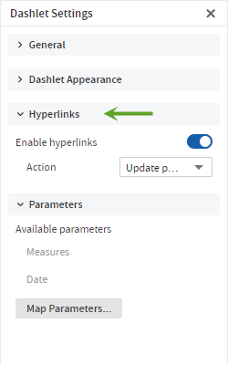
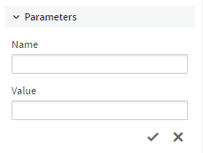
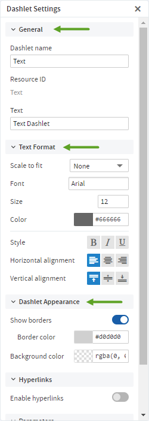
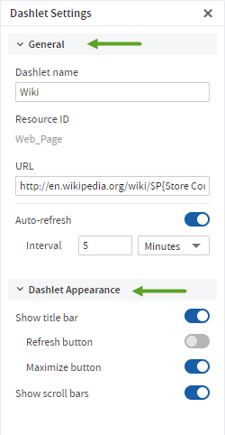
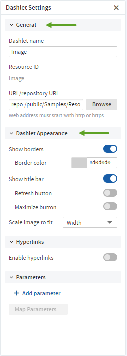
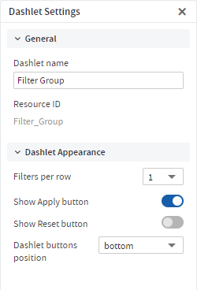
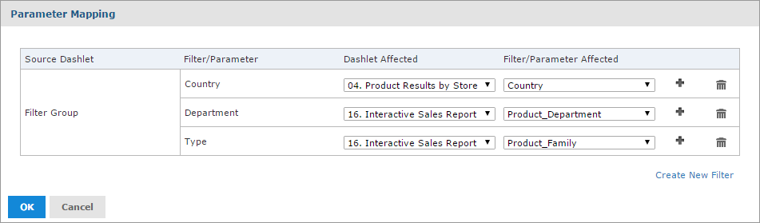

# Dashboard Settings

You can view and edit the basic appearance of the dashboard, and determine the refresh settings, through the Dashboard Settings.

To view and edit the Dashboard Settings

In the Dashboard Designer, Dashboard Settings display in the settings panel.


*Figure 1: Dashboard Settings*

### Canvas

-   **Background color**: Select the canvas background color by using the color picker or by entering a color value (hex, rgb, and rgba color formats are supported).

-   **Set custom size (pixels)**: Click the **Set custom size (pixels)** switch to turn it on, when you want the dashboard to be displayed at a specific width and height instead of dynamically resizing based on the browser window. The **Width** and **Height** inputs can be used to set the required width and height.

### General

-   **Show Export button**: Click the **Show Export button** switch to turn it on, to show the Export button in the dashboard viewer.

-   **Show Print button**: By default the **Show Print Button** is off. Click the **Show Print button** switch to turn it on, to show the Print button in the dashboard viewer.

-   **Auto-refresh**: Click the **Auto-refresh** switch to turn it on. The **Interval** inputs can be used to set the required refresh interval.

### Dashlet

-   **Show Filter Dashlet as pop-up window**: Click the switch to turn the setting on, when you want the filter dashlet to appear as a pop-up window instead of a dashlet pinned on the dashboard.

-   **Show borders**: This setting is on by default. Click the switch to turn the setting off, to hide the dashlet borders.

-   **Outer margin (pixels)**: Enter the required width, in pixels, of the margins between dashlets.

-   **Inner padding (pixels)**: Enter the required width, in pixels, of the padding inside each dashlet.

-   **Title bar**:

    -   Text: Text color for the title bars of all the dashboard's dashlets. Select the color by using the color picker or by entering a color value (hex, rgb, and rgba color formats are supported).

    -   Background: Background color for the title bars of all the dashboard's dashlets. Select the color by using the color picker or by entering a color value (hex, rgb, and rgba color formats are supported).

# Dashlet Settings

You can view and edit basic information and appearance for each dashlet on your dashboard using Dashlet Settings. For some dashlets, you can also create parameters that you can then map to in Parameter Mapping. The available settings vary based on the type of dashlet that you are working with.

To view and edit Dashlet Settings

Select the dashlet to show its settings in the settings panel. The **Hyperlinks** settings are available for Ad Hoc views and Ad Hoc view dashlets created inside the dashboard, as well as text and image dashlets. The **Text Format** settings are available for text dashlets.

## General and Dashlet Appearance Settings for Reports and Ad Hoc View Dashlets


*Figure 2: General and Dashlet Appearance Settings for Reports and Ad Hoc View Dashlets*

### General Settings

-   **Dashlet name**: Editable field for the displayed dashlet name.

-   **Resource ID**: Non-editable ID taken from the original dashlet name.

-   **Source Data**: Non-editable path of the source data.

!!! note

    The label name for this setting is different for different resource types:

    -   Source Data: For new Ad Hoc views created in dashboards (Chart, Crosstab, and Table)
    -   Source Ad Hoc View: For the existing Ad Hoc views
    -   Source Report: For the reports

-   **Auto-refresh**: Click the **Auto-refresh** switch to turn it on. The **Interval** inputs can be used to set the required refresh interval.

### Dashlet Appearance Settings

-   **Show title bar**: Choose to show or hide the title bar, which includes the Dashlet name, Refresh button, Maximize button, Back button, Print button, and Export button.

-   **Show Visualization Selector button**: Choose to show or hide the Visualization Selector button.

-   **Scale report to fit**: Use the dropdown menu to determine how the element is scaled in the dashlet. Scale report to fit is available for report dashlets Scale to fit is not available for Ad Hoc view dashlets.

## Hyperlinks Settings



*Figure 3: Hyperlinks Settings*

!!! note

    The **Hyperlinks** settings are available for Ad Hoc views and Ad Hoc view dashlets created inside the dashboard, as well as text and image dashlets.

-   **Enable hyperlinks**: Click the **Enable hyperlinks** switch to turn it on.

-   **Action**: Select the link behavior for this dashlet:

    -   **Update page**: Select this option to update the dashboard's contents when a user clicks a link in the dashlet.

    -   **Open new page**: Select this to have the dashlet open a web page or report, dashboard, or an Ad Hoc view in the repository in a new browser tab or window when a user clicks the dashlet. Click **Browse** to select a resource from the repository.

        You can link directly to a web page using `http:` syntax:

        ``` text
        http://en.wikipedia.org/wiki/$P{Customer Country}
        ```

        A repository URL must begin with `repo:`. For example,

        ``` text
        repo:/public/Samples/Ad_Hoc_Views/05._Unit_Sales_Trend
        ```

        You can add a parameter to a hyperlink for a web page, dashboard, Ad Hoc view, or report. See [Specifying Parameters in Dashlets](dashboards-parameters-in-dashlets.md) for more information about adding parameters to hyperlinks.

    -   **Replace page**: Select this option to replace the current dashboard page with a web page or report, dashboard, or an Ad Hoc view in the repository when a user clicks the dashlet. Click **Browse** to select a resource from the repository. The syntax for links and parameters is the same as the **Open new page** option.

        If the dashlet replaces the page with an Ad Hoc view, then it opens in the Ad Hoc View Designer. A **Back** button appears on the toolbar after the dashlet opens a report or dashboard that takes you back to the previous dashboard.

    -   **Replace dashlet**: Select this option to replace the current Ad Hoc view in a dashlet with some other Ad Hoc view, Report, or Report Option in the repository when a user clicks the dashlet. Click **Browse** to select a resource from the repository. The syntax for links and parameters is the same as the **Open new page** option.

-   **Available parameters**: If you want to add a parameter in the hyperlink, use a name in this list to have Parameter Mapping create the link to the parameter automatically.

-   **Add parameter**: For text and image dashlets, you can define a parameter to include in the hyperlink. Click the **Add parameter** button and in the fields that display, enter the parameter's name and value. Click  to save the new parameter.



*Figure 4: Adding a New Parameter to a Dashlet*

-   **Map Parameters**: If hyperlinks have been enabled, the **Map Parameters** button is active. Click **Map Parameters** to open the **Parameter Mapping** dialog box. See Parameter Mapping for more information.

## General, Text Format, and Dashlet Appearance Settings for Text Dashlets



*Figure 5: General, Text Format, and Dashlet Appearance Settings for Text Dashlets*

### General Settings

-   **Dashlet name**: Editable field for the displayed dashlet name.

-   **Resource ID**: Non-editable ID taken from the original dashlet name.

-   **Text**: Editable field for the text displayed in the dashlet.

### Text Format Settings

!!! note

    The **Text Format** settings are only available for text dashlets.

-   **Scale to fit**: Use the dropdown menu to determine how the text is scaled in the dashlet. This overrides the specified font size.

-   **Font**: Use the select input to select the font.

-   **Size**: Enter the font size or click the arrows to select a value.

-   **Color**: Color for the text displayed in the dashlet. Select the color by using the color picker or by entering a color value (hex, rgb, and rgba color formats are supported).

-   **Style**: Apply the text style using the associated toggle buttons. Multiple options can be selected.

-   **Horizontal alignment**: Apply the horizontal alignment using the associated toggle buttons. Only one option can be selected.

-   **Vertical alignment**: Apply the vertical alignment using the associated toggle buttons. Only one option can be selected.

### Dashlet Appearance Settings

-   **Show borders**: This setting is on by default. Click the switch to turn the setting off, to hide the dashlet border. If you select to show the dashlet border, you can choose the border color.

-   **Background color**: Select the dashboard background color by using the color picker or by entering a color value (hex, rgb, and rgba color formats are supported).

## General and Dashlet Appearance Settings for Web Page Dashlets



*Figure 6: General and Dashlet Appearance Settings for Web Page Dashlets*

### General Settings

-   **Dashlet name**: Editable field for the displayed dashlet name.

-   **Resource ID**: Non-editable ID taken from the original dashlet name.

-   **URL**: Editable field for the URL displayed in the dashlet.

-   **Auto-refresh**: Click the **Auto-refresh** switch to turn it on. The **Interval** inputs can be used to set the required refresh interval. This setting overrides the Auto-refresh setting at the dashboard level.

### Dashlet Appearance Settings

-   **Show title bar**: Choose to show or hide the title bar, which includes the Dashlet name, Refresh button, and Maximize button.

-   **Show scroll bars**: Choose to show or hide scroll bars.

## General and Dashlet Appearance Settings for Image Dashlets



*Figure 7: General and Dashlet Appearance Settings for Image Dashlets*

### General Settings

-   **Dashlet name**: Editable field for the displayed dashlet name.

-   **Resource ID**: Non-editable ID taken from the original dashlet name.

-   **URL/Repository URI**: Editable field for the location of the image displayed in the dashlet. This can include parameters. Click **Browse** to select an image from the repository.

### Dashlet Appearance Settings

-   **Show borders**: This setting is on by default. Click the switch to turn the setting off, to hide the dashlet border. If you select to show the dashlet border, you can choose the border color.

-   **Show title bar**: Choose to show or hide the title bar, which includes the Dashlet name, Refresh button, and Maximize button.

-   **Scale image to fit**: Use the dropdown menu to determine how the image is scaled in the dashlet.

## General and Dashlet Appearance Settings for Filter Dashlets



*Figure 8: Filter Dashlet Settings*

### General Settings

-   **Dashlet name**: Editable field for the displayed dashlet name.

-   **Resource ID**: Non-editable ID taken from the original dashlet name.

### Dashlet Appearance Settings

-   **Filters per row**: The default value is 1. To show more than one filter per row, select a different value in the associated select input.

-   **Show Apply button**: This setting is on by default. Click the switch to turn the setting off, to hide the button.

-   **Show Reset button**: This setting is off by default. Click the switch to turn the setting on, to show the button.

-   **Dashlet buttons position**: Use the dropdown menu to select bottom or right.

# Parameter Mapping

Parameter Mapping helps you refine your filters by letting you specify which dashlets and which parameters are affected by a filter.

To open Parameter Mapping

1.  Open a dashboard with filters, such as the Sales Dashboard created in [Creating a Dashboard](dashboards-creating-simple.md), in the Dashboard Designer.
2.  Click  to open Parameter Mapping.



*Figure 9: Parameter Mapping for the Sales Dashboard*

Parameter Mapping displays the filter-to-dashlet mapping, and includes the following columns and buttons:

-   **Source Dashlet**, the name of the dashlet where the filter originates. It can also display Filter Group (multiple filters in a single dashlet) or Manually Created Filter (filter created using Parameter Mapping, as described below).

-   **Filter/Parameter**, the name of the filter.

-   **Dashlet Affected**, with a dropdown menu including all dashlets that can be affected by that filter.

-   **Filter/Parameter Affected**, with a dropdown menu including all parameters associated with the selected dashlet in the Dashlet Affected column.

-   **Add** button , used to add additional dashlet/parameter combinations to a filter.

-   **Delete** button , used to delete a dashlet/parameter combination.

From Parameter Mapping, you can add, delete, or edit an existing dashlet/parameter combination, and create a new filter to add to the dashboard.

To add a filter using Parameter Mapping

1.  Open a dashboard with filters, and open Parameter Mapping as described above.
2.  In the filter row, click  to add the new filter . A row containing new affected dashlet and filter/parameter dropdown menus appears.
3.  Using these new line-items, select the dashlet and parameter combination you want to apply to the dashboard.
4.  Click **OK** to apply and save or **Cancel** to discard your changes.

To delete a filter using Parameter Mapping

1.  Open Parameter Mapping.
2.  In the filter row, click  to delete. The filter row disappears from Parameter Mapping.

To create a new filter via Parameter Mapping

1.  Open Parameter Mapping.
2.  Click **Create New Filter**. A new row is added to the manager.
3.  In the **Filter** column, enter a name for the new filter. Click outside the text box to apply the name.
4.  Click  and select the dashlet and parameter combination you want to apply to the new filter.
5.  Click **OK** to apply and save, or **Cancel** to discard the new filter.

To delete a newly created filter

1.  In Parameter Mapping, click  in the filter row you want to delete. The Dashlet Affected and Filter/Parameter affected dropdown menus disappear.
2.  Click  again in the row that you want to delete. The Filter row disappears.
3.  Click **OK** to apply and save, or **Cancel** to discard the new filter.
