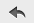
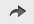
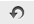

# Adding Controls to a Dashboard

The Interactive Sales Report was designed to be run with input controls. When you add a report that has input controls to a dashboard, the controls don’t appear until you explicitly add them, one-by-one. The controls can either be added directly to the dashboard as a dashlet or accessed from the toolbar as a pop-up window. When the report runs, dashboard users provide input using the control. Data based on the user input appears in the dashboard. For example, using the input control, you select Mexico. The report on the dashboard shows orders from Mexican companies.

Keep these points in mind when viewing a dashboard that has input controls:

- An input control may appear as a text field, a drop-down, a check box, a multi-select list box, or a calendar icon.

- If one of the dashlets in a dashboard does not refer to an input control, that dashlet does not update when you change that input control’s value. Only dashlets that use the input control reflect the change.

- The  buttons on the toolbar allow you to undo and redo recent changes made to the dashboard, including changes using an input control.

- If the  button appears on the toolbar, then the dashboard was set up to display input controls as a pop-up window instead of a dashlet. Click the button to view the controls.

To add controls as a dashlet

1.  If the Sales Dashboard created in [Creating a Dashboard](dashboards-creating-simple.md) is not open, locate the /Dashboards folder in the repository. Right-click the dashboard name and select **Open in Designer** from the context menu.

    The Sales Dashboard appears in the designer, as shown in [Figure 1-2, “Simple Dashboard Canvas with three reports”](dashboards-creating-simple.md), and the input controls available appear in the **Filters** section of the **Available Content** panel.

2.  In the **Filters** section, expand the 16. Interactive Sales Report folder.

    The input controls associated with the Interactive Sales Report appear.

3.  Drag the Country input control onto the canvas, and place it above the Product Results by Store Type dashlet.

    The Country input control and its label appear above the Product Results by Store type report on the canvas.

4.  Drag the Product Family and Product Department controls onto the Country input control dashlet. These input controls are added to the same dashlet. Resize the dashlets as needed to view all of the input controls.

5.  Click  and select **Save Dashboard**, then click the **Editing** button and select **Viewing** to preview the dashboard.

6.  Click in the **Country** text box to display the available countries. In this input control, you have the following options:
    - The three countries: **Canada**, **Mexico**, and **USA**.
    -  **All**, which selects all available values in the input control.
    -  **None**, which deselects all available values in the input control.
    -  **Invert**, which deselects any selected values, and selects the unselected values.

7.  Use the options to select **Mexico** from the values list, and click **Apply** at the bottom of the dashlet. The data displayed in the Interactive Sales Report changes, but is not updated in the other reports, as they do not have an input control named Country.

8.  Click the **Viewing** button and select **Editing** to return to the Dashboard Designer.

You can also change the labels, or display names, of individual input controls and filters within a dashlet.

To rename an input control or filter

1.  With the Sales Dashboard open in the Dashboard Designer, select Product Family in the input control dashlet, filter settings display in **Dashlet Settings** in the settings panel.
2.  Change the **Filter label** from `Product Family` to `Type`.
3.  Select the Product Department input control, filter settings display in **Dashlet Settings** in the settings panel. Change the `Product Department` filter label to `Department`. The input control labels are updated.

*Figure 1: Parameter Mapping for the Sales Dashboard*

To add controls as a pop-up window

1.  With the Sales Dashboard open in the Dashboard Designer, go to the **Dashboard Settings** on the settings panel.
2.  Click the **Show Filter Dashlet as pop-up window** switch to turn it on. 
    The input controls dashlet disappears from the dashboard and  appears on the toolbar. This button is also displayed when you're viewing the dashboard.
3.  Click  and select **Save Dashboard**, then click the **Editing** button and select **Viewing** to preview the dashboard.
4.  Click  to view the filter pop-up window. 
    Like the dashlet, selecting the options in the pop-up changes the data displayed in the Interactive Sales Report.
5.  Click  to close the filter pop-up window.
6.  Click **Viewing** button and select **Editing** to return to the Dashboard Designer.
