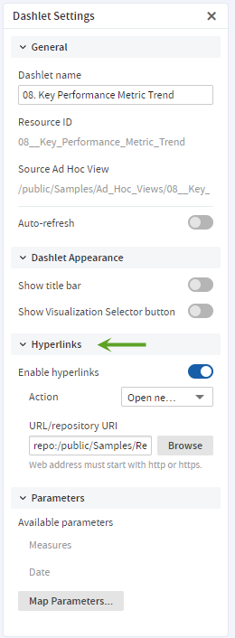
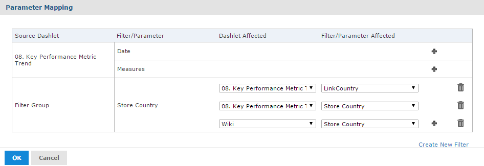

# Adding a Hyperlink to Ad Hoc View Dashlets

When working with Ad Hoc view dashlets in the Dashboard Designer, you can specify a link that opens when a user clicks the dashlet. You can optionally include a parameter that references an existing filter in another dashlet, and uses that filter to display a specific web page relevant to the filtered information.

The following example takes you through adding a hyperlink to the Ad Hoc view dashlet created in [Creating a Web Page Dashlet](dashboards-parameters-in-dashlets.md). The example also shows how to add a parameter to a hyperlink.

First, open the dashboard

1.  If the Key Performance Metric Trend dashboard created in [Creating a Web Page Dashlet](dashboards-parameters-in-dashlets.md) (above) is not open, then locate the /Dashboards folder in the repository. Right-click the dashboard name and select **Open in Designer** from the context menu. 
    The Key Performance Metric Trend dashboard appears in the designer.

Create an Ad Hoc view hyperlink

1.  Select the 08. Key Performance Metric Trend dashlet to show its settings in the settings panel.

2.  Go to the **Hyperlinks** settings in Dashlet Settings.

    

    *Figure 1: Hyperlinks settings in Dashlet Settings*

3.  Click the **Enable hyperlinks** switch to turn it on.

4.  Choose **Open new page** from the **Action** menu.

    The URL/Repository URI input is displayed.

5.  Enter `repo:/public/Samples/Reports/04._Product_Results_by_Store_Type_Report` for the URL/Repository URI. 

    !!! note

        To see the report's path, hover over the report's name in the Existing Content pane.

6.  Press Enter or Tab, or change the mouse focus anywhere in the canvas for the changes to take effect.

Preview the new dashboard functionality

1.  Click the **Editing** button and select **Viewing** to preview the dashboard.
2.  Click the Ad Hoc view dashlet. 
    The 04. Product Results by Store Type Report gets open in a new tab.
3.  Return to the tab containing the Key Performance Metric Trend dashboard and click the **Viewing** button and select **Editing** to return to the Dashboard Designer.

Add a parameter

1.  Select the Key Performance Metric Trend dashboard dashlet to show its settings in the settings panel and go to the **Hyperlinks** settings. 
    The Available parameters section shows the parameters available in the Ad Hoc view.

2.  Modify the URL to add a parameter that provides a value for an input control in the target report:

    -   You need to know the correct name of the input control in your target report. In this case, it is `sales__store__store_contact__store_country_1` in the 04. Product Results by Store Type Report.

    -   Create a parameter. If you create a parameter name, it is helpful to use a name that is not used in Parameter Mapping. In this example, use `LinkCountry`. For more information about parameters, see [Specifying Parameters in Dashlets](dashboards-parameters-in-dashlets.md).

        The link is as follows:

        `repo:/public/Samples/Reports/04._Product_Results_by_Store_Type_Report?sales__store__store_contact__store_country_1=$P{LinkCountry}`

        !!! note

            If you use one of the names in the Available Parameters list, the mapping to the parameter is created for you. In this example, if you use `Store Country` instead of `LinkCountry`, you do not need to create links in Parameter Mapping.

            This example does not show how to add support when more than one country is selected. For more information, see [Parameters in Dashlets](dashboards-parameters-in-dashlets.md).

3.  Click **Map Parameters**. Parameter Mapping is displayed. 

    

    *Figure 2: Parameter Mapping*

4.  In the **Store Country** filter group, click . 
    A new row with affected dashlet and filter/parameter dropdown menus appears.

5.  In the Dashlet Affected column, select **06. Sales Mix by Gender** from the new Select dashlet... dropdown menu.

6.  In the Filter/Parameter Affected column, select **LinkCountry** from the new Select parameter... dropdown menu.

7.  Click **OK**.

Finally, preview the new dashboard functionality

1.  Click the **Editing** button and select **Viewing** to preview the dashboard.

2.  Click in the **Store Country** text box to display the available countries.

3.  Select **Mexico** from the values list, and click **Apply** at the bottom of the dashlet.

4.  Click the Ad Hoc view dashlet. 
    The 04. Product Results by Store Type Report gets open in a new tab.

5.  To verify that the parameter has been passed correctly, click  in the 04. Product Results by Store Type Report. 
    The Input Controls dialog box opens, with Mexico set.

6.  Return to the tab that contains your dashboard.

7.  Click the **Viewing** button and select **Editing** to return to the Dashboard Designer.

8.  Click , then select **Save Dashboard**.
