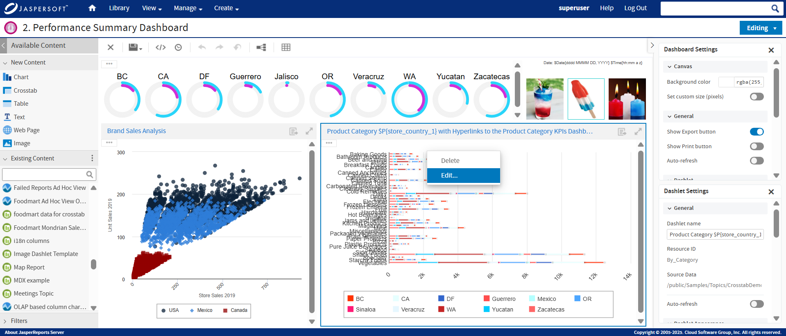

# Editing a Dashboard

You can edit a dashboard if you have the proper permissions.

To edit a dashboard.

1.  Select **View &gt; Repository** and search or browse for the Dashboard you want to modify. 
    By default, the repository includes the /Dashboards folder where you can store dashboards.

2.  Right-click the dashboard and select **Open in Designer** from the context menu. The designer appears, displaying the dashboard.

3.  Edit the dashboard by adding, removing, resizing, or dragging content. 
    For more information about working with dashboard content, see [“Creating a Dashboard” on page 1](dashboards-creating-simple.md).

4.  When you are satisfied with the dashboard, hover your cursor over  and select **Save Dashboard**. To create a new version of the dashboard, select **Save Dashboard As** and specify a new name.

    !!! note

        If you close the dashboard without saving the changes, a dialog prompts you to save or cancel the changes made to the dashboard.

# Editing Existing Ad Hoc Views in Dashboard

You can now edit the existing Ad Hoc views ( i.e the Ad Hoc views created from Ad Hoc designer and saved to the repository), directly from the dashboard.

To edit the existing Ad Hoc View from the dashboard.

1.  Open the dashboard in the **Editing** mode.

2.  Right-click on the Ad Hoc Dashlet that you want to edit and select **Edit** from the options.

    

3.  The embedded Ad Hoc Editor opens, now you can make the updates and Click  to save the Ad Hoc View.

4.  The dashlet automatically refreshes and the changes are now visible in the selected dashlet of the dashboard. The changes made to the existing Ad Hoc view in the dashboard, would reflect in the Ad Hoc designer as well.

!!! note

    If this existing Ad Hoc is been used in resources other than the current dashboard, modifying and saving the Ad Hoc shows the dependency resource dialog.
