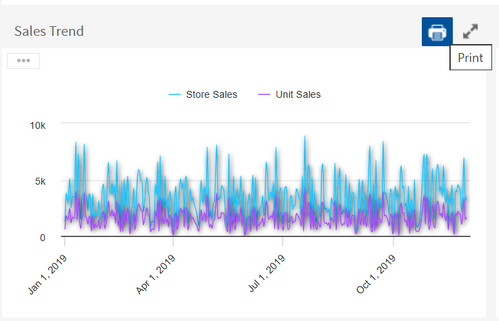

# Exporting Dashboards and Dashlets

You can export a dashboard or a dashlet and save it on your computer. Dashboards can be exported as a screenshot or in a detailed mode as a document. Dashlets can be exported in a detailed mode as a document. Exporting a dashboard or dashlet requires the following:

-   The export button has been enabled for the dashboard or dashlet. Hence, the export of the adhoc view dashlet created from the existing adhoc view remains available after changing the visualization type as the export button is enabled.

    !!! note

        The export button is disabled for the newly created dashlets, which are created by adding new content when switching from one visualization type to another. For example, when:

        -   Table is switched to another visualization type.

        -   CrossTab is switched to another visualization type.

        -   Chart is switched to either Table or CrossTab visualization type.

        Therefore, the export of the adhoc view dashlet created by adding new context is not available after changing the visualization type as the export button is disabled.

    For more information, see [Dashboard Properties](dashboard-properties.md) and [Dashlet Properties](dashboard-properties.md).

-   Chrome/Chromium is installed on the computer hosting JasperReports Server. For information on configuring Chrome/Chromium for dashboards, see the System Configuration chapter in the JasperReports Server Administrator Guide.

To export a dashboard or a dashlet

1.  Select **View &gt; Repository** and search or browse for the Dashboard you want to export.

2.  Click the link to open the dashboard.

3.  Hover your cursor over  for the dashboard or individual dashlet and select the export format from the drop-down list. 
    The available formats for dashboards are:

    <table>
    <colgroup>
    <col style="width: 50%" />
    <col style="width: 50%" />
    </colgroup>
    <thead>
    <tr>
    <th>Type</th>
    <th>Format</th>
    </tr>
    </thead>
    <tbody>
    <tr>
    <td>Screenshot</td>
    <td>
PNG Image (.png) 
    PDF Document (.pdf) 
    Microsoft Word (.docx) 
    OpenDocument Text (.odt) 
    Microsoft PowerPoint (.pptx)
</td>
    </tr>
    <tr>
    <td>Detailed</td>
    <td>
PDF Document (.pdf) 
    Microsoft Excel (.xlsx) 
    Comma Separated Values (.csv) 
    Microsoft Word (.docx) 
    Rich Text Format (.rtf) 
    OpenDocument Text (.odt) 
    OpenDocument Spreadsheet (.ods) 
    Microsoft PowerPoint (.pptx) 
    
</td>
    </tr>
    </tbody>
    </table>

    The available formats for dashlets are:

    -   PDF Document (.pdf)
    -   Rich Text Format (.rtf)
    -   Comma Separated Values (.csv)
    -   OpenDocument Text (.odt)
    -   OpenDocument Spreadsheet (.ods)
    -   Microsoft Word (.docx)
    -   Microsoft Excel - Paginated(.xlsx)
    -   Microsoft Excel (.xlsx)
    -   Microsoft PowerPoint (.pptx)

4.  Save the dashboard or dashlet in the export file format, for example PDF, or open it in the application.

You can export a dashboard containing a report with **Detail Chart Enabled** property as enabled or disabled. This property does not impact output formats like PDF, Excel, PPTX, etc.

!!! note

    If you perform the export while a dashlet is reloading its content, the dashlet will appear as a grayed-out box in the exported file.

# Printing Dashboards and Dashlets

You can print a dashboard or a dashlet and save it to your computer. Dashboards can be printed as **Screenshot** or **Detailed** PDF, while Dashlets can be exported in a detailed mode as a PDF.

To print a dashboard

1.  In the Editing mode, by default the **Show Print button** is disabled. Enable the **Show Print button** to show the Print button in the dashboard viewer.
2.  Switch to the Viewing mode to print the dashboard or the dashlet. 
    
3.  Hover over the Print button, and select the required print format, **Screenshot** or **Detailed**.

!!! note

    The available print format for **Screenshot** or **Detailed** is PDF (.pdf) only.

To print a dashlet

1.  In the Editing mode, by default the **Print button** is disabled. Enable the **Print button** to show the Print button in the dashlet viewer.
2.  Switch to the Viewing mode to print the dashlet. 
    
3.  Hover over the Print button, and select Print.

!!! note

    The available print format is PDF (.pdf) only.
