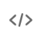
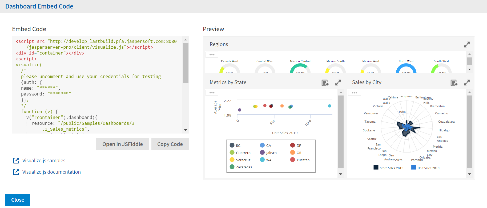

# Getting the Embed Code for Visualize.js

!!! info "Important"

    The features in this section may be restricted by your JasperReports Server software license. If you don't see some of the options described, your current license likely prohibits their use. Contact us to learn about your licensed features or to discuss upgrading.

Visualize.js is the JavaScript library available with JasperReports Server to embed dashboards and reports in custom web apps. If you create an app with Visualize.js, this feature gives you the JavaScript code needed to embed the current dashboard in your app. You can then write additional code to interact with the dashboard programmatically, for example to update a filter depending on other actions in your app. For more information, see the *JasperReports Server Visualize.js Guide*.

You can get the embed code for a dashboard from the dashboard view mode and the edit mode (dashboard designer).

To get a dashboard embed code

1.  On the toolbar, click  to open the **Dashboard Embed Code** dialog.

    

    *Figure 1: Dashboard Embed Code Dialog*

    The dialog shows the Visualize.js code and a preview of the dashboard as it is currently saved.

2.  Click the **Copy Code** button to copy the embed code to the clipboard.

3.  Click the **Open in JSFiddle** button to load the embed code into JSFiddle, an online JavaScript viewer and interactive editor.

4.  Click the **Close** button to return to the dashboard.
